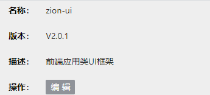
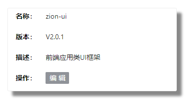
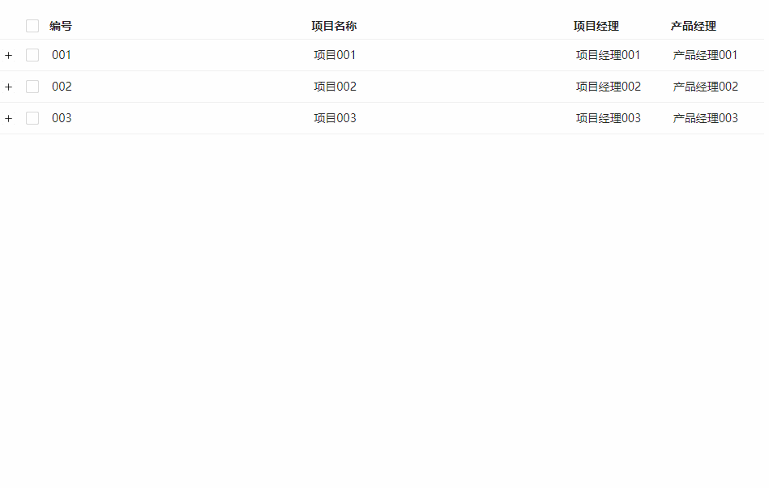

## DetailForm 详情菜单
### 完整API
```tsx
interface IProps extends IBaseFormModel {
  /** row行对应的数据 */
	data: Object
  /** 菜单行标题 */
	rows: IRowItem[],
  /** 布局 */
	layout?: {
    /** data对应布局 */
		wrapperCol?: { span: number }
    /** 菜单行标题布局 */
		labelCol?: { span: number }
	}
}

// rows
interface IRowItem {
  /**  标题 */
	title: string | ReactNode
  /** 索引 */
	dataIndex?: string
  /** 内容渲染函数 */
	render?: (value: string, data: Object) => ReactNode
}
```
### 基本使用
```tsx
import React from "react"
import { DetailForm, DetailFormProps, Button } from "zion-ui"
import { Row, Col } from "antd"

export const Demo = function () {
  const userInfo = {
    name: "zion-ui",
    version: "V2.0.1",
    desc: "前端应用类UI框架"
  }
  const props: DetailFormProps = {
    data: userInfo,
    layout: {
      labelCol: { span: 4 }
    },
    rows: [
      { title: "名称", dataIndex: "name" },
      { title: "版本", dataIndex: "version" },
      { title: "描述", dataIndex: "desc" },
      {
        title: "操作", render: () => {
          return <Button text="编辑" type="info" size="small" />
        }
      }
    ]
  }
  return <Row>
    <Col span={6}>
      <DetailForm {...props} />
    </Col>
  </Row>
}
```

#### 更改背景样式
```tsx
import React from "react"
import { DetailForm, DetailFormProps, Button } from "zion-ui"
import { Row, Col } from "antd"

export const Demo = function () {
  const userInfo = {
    name: "zion-ui",
    version: "V2.0.1",
    desc: "前端应用类UI框架"
  }
  const props: DetailFormProps = {
    data: userInfo,
    layout: {
      labelCol: { span: 4 }
    },
    rows: [
      { title: "名称", dataIndex: "name" },
      { title: "版本", dataIndex: "version" },
      { title: "描述", dataIndex: "desc" },
      {
        title: "操作", render: () => {
          return <Button text="编辑" type="info" size="small" />
        }
      }
    ],
    style: {
      background: "#fff",
      border: "1px solid #eee",
      borderRadius: "3px",
      boxShadow: "10px 10px 5px #888888"
    }
  }
  return <Row style={{ padding: "20px 20px" }}>
    <Col span={6}>
      <DetailForm {...props} />
    </Col>
  </Row>
}
```

### 结合Table示例
```tsx
import React from 'react';
import { Table, TableProps, DetailFormProps, Button, DetailForm } from "zion-ui";
import { Row, Col } from "antd";

const RecordInfo = function ({ record }) {
  const props: DetailFormProps = {
    data: record,
    layout: {
      labelCol: { span: 4 }
    },
    rows: [
      { title: "编号", dataIndex: "key" },
      { title: "项目名称", dataIndex: "name" },
      { title: "项目经理", dataIndex: "manageName" },
      { title: "产品经理", dataIndex: "productName" },
      {
        title: "操作", render: () => {
          return <Button text="编辑" type="info" size="small" />
        }
      }
    ]
  }
  return < DetailForm {...props} />
}

export const Demo = function () {
  const tableProps: TableProps = {
    columns: [
      { title: "编号", dataIndex: "key" },
      { title: "项目名称", dataIndex: "name" },
      { title: "项目经理", dataIndex: "manageName", width: 120 },
      { title: "产品经理", dataIndex: "productName", width: 120 }
    ],
    expandable: {
      rowExpandable: (record) => record["key"].length <= 8,
      onExpand: ({ record }) => <Row style={{ padding: "10px 20px" }}>
        <Col span={11}><RecordInfo record={record} /></Col>
        <Col span={2}></Col>
        <Col span={11}><RecordInfo record={record} /></Col>
      </Row>
    },
    rowSelection: {
      show: true,
      mode: "checkbox",
    },
    bordered: false,
    rowKey: "key",
    nestingMode: "customer",
    dataSource: [
      { key: "001", name: "项目001", manageName: "项目经理001", productName: "产品经理001" },
      { key: "002", name: "项目002", manageName: "项目经理002", productName: "产品经理002" },
      { key: "003", name: "项目003", manageName: "项目经理003", productName: "产品经理003" }
    ],
  }
  return <Row>
    <Col span={16}>
      <Table {...tableProps} />
    </Col>
  </Row>
}
```
