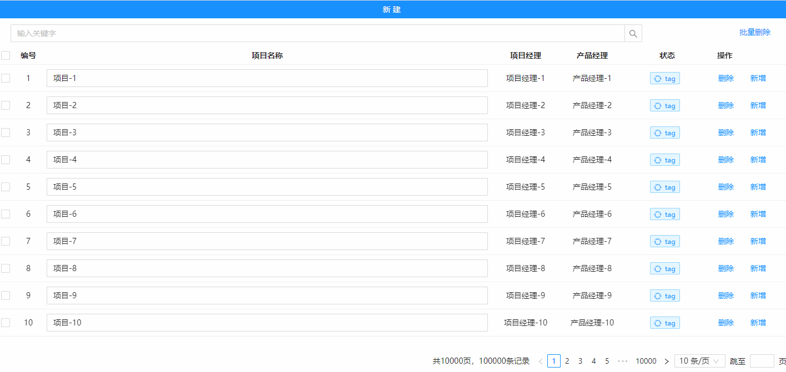

## EditTable 可编辑表格
### 完整API
```tsx
interface IProps {
  /** 表格标识字段 */
	controlKey?: string
  /** Table配置,参考组件Table的API */
	tableProps: TableProps
  /** 是否可编辑 */
	allowEdit?: boolean
  /** 查询的字段 */
	searchMapFields?: string[]
}
```
### 基本使用
```tsx
import React from 'react';
import { StateManage, Tag, EditTable, Input, Button } from "zion-ui"

export const Demo = function () {
  const [state, Tpl] = EditTable({
    tableProps: {
      columns: [
        { title: "编号", dataIndex: "key", width: 50, align: "center" },
        {
          title: "项目名称", dataIndex: "name", align: "center", render: (value, record) => {
            return <Input
              value={value}
              onBlur={({ value }) => {
                record["name"] = value
                const { updateDataSource } = StateManage.get(state)
                updateDataSource(record)
              }}
            />
          }
        },
        { title: "项目经理", dataIndex: "manageName", width: 120, align: "center" },
        { title: "产品经理", dataIndex: "productName", width: 120, align: "center" },
        { title: "状态", dataIndex: "status", width: 150, align: "center", render: (text) => <Tag text={text} type="processing" /> }
      ],
      rowKey: "key",
      pagination: { show: true },
      buttonConfig: {
        width: "140px",
        rowButton: [
          {
            text: "删除",
            btnCode: "ROW_DELETE_BUTTON",
            onClick: ({ record }: any) => {
              const { deleteData } = StateManage.get(state)
              deleteData([record.key])
            }
          },
          {
            text: "新增",
            onClick: ({ record }) => {
              const { addData, getDataSource } = StateManage.get(state)
              const newItem = { key: Math.random() * 1000, name: "新建项目" }
              let index = getDataSource().findIndex(item => item["key"] == record["key"])
              addData({ data: newItem, index: ++index })
            }
          }
        ]
      }
    },
    allowEdit: true,
    searchMapFields: ["name"]
  })
  const { setDataSource } = StateManage.get(state)
  setDataSource(new Array(100000).fill("").map((item, index) => {
    return {
      key: ++index,
      name: "项目-" + index,
      manageName: "项目经理-" + index,
      productName: "产品经理-" + index
    }
  }))
  return <div>
    <Button
      style={{ display: "block" }}
      text="新建"
      type="primary"
      onClick={() => {
        const newItem = { key: Math.random() * 1000, name: "新建项目" }
        const { addData } = StateManage.get(state)
        addData({ data: newItem, index: 4 })
      }}
    />
    <Tpl />
  </div>
}
```
