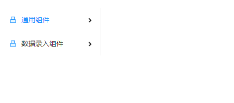

## Menu 菜单
### 完整API
```tsx
IProps extends IBaseModel {
  /** 布局方式 垂直(默认) | 水平 | 内联 */
	layout?: "vertical" | "horizontal" | "inline"                            
  /** 菜单主题（默认light）*/
	theme?: "light" | "dark"                                                
  /** 当前选中的节点 */
	selectedKeys?: string[]                                                   
  /** 当前打开的节点 */
	openKeys?: string[]         
  /** 菜单数据源 */                                              
	dataSource?: IMenuItem[]     
  /** 点击 MenuItem 调用此函数 */                                             
	onClick?: (params: OnClickEventHandlerParams, state: IObservableObject) => void  
  /** 展开|收起菜单时触发 */
	onOpenChange?: (params: { openKeys: string[] }, state: IObservableObject) => void
}

// dataSource
interface IMenuItem {
  /** 标识字段 */
	key: string,
  /** 标签内容 */
	label: string | ReactNode,
  /** 是否禁用 */
	disabled?: boolean,
  /** 图标 */
	icon?: ReactNode,
	isGroupMenu?: boolean
	isSubMenu?: boolean
	children?: IMenuItem[]
	[key: string]: any
}
```
### 基本使用
#### 布局方式
```tsx
import { MenuProps, Menu } from "zion-ui"
import { Row, Col } from "antd"
import React from "react"
import { UsbTwoTone, BugFilled } from "@ant-design/icons"

const config: MenuProps = {
  // 布局设置
  // "vertical" | "horizontal" | "inline" 
  layout: "vertical",
  style: { width: "200px" },
  dataSource: [
    {
      key: "common",
      label: "通用组件",
      isSubMenu: true,
      icon: <UsbTwoTone />,
      children: [
        {
          key: "Button",
          label: "Button 按钮",
          icon: <BugFilled />
        },
        {
          key: "Tag",
          label: "Tag 标签",
          icon: <BugFilled />
        }
      ]
    },
    {
      key: "data-entry",
      label: "数据录入组件",
      isSubMenu: true,
      icon: <UsbTwoTone />,
      children: [
        {
          key: "Input",
          label: "Input 文本框"
        },
        {
          key: "DateTime",
          label: "DateTime 日期时间"
        }
      ]
    }
  ]
}
export const Demo = function () {
  return <Row>
    <Col span={11}>
      <Menu {...config} />
    </Col>
  </Row>
}

```
##### 垂直

##### 水平

##### 内联

#### 主题
```tsx
import { MenuProps, Menu } from "zion-ui"
import { Row, Col } from "antd"
import React from "react"
import { UsbTwoTone, BugFilled } from "@ant-design/icons"

const config: MenuProps = {
  theme: "dark",
  style: { width: "200px" },
  dataSource: [
    {
      key: "common",
      label: "通用组件",
      isSubMenu: true,
      icon: <UsbTwoTone />,
      children: [
        {
          key: "Button",
          label: "Button 按钮",
          icon: <BugFilled />
        },
        {
          key: "Tag",
          label: "Tag 标签",
          icon: <BugFilled />
        }
      ]
    },
    {
      key: "data-entry",
      label: "数据录入组件",
      isSubMenu: true,
      icon: <UsbTwoTone />,
      children: [
        {
          key: "Input",
          label: "Input 文本框"
        },
        {
          key: "DateTime",
          label: "DateTime 日期时间"
        }
      ]
    }
  ]
}
export const Demo = function () {
  return <Row style={{ padding: "20px" }}>
    <Col span={11}>
      <Menu {...config} />
    </Col>
  </Row>
}
```

#### 事件回调
##### onClick
```tsx
import { MenuProps, Menu, PopMessage } from "zion-ui"
import { Row, Col } from "antd"
import React from "react"
import { UsbTwoTone, BugFilled } from "@ant-design/icons"

const config: MenuProps = {
  theme: "dark",
  layout: "inline",
  openKeys: ["data-entry"],
  style: { width: "200px" },
  dataSource: [
    {
      key: "common",
      label: "通用组件",
      isSubMenu: true,
      icon: <UsbTwoTone />,
      children: [
        {
          key: "Button",
          label: "Button 按钮",
          icon: <BugFilled />
        },
        {
          key: "Tag",
          label: "Tag 标签",
          icon: <BugFilled />
        }
      ]
    },
    {
      key: "data-entry",
      label: "数据录入组件",
      isSubMenu: true,
      icon: <UsbTwoTone />,
      children: [
        {
          key: "Input",
          label: "Input 文本框"
        },
        {
          key: "DateTime",
          label: "DateTime 日期时间"
        }
      ]
    },
  ],
  onClick: (params, state) => {
    console.log(params, state)
    PopMessage({
      type: "success",
      title: params.eventName + "==>" + params.value
    })
  }
}
export const Demo = function () {
  return <Row style={{ padding: "20px" }}>
    <Col span={11}>
      <Menu {...config} />
    </Col>
  </Row>
}
```

##### onOpenChange
```tsx
import { MenuProps, Menu, PopMessage } from "zion-ui"
import { Row, Col } from "antd"
import React from "react"
import { UsbTwoTone, BugFilled } from "@ant-design/icons"

const config: MenuProps = {
  theme: "dark",
  layout: "inline",
  openKeys: ["data-entry"],
  style: { width: "200px" },
  dataSource: [
    {
      key: "common",
      label: "通用组件",
      isSubMenu: true,
      icon: <UsbTwoTone />,
      children: [
        {
          key: "Button",
          label: "Button 按钮",
          icon: <BugFilled />
        },
        {
          key: "Tag",
          label: "Tag 标签",
          icon: <BugFilled />
        }
      ]
    },
    {
      key: "data-entry",
      label: "数据录入组件",
      isSubMenu: true,
      icon: <UsbTwoTone />,
      children: [
        {
          key: "Input",
          label: "Input 文本框"
        },
        {
          key: "DateTime",
          label: "DateTime 日期时间"
        }
      ]
    },
  ],
  onOpenChange: (params, state) => {
    console.log(params, state)
    PopMessage({
      type: "success",
      title: "==>" + params.openKeys[0]
    })
  }
}
export const Demo = function () {
  return <Row style={{ padding: "20px" }}>
    <Col span={11}>
      <Menu {...config} />
    </Col>
  </Row>
}
```

### 综合示例
```tsx
import { MenuProps, Menu, Button, StateManage } from "zion-ui"
import { Row, Col } from "antd"
import React from "react"
import { UsbTwoTone, BugFilled } from "@ant-design/icons"

const controlKey = "Menu.Demo.003"

const config: MenuProps = {
  controlKey,
  layout: "inline",
  openKeys: ["common", "data-entry"],
  selectedKeys: [],
  style: { width: "200px" },
  dataSource: [
    {
      key: "common",
      label: "通用组件",
      isSubMenu: true,
      icon: <UsbTwoTone />,
      children: [
        {
          key: "Button",
          label: "Button 按钮",
          icon: <BugFilled />
        },
        {
          key: "Tag",
          label: "Tag 标签",
          icon: <BugFilled />
        }
      ]
    },
    {
      key: "data-entry",
      label: "数据录入组件",
      isSubMenu: true,
      icon: <UsbTwoTone />,
      children: [
        {
          key: "Input",
          label: "Input 文本框"
        },
        {
          key: "DateTime",
          label: "DateTime 日期时间"
        }
      ]
    }
  ]
}
const Service = {
  // 添加节点
  addNode: function () {
    const { dataSource } = StateManage.get(controlKey)
    dataSource.push({
      key: "random-" + (Math.random() * 1000).toFixed(0),
      label: "随机节点"
    })
    StateManage.set(controlKey, { dataSource })
  },
  // 收起节点
  packUpNode: function () {
    StateManage.set(controlKey, { openKeys: [] })
  },
  // 展开节点
  openNode: function () {
    StateManage.set(controlKey, { openKeys: ["common", "data-entry"] })
  },
  // 修改节点
  updateNode: function () {
    const { dataSource } = StateManage.get(controlKey)
    dataSource[0]["label"] = "修改后的label"
    StateManage.set(controlKey, { dataSource })
  },
  // 选中节点
  selectNode: function () {
    StateManage.set(controlKey, { selectedKeys: ["Button"] })
  }
}
export const Demo = function () {
  return <Row>
    <Col span={11}>
      <Button text="添加节点" type="primary" style={{ margin: "10px", display: "block" }} onClick={Service.addNode} />
      <Button text="收起节点" type="primary" style={{ margin: "10px", display: "block" }} onClick={Service.packUpNode} />
      <Button text="展开节点" type="primary" style={{ margin: "10px", display: "block" }} onClick={Service.openNode} />
      <Button text="修改节点" type="primary" style={{ margin: "10px", display: "block" }} onClick={Service.updateNode} />
      <Button text="选中节点" type="primary" style={{ margin: "10px", display: "block" }} onClick={Service.selectNode} />
    </Col>
    <Col span={2}></Col>
    <Col span={11}>
      <Menu {...config} theme="dark" />
    </Col>
  </Row>
}
```
