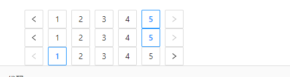
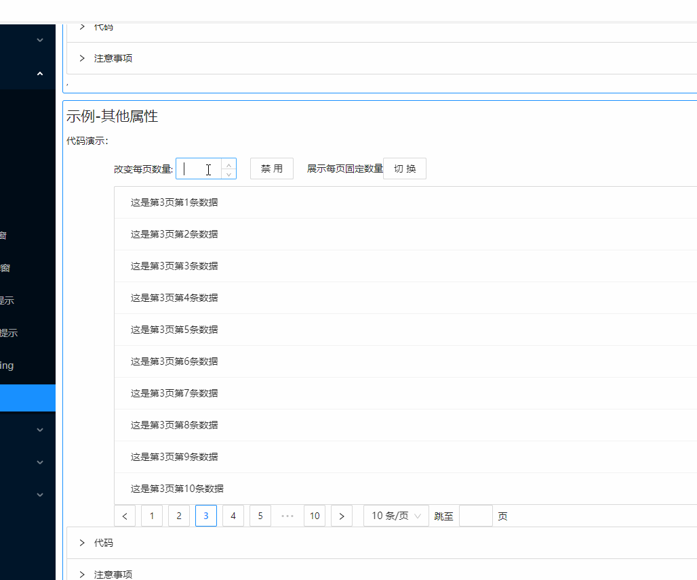
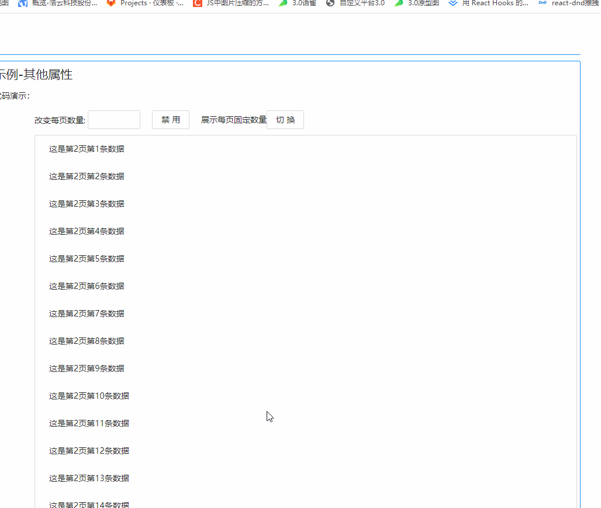
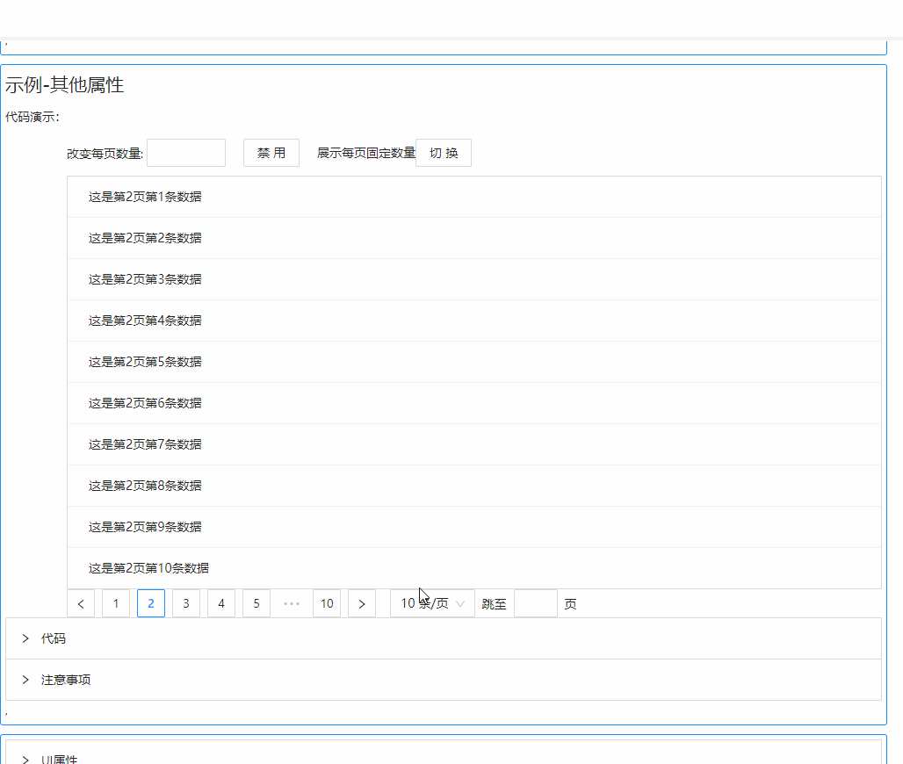

## Button 按钮

### 完整API
 - [BaseModel](../../架构设计/基础模型.md)
```ts
interface IProps extends IBaseModel {
  /** 当前页数*/
  page?: number
  /** 当前页数量*/
  pageSize?: number
  /** 是否禁用*/
  disabled?: boolean   
  /** 指定展示的分页器固定数据*/
  pageSizeOptions?: string[]                    
  /** 是否支持快速跳转*/          
  showQuickJumper?: boolean
  /** 是否展示页数切换器*/
  showSizeChanger?: boolean                                
  /** 数据总数*/ 
  total?: number      
  /** 简易模式*/                                   
  simple?: boolean          
  /** 大小类型*/                             
  type?: "default" | "small"
  /** 展示页码前头文字*/
  showTotal?: boolean | ((total: number, range: [number, number]) => ReactNode)   
  /** 切换当前页数量时产生调用*/
  onShowSizeChange?: (params: ({ page: number, pageSize: number }), state: IObservableObject) => void
  /** 页码和当前页数量发生改变时调用*/
  onChange?: (params: ({ page: number, pageSize: number }), state: IObservableObject) => void
}
```

### 示例

#### 三种使用方式


```tsx
import React from "react"
import { Pagination } from "zion-ui"

export const Demo3 = () => {
  const [state, Tpl] = Pagination({
    page: 1,
    total: 50
  }, false)
  const Template = Pagination({
    page: 1,
    total: 50
  }, true)
  return <div>
    <Pagination
      page={1}
      total={50}
    /> 组件式
    <Tpl />数组式
    <Template /> 模板式
  </div>
}
```

#### 改变当前页数量

```tsx
import React, { useEffect, useState } from "react"
import { Pagination, Input, Button } from "zion-ui"
import { List } from "antd"


export const Demo2 = () => {
  const [data, setData] = useState<Array<any>>()
  const [page, setPage] = useState(2)
  const [pageSize, setPageSize] = useState(10)
  useEffect(() => {
    createData(page, pageSize)
  }, [])
  const createData = (page, pageSize) => {
    const newData: any = []
    for (let index = 0; index < pageSize; index++) {
      newData.push(`这是第${page}页第${index + 1}条数据`)
      setData(newData)
    }
  }
  return <>
    <div style={{ display: "flex", marginBottom: "10px" }}>
      <div style={{ marginRight: "20px" }}>
        改变每页数量: <Input type={"number"} onBlur={({ value }) => {
          setPageSize(value)
        }} />
      </div>
    </div>
    <List
      bordered
      dataSource={data}
      renderItem={item => (
        <List.Item>
          {item}
        </List.Item>
      )}
    />
    <Pagination
      page={page}
      pageSize={pageSize}
      total={100}
      onChange={(params, state) => {
        createData(params.page, params.pageSize)
        setPage(params.page)
      }}
    />
  </>
}
```

#### 切换器数量改变

```tsx
import React, { useEffect, useState } from "react"
import { Pagination, Input, Button } from "zion-ui"
import { List } from "antd"
export const Demo2 = () => {
  const [data, setData] = useState<Array<any>>()
  const [page, setPage] = useState(2)
  const [pageSize, setPageSize] = useState(10)
  const [pagetotal, setPageTotal] = useState<any>(null)
  useEffect(() => {
    createData(page, pageSize)
  }, [])
  const createData = (page, pageSize) => {
    const newData: any = []
    for (let index = 0; index < pageSize; index++) {
      newData.push(`这是第${page}页第${index + 1}条数据`)
      setData(newData)
    }
  }
  return <>
    <div style={{ display: "flex", marginBottom: "10px" }}>
      <div style={{ marginLeft: "20px" }}>
        展示每页固定数量
        <Button text={"切换"} onClick={() => {
          setPageTotal(["20", "30", "40", "10"])
        }} />
      </div>
    </div>
    <List
      bordered
      dataSource={data}
      renderItem={item => (
        <List.Item>
          {item}
        </List.Item>
      )}
    />
    <Pagination
      page={page}
      pageSize={pageSize}
      total={100}
      onChange={(params, state) => {
        createData(params.page, params.pageSize)
        setPage(params.page)
      }}
      pageSizeOptions={pagetotal}
      showSizeChanger={true}
      onShowSizeChange={(params, state) => {
        setPageSize(params.pageSize)
        createData(params.page, params.pageSize)
        setPage(params.page)
      }}
    />
  </>
}
```
#### 快速跳转和改变切换器固定数

```tsx
import React, { useEffect, useState } from "react"
import { Pagination, Input, Button } from "zion-ui"
import { List } from "antd"


export const Demo2 = () => {
  const [data, setData] = useState<Array<any>>()
  const [page, setPage] = useState(2)
  const [pageSize, setPageSize] = useState(10)
  const [disabled, setDisabled] = useState(false)
  const [pagetotal, setPageTotal] = useState<any>(null)
  useEffect(() => {
    createData(page, pageSize)
  }, [])
  const createData = (page, pageSize) => {
    const newData: any = []
    for (let index = 0; index < pageSize; index++) {
      newData.push(`这是第${page}页第${index + 1}条数据`)
      setData(newData)
    }
  }
  return <>
    <div style={{ display: "flex", marginBottom: "10px" }}>
      <div style={{ marginLeft: "20px" }}>
        展示每页固定数量
        <Button text={"切换"} onClick={() => {
          setPageTotal(["20", "30", "40", "10"])
        }} />
      </div>
    </div>
    <List
      bordered
      dataSource={data}
      renderItem={item => (
        <List.Item>
          {item}
        </List.Item>
      )}
    />
    <Pagination
      page={page}
      pageSize={pageSize}
      total={100}
      onChange={(params, state) => {
        createData(params.page, params.pageSize)
        setPage(params.page)
      }}
      pageSizeOptions={pagetotal}
      showSizeChanger={true}
      onShowSizeChange={(params, state) => {
        setPageSize(params.pageSize)
        createData(params.page, params.pageSize)
        setPage(params.page)
      }}
      showQuickJumper={true}
    />
  </>
}

```