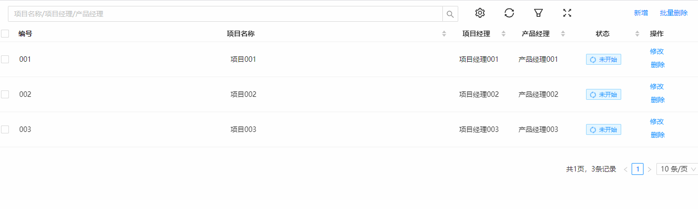

## SuperTable 超级表格
### 完整API
```tsx
interface IProps {
  /** 表格标识字段 */
	controlKey?: string
  /** Table配置,参考组件Table的API */
	tableProps: TableProps
  /** 新增功能的表单配置 */
	insertForm?: FormProps
  /** 新增功能的弹窗设置 */
	insertModal?: PopModalProps
  /** 过滤功能的表单配置 */
	filterForm?: FormProps
  /** 过滤功能的弹窗设置 */
	filterModal?: PopDrawerProps
  /** 修改功能的表单配置 */
	updateForm?: FormProps
  /** 修改功能的弹窗设置 */
	updateModal?: PopModalProps
  /** httpConfig 数据请求 */
	httpConfig?: {
		init?: () => Promise<{ data: object[], total: number }>
		delete?: (params: { checkedRows: object[] }) => Promise<boolean | string>
		search?: (params: { filterConditionMap: { [key: string]: any }, orderByMap: { [key: string]: "DESC" | "ASC" } }) => Promise<{ data: object[], total: number }>
		insert?: (params: { formData: object }) => Promise<boolean | string>
		beforeUpdate?: (params: { record: object }) => Promise<{ [key: string]: { value: any, showValue?: any } }>
		update?: (params: { formData: object, record: object }) => Promise<boolean | string>
	}
}
```
### 基本使用
```tsx
import React from 'react';
import { Tag, SuperTable, TableProps, FormProps, Input } from "zion-ui"

export const Demo = function () {
  const tableProps: TableProps = {
    columns: [
      { title: "编号", dataIndex: "key", width: 50, align: "center" },
      { title: "项目名称", dataIndex: "name", align: "center", sorter: true },
      { title: "项目经理", dataIndex: "manageName", width: 120, align: "center", sorter: true },
      { title: "产品经理", dataIndex: "productName", width: 120, align: "center", sorter: true },
      { title: "状态", dataIndex: "status", width: 150, align: "center", sorter: true, render: (text) => <Tag text={text} type="processing" /> }
    ],
    rowKey: "key",
    rowSelection: {
      show: true,
      mode: "checkbox"
    },
    header: {
      show: true,
      searchInput: {
        span: 16,
        placeholder: "项目名称/项目经理/产品经理"
      },
      customerColumns: {
        span: 1
      },
      refreshButton: {
        span: 1,
      },
      filterSetting: {
        span: 1,
      },
      fullscreenButton: {
        span: 1
      },
      headerButton: {
        span: 4,
        button: [
          { text: "新增", btnCode: "CREATE_BUTTON" },
          { text: "批量删除", btnCode: "HEADER_DELETE_BUTTON" }
        ]
      }
    },
    buttonConfig: {
      rowButton: [
        { text: "修改", btnCode: "EDIT_BUTTON" },
        { text: "删除", btnCode: "ROW_DELETE_BUTTON" },
      ]
    },
    pagination: {
      show: true
    }
  }
  const insertForm: FormProps = {
    formConfig: {
      columns: 1,
      labelCol: { span: 6 },
      wrapperCol: { span: 16 }
    },
    formItemConfig: [
      {
        field: "manageName",
        labelProps: {
          label: "项目经理",
          required: true
        },
        controlProps: {
          type: Input,
          props: {
            placeholder: "请输入"
          }
        }
      },
      {
        field: "productName",
        labelProps: {
          label: "产品经理",
          required: true
        },
        controlProps: {
          type: Input,
          props: {
            placeholder: "请输入"
          }
        }
      }
    ]
  }
  const httpConfig = {
    init: async () => {
      return {
        data: [
          { key: "001", name: "项目001", manageName: "项目经理001", productName: "产品经理001", status: "未开始" },
          { key: "002", name: "项目002", manageName: "项目经理002", productName: "产品经理002", status: "未开始" },
          { key: "003", name: "项目003", manageName: "项目经理003", productName: "产品经理003", status: "未开始" }
        ],
        total: 3
      }
    },
    insert: async ({ formData }) => {
      return true
    },
    beforeUpdate: async ({ record }) => {
      return {
        manageName: { value: record["manageName"], showValue: record["manageName"] },
        productName: { value: record["productName"], showValue: record["productName"] }
      }
    },
    update: async ({ formData }) => {
      return true
    },
    delete: async () => {
      return "删除失败了"
    },
    search: async ({ filterConditionMap, orderByMap }) => {
      return {
        data: [],
        total: 0
      }
    }
  }
  return <div>
    <SuperTable
      tableProps={tableProps}
      httpConfig={httpConfig}
      insertForm={insertForm}
      updateModal={{
        title: "修改项目名称",
        height: "200px",
        width: "550px"
      }}
      insertModal={{
        title: "新建项目",
        height: "200px",
        width: "550px"
      }}
      filterForm={insertForm}
      updateForm={insertForm} />
  </div>
}
```
