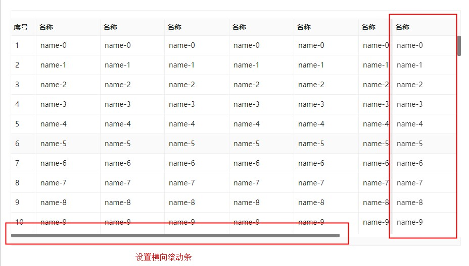
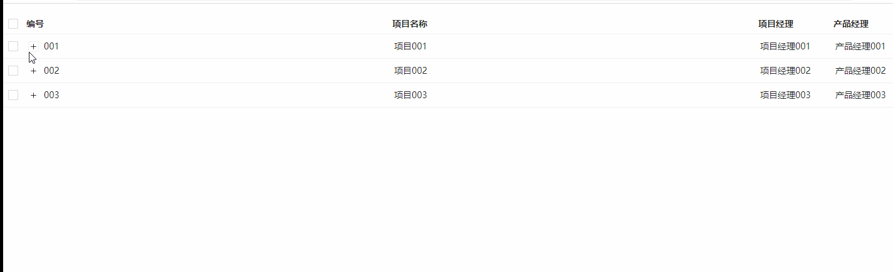

## Table 表格

### 完整 API

```tsx
interface IProps extends IBaseModel {
  /** 列配置 */
  columns?: IColumnType[];
  /** 分页配置 */
  pagination?: IPagination;
  /** 滚动条配置 */
  scroll?: IScroll;
  /** 表格size */
  size?: "small" | "middle" | "large";
  /** 表格是否全屏 */
  fullscreen?: boolean;
  /** 表头配置 */
  header?: IHeader;
  /** 是否展示边框 */
  bordered?: boolean;
  /** 表格底部配置 */
  footer?: IFooter | (() => ReactNode);
  /** 行选择功能配置 */
  rowSelection?: IRowSelection;
  /** 表格是否loading */
  loading?: boolean;
  /** 行按钮的配置 */
  buttonConfig?: IButtonConfig;
  /** 表格展开行 */
  expandedKeys?: string[];
  /** 树形表格相关的配置 */
  expandable?: {
    /** 行展开的事件回调 */
    onExpand?: (params: { expanded: boolean; record: object }) => ReactNode;
    /** 控制当前行是否可展开 */
    rowExpandable?: (params) => boolean;
  };
  /** 树形表格模式 */
  nestingMode?: "inherit" | "customer";
  /** 是否禁用 */
  disabled?: boolean;

  /** 表格数据源 */
  dataSource?: IDataSourceItem[];
  /** 数据标识字段 */
  rowKey?: string;
  /** 表格内部查询条件发生变化时触发的事件回调 */
  onChange?: (
    condition: ICondition,
    action: EAction,
    mobxState: IObservableObject
  ) => void;
  /** 数据请求相关的属性 */
  httpConfig?: IHttpConfig;
}
```

### columns 列配置

#### interface

```tsx
interface IColumnType {
  /** 控制列是否显示 */
  show?: boolean;
  /** 列头 */
  title: string | ReactNode;
  /** 列数据在数据项中对应的路径，支持通过数组查询嵌套路径 */
  dataIndex?: string | string[];
  /** 生成复杂数据的渲染函数，参数分别为当前行的值，当前行数据，行索引 */
  render?: (value, record, index) => ReactNode | null;
  /** 是否支持排序 */
  sorter?: boolean;
  /** 列宽 */
  width?: string | number;
  /** 对齐方式，默认居左对齐 */
  align?: "left" | "right" | "center";
  /** 表头列合并 */
  colSpan?: number;
}
```

#### 基本使用

```tsx
import React from "react";
import { Table } from "zion-ui";
import { HeartFilled } from "@ant-design/icons";

export const Demo = () => {
  const columns = [
    { title: "width:80px", dataIndex: "name", width: "120px" },
    { title: "居中", dataIndex: "version", align: "center" },
    { title: "居右", dataIndex: "right", align: "right" },
    { title: "所在省", dataIndex: ["city", "sheng"], sorter: true },
    { title: "所在市", dataIndex: ["city", "shi"], sorter: true },
    {
      title: (
        <span>
          籍贯
          <HeartFilled style={{ color: "red" }} />
        </span>
      ),
      dataIndex: "city",
      render: (value, record, index) => {
        return record["city"]["sheng"] + "-" + record["city"]["shi"];
      },
    },
  ];
  const dataSource = [
    {
      name: "zion",
      version: "2.0.1",
      right: "right",
      city: { sheng: "广东省", shi: "广州市" },
    },
  ];
  return (
    <div style={{ padding: "20px" }}>
      <Table columns={columns} bordered={true} dataSource={dataSource} />
    </div>
  );
};
```

- 效果图
  

### pagination 分配配置

#### interface

```tsx
// 分页器配置
interface IPagination {
  /** 是否展示分页 */
  show?: boolean;
  /** 当前页码 */
  page?: number;
  /** 每页展示数量 */
  pageSize?: number;
  /** 总数 */
  total?: number;
  /** 是否异步，默认是 true */
  isAsync?: boolean;
  /** 是否支持快速跳转到指定页码 */
  showQuickJumper?: boolean;
  /** 是否展示总数 */
  showTotal?: boolean | string | ReactNode;
  /** 是否支持切换每页展示数量 */
  showSizeChanger?: boolean;
  /** 是否显示简易模式 */
  simple?: boolean;
}
```

#### 注意事项

> 切换页码或者切换每页显示数量，会触发 httpConfig.onSearch 和 onChange 两个方法
>
> 一般在 httpConfig.onSearch 中捕获表格请求参数的变化

#### 基本使用

```tsx
import React from "react";
import { Table } from "zion-ui";

export const Demo = () => {
  const columns = [
    { title: "序号", width: "50px", render: (text, record, index) => ++index },
    { title: "名称", dataIndex: "name" },
  ];
  const dataSource = new Array(100)
    .fill("")
    .map((item, index) => ({ name: "name-" + index }));
  return (
    <div style={{ padding: "20px" }}>
      <Table
        columns={columns as any}
        bordered={true}
        pagination={{ show: true }}
        dataSource={dataSource}
      />
    </div>
  );
};
```


#### 简易模式

```tsx
import React from "react";
import { Table } from "zion-ui";

export const Demo = () => {
  const columns = [
    { title: "序号", width: "50px", render: (text, record, index) => ++index },
    { title: "名称", dataIndex: "name" },
  ];
  const dataSource = new Array(100)
    .fill("")
    .map((item, index) => ({ name: "name-" + index }));
  return (
    <div style={{ padding: "20px" }}>
      <Table
        columns={columns as any}
        bordered={true}
        pagination={{ show: true, simple: true }}
        dataSource={dataSource}
      />
    </div>
  );
};
```


#### 指定每页展示数量

```tsx
import React from "react";
import { Table } from "zion-ui";

export const Demo = () => {
  const columns = [
    { title: "序号", width: "50px", render: (text, record, index) => ++index },
    { title: "名称", dataIndex: "name" },
  ];
  const dataSource = new Array(100)
    .fill("")
    .map((item, index) => ({ name: "name-" + index }));
  return (
    <div style={{ padding: "20px" }}>
      <Table
        columns={columns as any}
        bordered={true}
        pagination={{ show: true, pageSize: 5, showSizeChanger: false }}
        dataSource={dataSource}
      />
    </div>
  );
};
```


### scroll 配置

#### interface

```tsx
interface IScroll {
  x?: number;
  y?: number;
}
```

#### 固定高度

```tsx
import React from "react";
import { Table } from "zion-ui";

export const Demo = () => {
  const columns = [
    { title: "序号", width: "50px", render: (text, record, index) => ++index },
    { title: "名称", dataIndex: "name" },
  ];
  const dataSource = new Array(100)
    .fill("")
    .map((item, index) => ({ name: "name-" + index }));
  return (
    <div style={{ padding: "20px" }}>
      <Table
        columns={columns as any}
        bordered={true}
        scroll={{ y: 400 }}
        pagination={{ show: false }}
        dataSource={dataSource}
      />
    </div>
  );
};
```


#### 自动计算高度

```tsx
import React from "react";
import { Table } from "zion-ui";

export const Demo = () => {
  const columns = [
    { title: "序号", width: "50px", render: (text, record, index) => ++index },
    { title: "名称", dataIndex: "name" },
  ];
  const dataSource = new Array(100)
    .fill("")
    .map((item, index) => ({ name: "name-" + index }));
  return (
    <div style={{ padding: "20px" }}>
      <Table
        columns={columns as any}
        bordered={true}
        scroll={{ y: document.body.clientHeight - 200 }}
        pagination={{ show: false }}
        dataSource={dataSource}
      />
    </div>
  );
};
```


#### 横向滚动

```tsx
import React from "react";
import { Table } from "zion-ui";

export const Demo = () => {
  const columns = [
    { title: "序号", width: "50px", render: (text, record, index) => ++index },
    { title: "名称", dataIndex: "name" },
    { title: "名称", dataIndex: "name" },
    { title: "名称", dataIndex: "name" },
    { title: "名称", dataIndex: "name" },
    { title: "名称", dataIndex: "name" },
    { title: "名称", dataIndex: "name" },
    { title: "名称", dataIndex: "name" },
    { title: "名称", dataIndex: "name" },
    { title: "名称", dataIndex: "name", fixed: "right" },
  ];
  const dataSource = new Array(100)
    .fill("")
    .map((item, index) => ({ name: "name-" + index }));
  return (
    <div style={{ padding: "20px" }}>
      <Table
        columns={columns as any}
        bordered={true}
        scroll={{ x: 1200, y: 400 }}
        pagination={{ show: false }}
        dataSource={dataSource}
      />
    </div>
  );
};
```



### buttonConfig 行按钮

#### interface

```tsx
interface IButtonConfig {
  /**  */
  maxRowButton?: number;
  /** 按钮对齐方式,默认居左对齐  */
  align?: "center" | "left" | "right";
  /** 列宽 */
  width?: number | string;
  /** 按钮配置 */
  rowButton?: {
    /** 按钮类型 */
    btnCode?: EButtonCode;
    /** 按钮文本名 */
    text?: string | ReactNode;
    /** 颜色 */
    color?: string;
    /** 根据当前行的数据控制按钮是否显示 */
    isRender?: (record: object) => boolean;
    /** 点击事件 */
    onClick?: (params: {
      record: object;
      index: number;
      btnCode?: EButtonCode;
    }) => void;
    /** 是否展示按钮，如果为 false 则不展示，默认伟true */
    show?: boolean;
  }[];
}

/** 按钮可选类型 */
type EButtonCode =
  | "HEADER_DELETE_BUTTON" // 批量删除按钮
  | "ROW_DELETE_BUTTON"    // 删除按钮
  | "EXPORT_BUTTON"        // 导出按钮
  | "IMPORT_BUTTON"        // 导入按钮
  | "HEART_BUTTON"
  | "CREATE_BUTTON"        // 新建按钮
  | "DOWNLOAD_BUTTON"
  | "EDIT_BUTTON"          // 编辑按钮
  | "SETTING_BUTTON";
```

#### 注意事项

> 使用按钮类型配置 btnCode，会触发 httpConfig 的相应事件

#### 基本使用
```tsx
import React from "react"
import { Table } from "zion-ui"

export const Demo = () => {
  const columns = [
    { title: "序号", width: "50px", render: (text, record, index) => ++index },
    { title: "名称", dataIndex: "name" },
    { title: "名称", dataIndex: "name" },
    { title: "名称", dataIndex: "name" },
    { title: "名称", dataIndex: "name" },
    { title: "名称", dataIndex: "name" },
    { title: "名称", dataIndex: "name" },
    { title: "名称", dataIndex: "name" },
    { title: "名称", dataIndex: "name" },
    { title: "名称", dataIndex: "name", fixed: "right" }
  ]
  const dataSource = new Array(100).fill("").map((item, index) => ({ name: "name-" + index }))
  const buttonConfig = {
    rowButton: [
      {
        text: "编辑",
        btnCode: "EDIT_BUTTON",
        onClick: function ({ record }) {
          console.log(record)
        }
      },
      {
        text: "流转",
        btnCode: "IMPORT_BUTTON",
        onClick: function ({ record }) {
          console.log(record)
        }
      }
    ]
  }
  return <div style={{ padding: "20px" }}>
    <Table
      columns={columns as any}
      bordered={true}
      scroll={{ x: 1200, y: 400 }}
      pagination={{ show: false }}
      dataSource={dataSource}
      buttonConfig={buttonConfig as any}
    />
  </div>
}
```


```tsx
import React from "react";
import { Table } from "zion-ui";
import { FormOutlined } from "@ant-design/icons";

export const Demo = () => {
  const columns = [
    { title: "编号", dataIndex: "key", width: 50, align: "center" },
    { title: "项目名称", dataIndex: "name", align: "center" },
    { title: "项目经理", dataIndex: "manageName", width: 120, align: "center" },
    { title: "产品经理", dataIndex: "productName", width: 120, align: "center" },
    { title: "状态", dataIndex: "status", width: 150, align: "center" }
  ];
  const dataSource = [
    { key: "001", name: "项目001", manageName: "项目经理001", productName: "产品经理001", status: "未开始" },
    { key: "002", name: "项目002", manageName: "项目经理002", productName: "产品经理002", status: "未开始" },
    { key: "003", name: "项目003", manageName: "项目经理003", productName: "产品经理003", status: "未开始" }
  ];
  const buttonConfig = {
    width: "300px",
    align: "center",
    rowButton: [
      {
        text: "删除",
        btnCode: "ROW_DELETE_BUTTON",
        color: "red",
      },
      {
        text: "其他",
        color: "blue",
        onClick: () => {
          alert("点击了其他按钮");
        },
      },
    ],
  };
  return (
    <div style={{ padding: "20px" }}>
      <Table
        columns={columns}
        bordered={true}
        dataSource={dataSource}
        buttonConfig={buttonConfig}
      />
    </div>
  );
};
```


### header 表头

#### interface

```tsx
/** 表头配置 */
interface IHeader {
  /** 是否显示表头 */
  show?: boolean;
  /** 是否只显示搜索面板 */
  onlySearch?: boolean;
  /** 布局配置，显示顺序：标题 + 搜索框 + 表头按钮 + 全屏按钮 + 设置展示列按钮, 如[6,6,6,6,0],0表示不显示 */
  layout?: number[];
  render?: () => ReactNode;
  /** 表头标题 */
  title?: {
    content?: ReactNode | string;
    render?: () => ReactNode;
    span?: number;
  };
  /** 搜索框 */
  searchInput?: {
    span?: number;
    placeholder?: string;
  };
  /** 表头按钮配置 */
  headerButton?: {
    /** 列宽 */
    span?: number;
    button?: {
      text?: string;
      color?: string;
      btnCode?: EButtonCode;
      onClick?: (params: {
        checkedRows: object[];
        btnCode: EButtonCode;
      }) => void;
      show?: boolean; // 是否展示按钮，如果为 false 则不展示
    }[];
  };
  /** 刷新按钮 */
  refreshButton?: {
    span?: number;
    onClick?: () => void;
  };
  /** 全屏按钮 */
  fullscreenButton?: {
    span?: number;
  };
  /** 筛选按钮 */
  filterSetting?: {
    span?: number;
    onClick?: (mobxState: IObservableObject) => void;
  };
  /** 展示列设置按钮 */
  customerColumns?: {
    span?: number;
  };
}
```
#### headerButton使用
```tsx
import React from "react";
import { Table } from "zion-ui";

export const Demo = () => {
    const columns = [
        { title: "编号", dataIndex: "key", width: 50, align: "center" },
        { title: "项目名称", dataIndex: "name", align: "center" },
        { title: "项目经理", dataIndex: "manageName", width: 120, align: "center" },
        { title: "产品经理", dataIndex: "productName", width: 120, align: "center" },
        { title: "状态", dataIndex: "status", width: 150, align: "center" }
    ];
    const dataSource = [
        { key: "001", name: "项目001", manageName: "项目经理001", productName: "产品经理001", status: "未开始" },
        { key: "002", name: "项目002", manageName: "项目经理002", productName: "产品经理002", status: "未开始" },
        { key: "003", name: "项目003", manageName: "项目经理003", productName: "产品经理003", status: "未开始" }
    ];
    const header = {
        show: true,
        title: {
            span: 16,
            content: "项目列表标题"
        },
        headerButton: {
            span: 8,
            button: [
                { text: "新建", btnCode: "CREATE_BUTTON" },
                { text: "导出", btnCode: "EXPORT_BUTTON" },
            ]
        }
    }
    return (
        <div style={{ padding: "20px" }}>
            <Table columns={columns} bordered={true} dataSource={dataSource} header={header} />
        </div>
    );
};

```


#### 图标按钮使用
```tsx
import React from "react";
import { Table } from "zion-ui";

export const Demo = () => {
    const columns = [
        { title: "编号", dataIndex: "key", width: 50, align: "center" },
        { title: "项目名称", dataIndex: "name", align: "center" },
        { title: "项目经理", dataIndex: "manageName", width: 120, align: "center" },
        { title: "产品经理", dataIndex: "productName", width: 120, align: "center" },
        { title: "状态", dataIndex: "status", width: 150, align: "center" }
    ];
    const dataSource = [
        { key: "001", name: "项目001", manageName: "项目经理001", productName: "产品经理001", status: "未开始" },
        { key: "002", name: "项目002", manageName: "项目经理002", productName: "产品经理002", status: "未开始" },
        { key: "003", name: "项目003", manageName: "项目经理003", productName: "产品经理003", status: "未开始" }
    ];
    const header = {
        show: true,
        searchInput: { span: 16, placeholder: '请输入关键字' },
        refreshButton: { span: 1, },
        fullscreenButton: { span: 1 },
        filterSetting: { span: 1 },
        customerColumns: { span: 1 }
    }
    return (
        <div style={{ padding: "20px" }}>
            <Table columns={columns} bordered={true} dataSource={dataSource} header={header} />
        </div>
    );
};
```

### footer 表格底部
#### interface
```tsx
/** 页脚配置，用于展示选中的数据 */
interface IFooter {
    /** 是否展示页脚 */
	show?: boolean
    /** 标识 */
	key: string
    /** 显示的标签名 */
	label: string
    /** 是否允许列表显示 */
	allowShowList?: boolean
    /** 自定义渲染 */
	render?: (data: { record: object }) => string
}
```
#### 基本使用
```tsx
import React from "react";
import { Table } from "zion-ui";

export const Demo = () => {
    const columns = [
        { title: "编号", dataIndex: "key", width: 50, align: "center" },
        { title: "项目名称", dataIndex: "name", align: "center" },
        { title: "项目经理", dataIndex: "manageName", width: 120, align: "center" },
        { title: "产品经理", dataIndex: "productName", width: 120, align: "center" },
        { title: "状态", dataIndex: "status", width: 150, align: "center" }
    ];
    const dataSource = [
        { key: "001", name: "项目001", manageName: "项目经理001", productName: "产品经理001", status: "未开始" },
        { key: "002", name: "项目002", manageName: "项目经理002", productName: "产品经理002", status: "未开始" },
        { key: "003", name: "项目003", manageName: "项目经理003", productName: "产品经理003", status: "未开始" }
    ];
    const rowSelection = {
        show: true
    }
    const footer = {
        show: true,
        key: "key",
        label: "name",
        allowShowList: true,
        render: (({ record }) => "项目名称:" + record["name"])
    }
    return (
        <div style={{ padding: "20px" }}>
            <Table columns={columns} rowKey={"key"} bordered={true} dataSource={dataSource} rowSelection={rowSelection} footer={footer} />
        </div>
    );
};
```

### httpConfig 数据请求
#### interface
```tsx
/** http请求相关的配置 */
interface IHttpConfig {
    /** 初始化设置 */
	init?: (params?: { checkedKeys?: string[], rowKey?: string }, 
        mobxState?: IObservableObject) => Promise<{ data: object[], total: number, checkedRows?: object[] | [] }>
    /** 查询，search与onSearch等价 */
	search?: (params: { condition: ICondition, action: EAction }, 
        mobxState: IObservableObject) => Promise<{ data: object[], total: number }>
	onSearch?: (params: { condition: ICondition, action: EAction }, 
        mobxState: IObservableObject) => Promise<{ data: object[], total: number }>
    /** 删除 */
	delete?: (params: { checkedRows: object[] }, 
        mobxState: IObservableObject) => Promise<{ result: boolean, message?: string }>
    /** 树形表展开设置，expand与onExpand等价 */
	expand?: (params: { expanded: boolean, record: object }, 
        mobxState: IObservableObject) => Promise<IDataSourceItem[]>
	onExpand?: (params: { expanded: boolean, record: object }, 
        mobxState: IObservableObject) => Promise<IDataSourceItem[]>
}
```
#### 注意事项
> delete
> 1.表头按钮中 btnCode 为: HEADER_DELETE_BUTTON 会触发 httpConfig.delete
> 2.行按钮中 btnCode 为: ROW_DELETE_BUTTON 会触发 httpConfig.delete 
>
> onSearch
> 1.表头搜索按钮点击回车时触发，action: CHANGE_SEARCHVALUE_002
> 2.点击表头刷新按钮时触发，action: BUTTON_REFRESH
> 3.切换页码时触发, action: CHANGE_PAGE
> 4.切换每页显示数量时触发，action: CHANGE_PAGESIZE
> 5.切换列头排序时触发，action: CHANGE_ORDERBY
#### init与delete示例
```tsx
import React from "react";
import { Table, StateManage } from "zion-ui";

export const Demo = () => {
    const [tableState, Tpl] = Table({
        columns: [
            { title: "编号", dataIndex: "key", width: 50, align: "center" },
            { title: "项目名称", dataIndex: "name", align: "center" },
            { title: "项目经理", dataIndex: "manageName", width: 120, align: "center" },
            { title: "产品经理", dataIndex: "productName", width: 120, align: "center" },
            { title: "状态", dataIndex: "status", width: 150, align: "center" }
        ],
        rowKey: "key",
        rowSelection: {
            show: true,
            mode: "checkbox"
        },
        header: {
            show: true,
            title: {
                span: 20,
                content: " "
            },
            headerButton: {
                span: 4,
                button: [
                    {
                        text: "批量删除",
                        btnCode: "HEADER_DELETE_BUTTON"
                    }
                ]
            }
        },
        buttonConfig: {
            rowButton: [
                {
                    text: "删除",
                    color: "red",
                    btnCode: "ROW_DELETE_BUTTON"
                }
            ]
        },
        httpConfig: {
            init: async () => {
                return {
                    data: [
                        { key: "001", name: "项目001", manageName: "项目经理001", productName: "产品经理001", status: "未开始" },
                        { key: "002", name: "项目002", manageName: "项目经理002", productName: "产品经理002", status: "未开始" },
                        { key: "003", name: "项目003", manageName: "项目经理003", productName: "产品经理003", status: "未开始" },
                        { key: "004", name: "项目004", manageName: "项目经理004", productName: "产品经理004", status: "未开始" }
                    ],
                    total: 4
                }
            },
            delete: async ({ checkedRows }) => {
                const keys = checkedRows.map(item => item["key"])
                let { dataSource } = StateManage.get(tableState)
                dataSource = dataSource.filter(data => keys.includes(data["key"]) == false)
                StateManage.set(tableState, { loading: true })
                return new Promise((resolve) => {
                    const timer = setTimeout(() => {
                        clearTimeout(timer)
                        StateManage.set(tableState, { dataSource, loading: false })
                        resolve({
                            result: true,
                            message: "删除成功"
                        })
                    }, 800)
                })
            }
        }
    }, false)
    return (
        <div style={{ padding: "20px" }}>
            <Tpl />
        </div>
    );
};
```

#### onSearch示例
```tsx
import React from "react";
import { Table, StateManage, TableProps } from "zion-ui";

export const Demo = () => {
    const getDataSource = function ({ count }) {
        const dataSource: any = []
        while (count-- > 0) {
            dataSource.push({
                key: "key-" + count,
                name: "项目" + count,
                manageName: "项目经理" + count,
                productName: "产品经理" + count,
                status: "未开始"
            })
        }
        return dataSource
    }
    const controlKey = "Table.Pro.Demo006"
    const tableProps: TableProps = {
        controlKey,
        columns: [
            { title: "编号", dataIndex: "key", width: 100, align: "center" },
            { title: "项目名称", dataIndex: "name", align: "center" },
            { title: "项目经理", dataIndex: "manageName", width: 120, align: "center" },
            { title: "产品经理", dataIndex: "productName", width: 120, align: "center" },
            { title: "状态", dataIndex: "status", width: 150, align: "center" }
        ],
        rowKey: "key",
        dataSource: getDataSource({ count: 23 }),
        pagination: { show: true, pageSize: 10 },
        header: {
            show: true,
            searchInput: {
                span: 20
            },
            refreshButton: {
                span: 4
            }
        },
        httpConfig: {
            onSearch: async ({ condition, action }) => {
                console.log(action)
                const { filterConditionMap } = condition
                const searchValue = filterConditionMap["@searchValue"]
                let dataSource = StateManage.get(controlKey, "dataSource")
                return new Promise((resolve) => {
                    const timer = setTimeout(() => {
                        clearTimeout(timer)
                        if (!searchValue) {
                            resolve({
                                data: getDataSource({ count: 23 }),
                                total: 23
                            })
                        } else {
                            let newDataSource = dataSource.filter(
                                data => {
                                    return data["name"].indexOf(searchValue) > -1 || data["manageName"].indexOf(searchValue) > -1 || data["productName"].indexOf(searchValue) > -1
                                })
                            resolve({
                                data: newDataSource,
                                total: newDataSource.length
                            })
                        }
                    }, 800)
                })
            }
        }
    }
    return (
        <div style={{ padding: "20px" }}>
            <Table {...tableProps} />
        </div>
    );
};
```

### rowSelection 行选择
#### interface
```tsx
interface IRowSelection {
    /** 是否可选 */
	show?: boolean
    /** 选择模式 单选 | 多选（默认） */
	mode?: "radio" | "checkbox"
    /** 选中的key值 */
	checkedKeys?: string[] | number[]
    /** 选中的行 */
	checkedRows?: object[]
    /** 选中的标签 */
	checkedTags?: IFooter[]
    /** 点击事件 */
	onClick?: (data: { currentRow: object, index: number, checkedKeys: string[] | number[], checkedRows: object[], checkedTags: object[] }) => void
    /** 排序事件 */
	onSort?: () => void
}
```
#### 基本使用
```tsx
import React from "react";
import { Table, TableProps } from "zion-ui";

export const Demo = () => {
    const getDataSource = function ({ count }) {
        const dataSource: any = []
        while (count-- > 0) {
            dataSource.push({
                key: "key-" + count,
                name: "项目" + count,
                manageName: "项目经理" + count,
                productName: "产品经理" + count,
                status: "未开始"
            })
        }
        return dataSource
    }
    const controlKey = "Table.Pro.Demo007"
    const tableProps: TableProps = {
        controlKey,
        columns: [
            { title: "编号", dataIndex: "key", width: 100, align: "center" },
            { title: "项目名称", dataIndex: "name", align: "center" },
            { title: "项目经理", dataIndex: "manageName", width: 120, align: "center" },
            { title: "产品经理", dataIndex: "productName", width: 120, align: "center" },
            { title: "状态", dataIndex: "status", width: 150, align: "center" }
        ],
        rowKey: "key",
        dataSource: getDataSource({ count: 23 }),
        pagination: { show: true, pageSize: 10 },
        footer: {
            show: true,
            key: "key",
            label: "name"
        },
        rowSelection: {
            show: true,
            mode: "radio",
            onClick: (data) => {
                console.log('data==>', data)
            }
        },
    }
    return (
        <div style={{ padding: "20px" }}>
            <Table {...tableProps} />
        </div>
    );
};
```

### 树形表格
#### interface
```tsx
interface IProps extends IBaseModel {
    /** 表格展开行 */
    expandedKeys?: string[];
    /** 树形表格相关的配置 */
    expandable?: {
        /** 行展开的事件回调 */
        onExpand?: (params: { expanded: boolean; record: object }) => ReactNode;
        /** 控制当前行是否可展开 */
        rowExpandable?: (params) => boolean;
    };
    /** 树形表格模式：  继承 | 自定义 */
    nestingMode?: "inherit" | "customer";
    /** 数据请求 */
    httpConfig.onExpand?: (params: { expanded: boolean, record: object }, mobxState: IObservableObject) => Promise<IDataSourceItem[]>
}
```
#### 注意事项
> 树形表格模式
> 1.继承模式 ==> 子表格的列和父表格一样
>    --通过 `httpConfig.onExpand` 获取子表格的数据，通过控制数据源的 children 字段(有无该字段)决定当前行是否可展开
>
> 2.自定义模式 ==> 子表格的列和父表格不一样
>    --展开时调用 `expandable.onExpand` 返回自定义渲染的组件, 如果使用该模式，需确保dataSource数据源中的数据没有 children 字段, 通过expandable.rowExpandable 决定当前行是否可展开
#### 继承模式
```tsx
import React from 'react';
import { Table, TableProps } from "zion-ui"

export const Demo = function () {
    const getChildren = function ({ pid }) {
        const item: any = { key: "001" + "-" + pid, name: "项目001", manageName: "项目经理001", productName: "产品经理001" }
        if (pid.length <= 8) {
            item.children = []
        }
        return [item]
    }
    const tableProps: TableProps = {
        columns: [
            { title: "编号", dataIndex: "key" },
            { title: "项目名称", dataIndex: "name" },
            { title: "项目经理", dataIndex: "manageName", width: 120 },
            { title: "产品经理", dataIndex: "productName", width: 120 }
        ],
        rowSelection: {
            show: true,
            mode: "checkbox",
        },
        expandable: {
            rowExpandable: (record) => record["key"].length <= 8
        },
        bordered: false,
        rowKey: "key",
        nestingMode: "inherit",
        dataSource: [
            { key: "001", name: "项目001", manageName: "项目经理001", productName: "产品经理001", children: [] },
            { key: "002", name: "项目002", manageName: "项目经理002", productName: "产品经理002", children: [] },
            { key: "003", name: "项目003", manageName: "项目经理003", productName: "产品经理003", children: [] }
        ],
        httpConfig: {
            onExpand: async ({ record }) => {
                return getChildren({ pid: record["key"] })
            }
        }
    }
    return <div>
        <Table {...tableProps} />
    </div>
}
```

#### 自定义模式
```tsx
import React from 'react';
import { Table, TableProps } from "zion-ui";
import { Row, Col } from "antd";

const InnerTable = function () {
    const tableProps: TableProps = {
        columns: [
            { title: "编号", dataIndex: "key", width: 100 },
            { title: "bug标题", dataIndex: "name" },
            { title: "bug处理人", dataIndex: "user", width: 120 },
        ],
        dataSource: [
            { key: "001", name: "bug001", user: "zion" },
            { key: "002", name: "bug002", user: "zion" },
            { key: "003", name: "bug003", user: "zion" }
        ],
    }
    return <Table {...tableProps} />
}

export const Demo = function () {
    const tableProps: TableProps = {
        columns: [
            { title: "编号", dataIndex: "key" },
            { title: "项目名称", dataIndex: "name" },
            { title: "项目经理", dataIndex: "manageName", width: 120 },
            { title: "产品经理", dataIndex: "productName", width: 120 }
        ],
        expandable: {
            rowExpandable: (record) => record["key"].length <= 8,
            onExpand: (params) => <Row style={{ padding: "10px 20px" }}>
                <Col span={11}><InnerTable /></Col>
                <Col span={2}></Col>
                <Col span={11}><InnerTable /></Col>
            </Row>
        },
        rowSelection: {
            show: true,
            mode: "checkbox",
        },
        bordered: false,
        rowKey: "key",
        nestingMode: "customer",
        dataSource: [
            { key: "001", name: "项目001", manageName: "项目经理001", productName: "产品经理001" },
            { key: "002", name: "项目002", manageName: "项目经理002", productName: "产品经理002" },
            { key: "003", name: "项目003", manageName: "项目经理003", productName: "产品经理003" }
        ],
    }
    return <div>
        <Table {...tableProps} />
    </div>
}
```

### 行合并

### 列合并

### 其他

#### 是否展示边框
##### interface
```tsx
interface IProps extends IBaseModel {
    /** 是否展示边框 */
    bordered?: boolean;
}
```
##### 基本使用
```tsx
import React from 'react';
import { Table } from "zion-ui"

export const Demo = function () {
    const Tpl = Table({
        columns: [
            { title: "编号", dataIndex: "key", width: 50, align: "center" },
            { title: "项目名称", dataIndex: "name", align: "center" },
            { title: "项目经理", dataIndex: "manageName", width: 120, align: "center" },
            { title: "产品经理", dataIndex: "productName", width: 120, align: "center" },
            { title: "状态", dataIndex: "status", width: 150, align: "center" }
        ],
        rowKey: "key",
        dataSource: [
            { key: "001", name: "项目001", manageName: "项目经理001", productName: "产品经理001", status: "未开始" },
            { key: "002", name: "项目002", manageName: "项目经理002", productName: "产品经理002", status: "未开始" },
            { key: "003", name: "项目003", manageName: "项目经理003", productName: "产品经理003", status: "未开始" }
        ],
        bordered: false
        // bordered: true
    }, true)
    return <div>
        <Tpl />
    </div>
}
```


#### 是否禁用
##### interface
```tsx
interface IProps extends IBaseModel {
    /** 是否禁用 */
    disabled?: boolean;
}
```
##### 基本使用
```tsx
import React from 'react';
import { Table } from "zion-ui"

export const Demo = function () {
    const Tpl = Table({
        columns: [
            { title: "编号", dataIndex: "key", width: 50, align: "center" },
            { title: "项目名称", dataIndex: "name", align: "center" },
            { title: "项目经理", dataIndex: "manageName", width: 120, align: "center" },
            { title: "产品经理", dataIndex: "productName", width: 120, align: "center" },
            { title: "状态", dataIndex: "status", width: 150, align: "center" }
        ],
        rowKey: "key",
        dataSource: [
            { key: "001", name: "项目001", manageName: "项目经理001", productName: "产品经理001", status: "未开始" },
            { key: "002", name: "项目002", manageName: "项目经理002", productName: "产品经理002", status: "未开始" },
            { key: "003", name: "项目003", manageName: "项目经理003", productName: "产品经理003", status: "未开始" }
        ],
        // disabled: true
        disabled: false
    }, true)
    return <div>
        <Tpl />
    </div>
}
```


#### 是否 loading
##### interface
```tsx
interface IProps extends IBaseModel {
    /** 表格是否loading */
    loading?: boolean;
}
```
##### 基本使用
```tsx
import React from 'react';
import { Table } from "zion-ui"

export const Demo = function () {
    const Tpl = Table({
        columns: [
            { title: "编号", dataIndex: "key", width: 50, align: "center" },
            { title: "项目名称", dataIndex: "name", align: "center" },
            { title: "项目经理", dataIndex: "manageName", width: 120, align: "center" },
            { title: "产品经理", dataIndex: "productName", width: 120, align: "center" },
            { title: "状态", dataIndex: "status", width: 150, align: "center" }
        ],
        rowKey: "key",
        dataSource: [
            { key: "001", name: "项目001", manageName: "项目经理001", productName: "产品经理001", status: "未开始" },
            { key: "002", name: "项目002", manageName: "项目经理002", productName: "产品经理002", status: "未开始" },
            { key: "003", name: "项目003", manageName: "项目经理003", productName: "产品经理003", status: "未开始" }
        ],
        loading: true
    }, true)
    return <div>
        <Tpl />
    </div>
}
```

#### 是否全屏
##### interface
```tsx
interface IProps extends IBaseModel {
    /** 表格是否全屏 */
    fullscreen?: boolean;
}
```
##### 基本使用
```tsx

```


#### 表格尺寸

#### onChange 事件
##### interface
```tsx
interface IProps extends IBaseModel {
    /** 表格内部查询条件发生变化时触发的事件回调 */
    onChange?: (
        condition: ICondition,
        action: EAction,
        mobxState: IObservableObject
    ) => void;
}

/** 表格内部交互产生的查询条件 */
interface ICondition {
	filterConditionMap: {
		[field: string]: {
			value: any
			showValue: any
		}
	}
	filterConditon: {
		filed: string,
		value: any
	}[],
	orderByMap: {
		[key: string]: "DESC" | "ASC"
	}
	orderBy: {
		filed: string,
		order: string
	}[]
}

/** 表格内部交互的枚举值定义 */
enum EAction {
	"CHANGE_ORDERBY" = "CHANGE_ORDERBY",
	"CHANGE_PAGESIZE" = "CHANGE_PAGESIZE",
	"CHANGE_PAGE" = "CHANGE_PAGE",
	"CHANGE_SEARCHVALUE_001" = "CHANGE_SEARCHVALUE_001",
	"CHANGE_SEARCHVALUE_002" = "CHANGE_SEARCHVALUE_002",
	"BUTTON_REFRESH" = "BUTTON_REFRESH",
}
```
