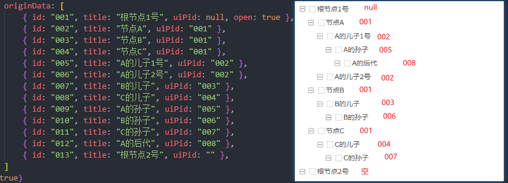
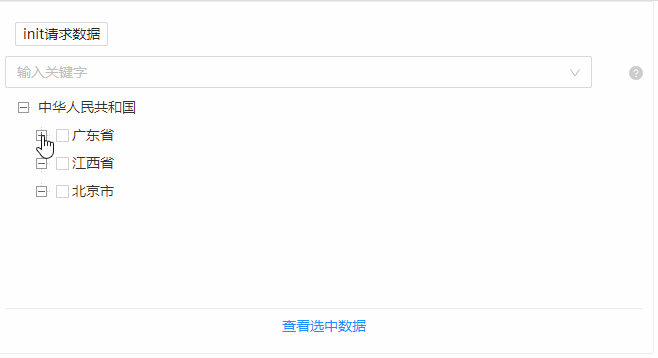
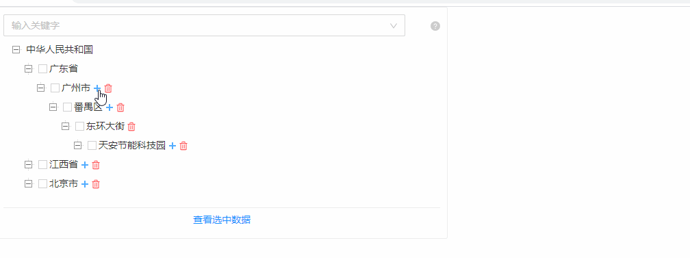

## Tree 树

### 完整API
```tsx
interface IProps {
	/** 树的高度 */
	height?: number
    /** 模式选择 */
	mode?: {
        /** 是否为单选 */
		isRadio?: boolean
        /** 兄弟节点是否单选 */
		radioBrothers?: boolean
        /** 是否异步 */
		isAsync?: boolean
	}
    /** 是否禁用 */
	disabled?: boolean
    /** 结点是否可拖拽 */
	draggable?: boolean
    /** 是否展示底部（查看选中数据框） */
	showFooter?: boolean

	positionKey?: string
    /** 是否允许查询 */
	allowSearch?: boolean
	/** 树标识字段 */
	controlKey?: string
    /** 树数据源 */
	originData?: TreeNodeData[]
	/** 数据请求相关的属性 */
	httpConfig?: {
		init?: () => Promise<TreeNodeData[]>
		onSearch?: (searchValue: string) => Promise<{ key: string, label: string, [key: string]: any }[]>
		onSelectOption?: (option: { key: string, label: string, [key: string]: any }) => Promise<TreeNodeData[]>
		onExpand?: (treeNode: object) => Promise<TreeNodeData[]>
	}
	/** 事件回调 */
	// 事件属性
	callbackConfig?: {
		onState?: (data: ICallbackData, eventType: EventType) => void
		/** 树内部拖拽，调整树节点的位置 */
		onDrop?: (data: { dragNode: object, dropNode: object, dropPosition: "inner" | "up" | "down" }) => Promise<boolean>
		/** 树外部拖拽，将树节点拖动到其他任何地方 */
		onDrop2?: (data: { ev, dragNode: object }) => void
		onDragStart?: (data: { ev, dragNode: object }) => void
		onDragMove?: (data: { ev, dragNode: object }) => void
	}
    /** 图标 */
	iconCallback?: {
		[key: string]: (treeNode: object) => void
	}
}
```

### 基本使用

#### 数据源格式

> uiPid 为 `null` 或为 `空` 或 `不规范` 时，为根节点
> 根节点下的第一层节点uiPid为 `001`，兄弟结点的uiPid相同
> 根节点下的第一层的第一个节点A，该A节点的子节点uiPid为 `002`,若存在根节点下的第一层的第二个节点B,B的子字节uiPid为 `003`，若存在节点C以此类推，直到同层节点为空为止

示例一

示例二

#### httpConfig 数据请求
##### API
```tsx
httpConfig?: {
    /** 初始化设置 */
    init?: () => Promise<TreeNodeData[]>
    onSearch?: (searchValue: string) => Promise<{ key: string, label: string, [key: string]: any }[]>
    onSelectOption?: (option: { key: string, label: string, [key: string]: any }) => Promise<TreeNodeData[]>
    onExpand?: (treeNode: object) => Promise<TreeNodeData[]>
	}
```
##### init 初始化
```tsx
import React from 'react';
import { Tree, Button, StateManage } from "zion-ui";
import { Row, Col } from "antd";

export const Demo = function () {
    const controlKey = "TreeBaseDemo003"
    const TestTree = Tree({
        controlKey: controlKey,
        showFooter: true,
        mode: { isRadio: false, radioBrothers: true },
        height: 300,
        httpConfig: {
            init: async () => {
                // 返回接口查询的数据
                return new Promise((resolve) => {
                    setTimeout(() => {
                        const originData = [
                            { id: "001", title: "中华人民共和国", nocheck: true, uiPid: null, open: true },  // 展开该节点
                            { id: "002", title: "广东省", uiPid: "001" },
                            { id: "003", title: "江西省", uiPid: "001" },
                            { id: "004", title: "北京市", uiPid: "001" },
                            { id: "005", title: "广州市", uiPid: "002" },
                            { id: "006", title: "番禺区", uiPid: "005" },
                            { id: "007", title: "东环大街", uiPid: "006" },
                            { id: "008", title: "天安节能科技园", uiPid: "007" },
                            { id: "009", title: "千千氏", uiPid: "008", disabled: true },
                            { id: "010", title: "四季沐足", uiPid: "008", nocheck: true }
                        ]
                        resolve(originData)
                    }, 800)
                })
            }
        }
    }, true)
    return <Row>
        <Col span={11} style={{ width: "300px", border: "1px solid #eee", padding: "10px", borderRadius: "3px" }}>
            <Button text="init请求数据" size="small" style={{ margin: "10px" }} onClick={() => {
                const { init } = StateManage.get(controlKey)
                init()
            }} />
            <TestTree />
        </Col>
    </Row>
}
```

##### onSearch与onExpand示例
```tsx
import React from 'react';
import { Tree } from "zion-ui";
import { Row, Col } from "antd";

export const Demo = function () {
    const DisabledTree = Tree({
        height: 400,
        mode: { isRadio: false, isAsync: true },
        originData: [
            { id: "001", title: "中华人民共和国", nocheck: true, uiPid: null },  // 展开该节点
            { id: "002", title: "广东省", nocheck: true, uiPid: "001" },
            { id: "003", title: "江西省", uiPid: "001" },
            { id: "004", title: "北京市", uiPid: "001" },
            { id: "005", title: "广州市", uiPid: "002" },
            { id: "006", title: "番禺区", uiPid: "005" },
            { id: "007", title: "东环大街", uiPid: "006" },
            { id: "008", title: "天安节能科技园", uiPid: "007", isParent: true },
        ],
        httpConfig: {
            onSearch: async (value) => {
                // 返回接口查询的数据
                return [
                    { key: "HY001", label: "浩云科技" },
                ]
            },
            onExpand: async (node) => {
                // 返回接口查询的数据
                return [
                    { id: "HY001", title: "浩云科技", uiPid: "008" },
                ]
            }
        }
    }, true)
    return <Row>
        <Col span={11} style={{ width: "300px", border: "1px solid #eee", padding: "10px", borderRadius: "3px" }}>
            <DisabledTree />
        </Col>
    </Row>
}

```

#### callbackConfig 事件回调
##### API
```tsx
callbackConfig?: {
    /**事件回调 */
    onState?: (data: ICallbackData, eventType: EventType) => void
    /** 拖拽回调 */
    onDrop?: (data: { dragNode: object, dropNode: object, dropPosition: "inner" | "up" | "down" }) => Promise<boolean>
	}
```
##### onState示例
```tsx
import React from 'react';
import { Tree } from "zion-ui";
import { Row, Col } from "antd";

export const Demo = function () {
    const StateTree = Tree({
        showFooter: true,
        mode: { isRadio: false, isAsync: true },
        height: 300,
        originData: [
            { id: "001", title: "中华人民共和国", nocheck: true, uiPid: null, open: true },  // 展开该节点
            { id: "002", title: "广东省", uiPid: "001" },
            { id: "003", title: "江西省", uiPid: "001" },
            { id: "004", title: "北京市", uiPid: "001" },
            { id: "005", title: "广州市", uiPid: "002" },
            { id: "006", title: "番禺区", uiPid: "005" },
            { id: "007", title: "东环大街", uiPid: "006" },
            { id: "008", title: "天安节能科技园", uiPid: "007" }
        ],
        callbackConfig: {
            // 事件回调函数
            onState: (data, action) => {
                console.log('data==>', data)
                console.log('action==>', action);

            }
        }
    }, true)
    return <Row>
        <Col span={15} style={{ width: "300px", border: "1px solid #eee", padding: "10px", borderRadius: "3px" }}>
            <StateTree />
        </Col>
    </Row>
}

```

##### onDrop示例
```tsx
import React from 'react';
import { Tree } from "zion-ui";
import { Row, Col } from "antd";

export const Demo = function () {
    const DragTree = Tree({
        showFooter: true,
        draggable: true,
        mode: { isRadio: false, isAsync: true },
        height: 300,
        originData: [
            { id: "001", title: "中华人民共和国", nocheck: true, uiPid: null, open: true },  // 展开该节点
            { id: "002", title: "广东省", uiPid: "001" },
            { id: "003", title: "江西省", uiPid: "001" },
            { id: "004", title: "北京市", uiPid: "001" },
            { id: "005", title: "广州市", uiPid: "002" },
            { id: "006", title: "番禺区", uiPid: "005" },
            { id: "007", title: "东环大街", uiPid: "006" },
            { id: "008", title: "天安节能科技园", uiPid: "007" }
        ],
        callbackConfig: {
            // 拖拽事件回调
            onDrop: async (data) => {
                console.log(data);
                return true
            }
        }
    }, true)
    return <Row>
        <Col span={15} style={{ width: "300px", border: "1px solid #eee", padding: "10px", borderRadius: "3px" }}>
            <DragTree />
        </Col>
    </Row>
}
```

#### iconCallback 小图标
##### API 
```tsx
iconCallback?: {
    [key: string]: (treeNode: object) => void
}
```
##### 展示图标
```tsx
import React from 'react';
import { Tree } from "zion-ui";
import { Row, Col } from "antd";

export const Demo = function () {
    const IconTree = Tree({
        showFooter: true,
        mode: { isRadio: true },
        height: 350,
        originData: [
            { id: "001", title: "中华人民共和国", nocheck: true, uiPid: null, open: true, prefixIcon: ["buildGroupSvg"] },  // 展开该节点
            { id: "002", title: "广东省", uiPid: "001", prefixIcon: ["buildSvg"] },
            { id: "003", title: "江西省", uiPid: "001", prefixIcon: ["buildSvg"] },
            { id: "004", title: "北京市", uiPid: "001", prefixIcon: ["buildSvg"] },
            { id: "005", title: "广州市", uiPid: "002", prefixIcon: ["floorSvg"] },
            { id: "006", title: "番禺区", uiPid: "005", prefixIcon: ["areaSvg"] },
            { id: "007", title: "东环大街", uiPid: "006", prefixIcon: ["areaSvg"] },
            { id: "008", title: "天安节能科技园", uiPid: "007", prefixIcon: ["pointSvg"] }
        ],
    }, true)
    return <Row>
        <Col span={11} style={{ width: "300px", border: "1px solid #eee", padding: "10px", borderRadius: "3px" }}>
            <IconTree />
        </Col>
    </Row>
}
```

##### 图标事件回调
```tsx
import React from 'react';
import { Tree } from "zion-ui";
import { Row, Col } from "antd";

export const Demo = function () {
    const IconTree = Tree({
        showFooter: true,
        draggable: true,
        mode: { isRadio: false },
        height: 330,
        originData: [
            { id: "001", title: "中华人民共和国", nocheck: true, uiPid: null, open: true },  // 展开该节点
            { id: "002", title: "广东省", uiPid: "001", open: true },
            { id: "003", title: "江西省", uiPid: "001", open: true, suffixIcon: ["plusSvg", "deleteSvg"] },
            { id: "004", title: "北京市", uiPid: "001", open: true, suffixIcon: ["plusSvg", "deleteSvg"] },
            { id: "005", title: "广州市", uiPid: "002", open: true, suffixIcon: ["plusSvg", "deleteSvg"] },
            { id: "006", title: "番禺区", uiPid: "005", open: true, suffixIcon: ["plusSvg", "deleteSvg"] },
            { id: "007", title: "东环大街", uiPid: "006", open: true, suffixIcon: ["deleteSvg"] },
            { id: "008", title: "天安节能科技园", uiPid: "007", suffixIcon: ["plusSvg", "deleteSvg"] }
        ],
        iconCallback: {
            deleteSvg: node => {
                alert("deleteSvg")
            },
            plusSvg: node => {
                alert("plusSvg")
            }
        }
    }, true)
    return <Row>
        <Col span={11} style={{ width: "300px", border: "1px solid #eee", padding: "10px", borderRadius: "3px" }}>
            <IconTree />
        </Col>
    </Row>
}
```

### 常用操作方法
#### interface
```tsx
interface IState {
    /** 是否需要loading */
	loading: boolean
    /** 初始化树 */
	init: () => void           
    /** 追加树节点 */                                                                    
	appendNodes: (parentId: string, treeNode: TreeNodeData | TreeNodeData[]) => void   
    /** 删除树节点 */            
	deleteNodes: (ids: string[]) => void
    /** 更新树的选中节点 */                                                           
	updateCheckedKeys: (checkedKeys: string[], operation: "replace" | "delete" | "add") => void   
    /** 模拟触发定位事件 */
	triggerOnSelectOption: (id: string) => void
    /** 展开 | 收起全部 */                                                   
	expandAll: (bool?: boolean) => void                                                             
}
```
#### getCallbackData 获取树选中的数据

#### init 初始化

#### appendNodes 追加节点
```tsx
import React from 'react';
import { Tree, StateManage } from "zion-ui";
import { Row, Col, Button } from "antd";

export const Demo = function () {
    const [state, AddTree] = Tree({
        showFooter: true,
        mode: { isRadio: true },
        height: 350,
        originData: [
            { id: "001", title: "中华人民共和国", nocheck: true, uiPid: null, open: true, prefixIcon: ["buildGroupSvg"] },  // 展开该节点
            { id: "002", title: "广东省", uiPid: "001", prefixIcon: ["buildSvg"] },
            { id: "003", title: "江西省", uiPid: "001", prefixIcon: ["buildSvg"] },
            { id: "004", title: "北京市", uiPid: "001", prefixIcon: ["buildSvg"] },
            { id: "005", title: "广州市", uiPid: "002", prefixIcon: ["floorSvg"] },
            { id: "006", title: "番禺区", uiPid: "005", prefixIcon: ["areaSvg"] },
            { id: "007", title: "东环大街", uiPid: "006", prefixIcon: ["areaSvg"] },
            { id: "008", title: "天安节能科技园", uiPid: "007", prefixIcon: ["pointSvg"] }
        ],
    }, false)
    return <Row>
        <Col span={11} style={{ width: "300px", border: "1px solid #eee", padding: "10px", borderRadius: "3px" }}>
            <Button size="small" style={{ margin: "10px" }} onClick={() => {
                const { appendNodes } = StateManage.get(state)
                appendNodes("008", [{ id: (Math.random() * 100000).toFixed(0), title: "浩云科技", uiPid: "001", prefixIcon: ["buildSvg"] }])
            }}>追加节点</Button>
            <AddTree />
        </Col>
    </Row>
}
```


#### deleteNodes 删除节点
```tsx
import React from 'react';
import { Tree, StateManage, PopConfirm, Loading, PopMessage } from "zion-ui";
import { Row, Col, Button } from "antd";
import { WarningTwoTone } from "@ant-design/icons"

export const Demo = function () {
    const [state, DeleteTree] = Tree({
        showFooter: true,
        draggable: true,
        mode: { isRadio: false },
        height: 350,
        originData: [
            { id: "001", title: "中华人民共和国", nocheck: true, uiPid: null, open: true },  // 展开该节点
            { id: "002", title: "广东省", uiPid: "001", open: true },
            { id: "003", title: "江西省", uiPid: "001", open: true, suffixIcon: ["plusSvg", "deleteSvg"] },
            { id: "004", title: "北京市", uiPid: "001", open: true, suffixIcon: ["plusSvg", "deleteSvg"] },
            { id: "005", title: "广州市", uiPid: "002", open: true, suffixIcon: ["plusSvg", "deleteSvg"] },
            { id: "006", title: "番禺区", uiPid: "005", open: true, suffixIcon: ["plusSvg", "deleteSvg"] },
            { id: "007", title: "东环大街", uiPid: "006", open: true, suffixIcon: ["deleteSvg"] },
            { id: "008", title: "天安节能科技园", uiPid: "007", suffixIcon: ["plusSvg", "deleteSvg"] }
        ],
        iconCallback: {
            deleteSvg: node => {
                alert("deleteSvg")
            },
            plusSvg: node => {
                alert("plusSvg")
            }
        }
    }, false)
    const DeleteNodeBtn = PopConfirm({
        title: "是否确认删除?",
        okText: "是",
        cancelText: "否",
        onConfirm: function () {
            const { deleteNodes } = StateManage.get(state)
            Loading.setGlobalLoading(true)
            setTimeout(() => {
                deleteNodes(["008", "007"])
                Loading.setGlobalLoading(false)
                PopMessage({
                    type: "success",
                    title: "删除成功"
                })
            }, 800)
        },
        icon: <WarningTwoTone />,
        content: <Button size="small" style={{ margin: "10px" }}>删除节点</Button>
    }, true)
    return <Row>
        <Col span={11} style={{ width: "300px", border: "1px solid #eee", padding: "10px", borderRadius: "3px" }}>
            <DeleteNodeBtn />
            <DeleteTree />
        </Col>
    </Row>
}
```

#### updateCheckedKeys 更新选中节点
```tsx
import React from 'react';
import { Tree, StateManage } from "zion-ui";
import { Row, Col, Button } from "antd";

export const Demo = function () {
    const [state, UpdateTree] = Tree({
        showFooter: true,
        mode: { isRadio: true },
        height: 350,
        originData: [
            { id: "001", title: "中华人民共和国", nocheck: true, uiPid: null, open: true, prefixIcon: ["buildGroupSvg"] },  // 展开该节点
            { id: "002", title: "广东省", uiPid: "001", open: true, prefixIcon: ["buildSvg"] },
            { id: "003", title: "江西省", uiPid: "001", prefixIcon: ["buildSvg"] },
            { id: "004", title: "北京市", uiPid: "001", prefixIcon: ["buildSvg"] },
            { id: "005", title: "广州市", uiPid: "002", open: true, prefixIcon: ["floorSvg"] },
            { id: "006", title: "番禺区", uiPid: "005", open: true, prefixIcon: ["areaSvg"] },
            { id: "007", title: "东环大街", uiPid: "006", open: true, prefixIcon: ["areaSvg"] },
            { id: "008", title: "天安节能科技园", uiPid: "007", prefixIcon: ["pointSvg"] }
        ],
    }, false)
    return <Row>
        <Col span={11} style={{ width: "300px", border: "1px solid #eee", padding: "10px", borderRadius: "3px" }}>
            <Button size="small" style={{ margin: "10px" }} onClick={() => {
                const { updateCheckedKeys } = StateManage.get(state)
                setTimeout(() => {
                    updateCheckedKeys(["008"], "replace")
                }, 300)
            }}>更新选中节点</Button>
            <UpdateTree />
        </Col>
    </Row>
}
```

#### triggerOnSelectOption 模拟触发定位事件
```tsx
import React from 'react';
import { Tree, StateManage } from "zion-ui";
import { Row, Col, Button } from "antd";

export const Demo = function () {
    const [state, TriggerTree] = Tree({
        showFooter: true,
        mode: { isRadio: true },
        height: 350,
        originData: [
            { id: "001", title: "中华人民共和国", nocheck: true, uiPid: null, open: true, prefixIcon: ["buildGroupSvg"] },  // 展开该节点
            { id: "002", title: "广东省", uiPid: "001", open: true, prefixIcon: ["buildSvg"] },
            { id: "003", title: "江西省", uiPid: "001", prefixIcon: ["buildSvg"] },
            { id: "004", title: "北京市", uiPid: "001", prefixIcon: ["buildSvg"] },
            { id: "005", title: "广州市", uiPid: "002", open: true, prefixIcon: ["floorSvg"] },
            { id: "006", title: "番禺区", uiPid: "005", open: true, prefixIcon: ["areaSvg"] },
            { id: "007", title: "东环大街", uiPid: "006", open: true, prefixIcon: ["areaSvg"] },
            { id: "008", title: "天安节能科技园", uiPid: "007", prefixIcon: ["pointSvg"] }
        ],
    }, false)
    return <Row>
        <Col span={11} style={{ width: "300px", border: "1px solid #eee", padding: "10px", borderRadius: "3px" }}>
            <Button size="small" style={{ margin: "10px" }} onClick={() => {
                const { triggerOnSelectOption } = StateManage.get(state)
                triggerOnSelectOption("008")
            }}>模拟触发定位</Button>
            <TriggerTree />
        </Col>
    </Row>
}
```

#### expandAll 展开全部
```tsx
import React from 'react';
import { Tree, StateManage } from "zion-ui";
import { Row, Col, Button } from "antd";

export const Demo = function () {
    const [state, UpdateTree] = Tree({
        showFooter: true,
        mode: { isRadio: true },
        height: 350,
        originData: [
            { id: "001", title: "中华人民共和国", nocheck: true, uiPid: null, open: true, prefixIcon: ["buildGroupSvg"] },  // 展开该节点
            { id: "002", title: "广东省", uiPid: "001", open: true, prefixIcon: ["buildSvg"] },
            { id: "003", title: "江西省", uiPid: "001", prefixIcon: ["buildSvg"] },
            { id: "004", title: "北京市", uiPid: "001", prefixIcon: ["buildSvg"] },
            { id: "005", title: "广州市", uiPid: "002", open: true, prefixIcon: ["floorSvg"] },
            { id: "006", title: "番禺区", uiPid: "005", prefixIcon: ["areaSvg"] },
            { id: "007", title: "东环大街", uiPid: "006", prefixIcon: ["areaSvg"] },
            { id: "008", title: "天安节能科技园", uiPid: "007", prefixIcon: ["pointSvg"] }
        ],
    }, false)
    let tip = true
    return <Row>
        <Col span={11} style={{ width: "300px", border: "1px solid #eee", padding: "10px", borderRadius: "3px" }}>
            <Button size="small" style={{ margin: "10px" }} onClick={() => {
                const { expandAll } = StateManage.get(state)
                expandAll(tip = !tip)
            }}>展开 | 收起全部节点</Button>
            <UpdateTree />
        </Col>
    </Row>
}
```

#### updateTitle 修改节点标题

```tsx
const { updateTitle } = StateManage.get(state || controlKey)
updateTitle({id:string, title: string})
```


### 其他

#### 可拖拽
##### 注意事项
> 除了设置 `draggable: true`
> 还需要调用 `callbackConfig.onDrop`
> 若不调用 `callbackConfig.onDrop` ，可进行拖拽但无结果
##### 基本使用
```tsx
import React from 'react';
import { Tree } from "zion-ui";
import { Row, Col } from "antd";

export const Demo = function () {
    const DragTree = Tree({
        showFooter: true,
        /** 设置是否拖拽 */
        draggable: true,
        mode: { isRadio: false, isAsync: true },
        height: 350,
        originData: [
            { id: "001", title: "中华人民共和国", nocheck: true, uiPid: null, open: true },  // 展开该节点
            { id: "002", title: "广东省", open: true, uiPid: "001" },
            { id: "003", title: "江西省", open: true, uiPid: "001" },
            { id: "004", title: "北京市", open: true, uiPid: "001" },
            { id: "005", title: "广州市", open: true, uiPid: "002" },
            { id: "006", title: "番禺区", open: true, uiPid: "005" },
            { id: "007", title: "东环大街", open: true, uiPid: "006" },
            { id: "008", title: "天安节能科技园", uiPid: "007" }
        ],
        callbackConfig: {
            // 拖拽事件回调
            onDrop: async data => true
        }
    }, true)
    return <Row>
        <Col span={11} style={{ width: "300px", border: "1px solid #eee", padding: "10px", borderRadius: "3px" }}>
            <DragTree />
        </Col>
    </Row>
}
```

#### 是否展示搜索框
##### API
```tsx
allowSearch: boolean
```
##### 基本使用
```tsx
import React from 'react';
import { Tree } from "zion-ui";
import { Row, Col } from "antd";

export const Demo = function () {
    const DragTree = Tree({
        showFooter: true,
        /** 是否显示搜索框 */
        allowSearch: false,
        mode: { isRadio: false, isAsync: true },
        height: 350,
        originData: [
            { id: "001", title: "中华人民共和国", nocheck: true, uiPid: null, open: true },  // 展开该节点
            { id: "002", title: "广东省", open: true, uiPid: "001" },
            { id: "003", title: "江西省", open: true, uiPid: "001" },
            { id: "004", title: "北京市", open: true, uiPid: "001" },
            { id: "005", title: "广州市", open: true, uiPid: "002" },
            { id: "006", title: "番禺区", open: true, uiPid: "005" },
            { id: "007", title: "东环大街", open: true, uiPid: "006" },
            { id: "008", title: "天安节能科技园", uiPid: "007" }
        ]
    }, true)
    return <Row>
        <Col span={11} style={{ width: "300px", border: "1px solid #eee", padding: "10px", borderRadius: "3px" }}>
            <DragTree />
        </Col>
    </Row>
}
```

#### 回填时自动展开

#### 是否禁用
##### API
```tsx
disabled: boolean
```
##### 基本使用
```tsx
import React from 'react';
import { Tree } from "zion-ui";
import { Row, Col } from "antd";

export const Demo = function () {
    const DragTree = Tree({
        /** 是否禁用 */
        disabled: true,
        showFooter: true,
        mode: { isRadio: false, isAsync: true },
        height: 350,
        originData: [
            { id: "001", title: "中华人民共和国", nocheck: true, uiPid: null, open: true },  // 展开该节点
            { id: "002", title: "广东省", open: true, uiPid: "001" },
            { id: "003", title: "江西省", open: true, uiPid: "001" },
            { id: "004", title: "北京市", open: true, uiPid: "001" },
            { id: "005", title: "广州市", uiPid: "002" },
            { id: "006", title: "番禺区", uiPid: "005" },
            { id: "007", title: "东环大街", uiPid: "006" },
            { id: "008", title: "天安节能科技园", uiPid: "007" }
        ]
    }, true)
    return <Row>
        <Col span={11} style={{ width: "300px", border: "1px solid #eee", padding: "10px", borderRadius: "3px" }}>
            <DragTree />
        </Col>
    </Row>
}
```

#### 最大滚动高度
##### API
```tsx
height: number
```
##### 基本使用
```tsx
import React from 'react';
import { Tree } from "zion-ui";
import { Row, Col } from "antd";

export const Demo = function () {
    const DragTree = Tree({
        /** 设置最大高度为200 */
        height: 200,
        showFooter: true,
        mode: { isRadio: false, isAsync: true },
        originData: [
            { id: "001", title: "中华人民共和国", nocheck: true, uiPid: null },  // 展开该节点
            { id: "002", title: "广东省", uiPid: "001" },
            { id: "003", title: "江西省", uiPid: "001" },
            { id: "004", title: "北京市", uiPid: "001" },
            { id: "005", title: "广州市", uiPid: "002" },
            { id: "006", title: "番禺区", uiPid: "005" },
            { id: "007", title: "东环大街", uiPid: "006" },
            { id: "008", title: "天安节能科技园", uiPid: "007" }
        ]
    }, true)
    return <Row>
        <Col span={11} style={{ width: "300px", border: "1px solid #eee", padding: "10px", borderRadius: "3px" }}>
            <DragTree />
        </Col>
    </Row>
}
```

#### 异步加载


