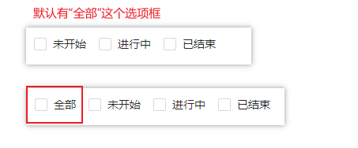

## Checkbox 复选框
### 完整API
```tsx
interface IProps extends IBaseFormModel {
  /** 复选框数据源 */
	dataSource?: IDataSourceItem[]
  /** 默认选中（key为标识） */
	value?: string[]
  /** 是否展示“全部”框 默认为：true */
	showAll?: boolean
  /** 布局方式 垂直布局 | 水平布局（默认） */
	placement?: "vertical" | "inline"
  /** 事件回调 */
	onChange?: (params: EventHandlerResult, mobxState: IObservableObject) => void
  /** httpConfig 数据请求 */
	httpConfig?: {
		init?: () => Promise<IDataSourceItem[]>
	}
}
```
### 基本使用
#### 水平布局
```tsx
import React from 'react';
import { Checkbox } from "zion-ui"

export const Demo = function () {
  const Tpl = Checkbox({
    placement: "inline",
    dataSource: [
      { key: "001", label: "未开始" },
      { key: "002", label: "进行中" },
      { key: "003", label: "已结束" }
    ]
  }, true)
  return <div style={{ padding: "10px 10px" }}>
    <Tpl />
  </div>
}
```

#### 垂直布局
```tsx
import React from 'react';
import { Checkbox } from "zion-ui"

export const Demo = function () {
  const Tpl = Checkbox({
    placement: "vertical",
    dataSource: [
      { key: "001", label: "未开始" },
      { key: "002", label: "进行中" },
      { key: "003", label: "已结束" }
    ]
  }, true)
  return <div style={{ padding: "10px 10px" }}>
    <Tpl />
  </div>
}
```

#### 默认选中
```tsx
import React from 'react';
import { Checkbox } from "zion-ui"

export const Demo = function () {
  const Tpl = Checkbox({
    dataSource: [
      { key: "001", label: "未开始" },
      { key: "002", label: "进行中" },
      { key: "003", label: "已结束" }
    ],
    value: ['001', '002']
  }, true)
  return <div style={{ padding: "10px 10px" }}>
    <Tpl />
  </div>
}
```

#### 取消全部框
```tsx
import React from 'react';
import { Checkbox } from "zion-ui"

export const Demo = function () {
  const Tpl = Checkbox({
    dataSource: [
      { key: "001", label: "未开始" },
      { key: "002", label: "进行中" },
      { key: "003", label: "已结束" }
    ],
    showAll: false
  }, true)
  return <div style={{ padding: "10px 10px" }}>
    <Tpl />
  </div>
}
```

#### httpConfig 数据请求
```tsx
import React from 'react';
import { Checkbox } from "zion-ui"

export const Demo = function () {
  const Tpl = Checkbox({
    placement: "inline",
    httpConfig: {
      init: async () => {
        return [
          { key: "001", label: "未开始" },
          { key: "002", label: "进行中" },
          { key: "003", label: "已结束" }
        ]
      }
    }
  }, true)
  return <div style={{ padding: "10px 10px" }}>
    <Tpl />
  </div>
}
```

#### onChange
```tsx
import React from 'react';
import { Checkbox, PopMessage } from "zion-ui"

export const Demo = function () {
  const Tpl = Checkbox({
    httpConfig: {
      init: async () => {
        return [
          { key: "001", label: "未开始" },
          { key: "002", label: "进行中" },
          { key: "003", label: "已结束" }
        ]
      }
    },
    onChange: function (params, state) {
      PopMessage({
        type: "success",
        title: params.eventName
      })
    }
  }, true)
  return <div style={{ padding: "10px 10px" }}>
    <Tpl />
  </div>
}
```


### 综合示例
```tsx
import React from 'react';
import { Checkbox, CheckboxProps, Button, PopMessage, StateManage } from "zion-ui"

export const Demo = function () {
  const controlKey = "Checkbox_Demo002.Checkbox"
  const props: CheckboxProps = {
    controlKey,
    showAll: true,
    placement: "vertical",
    value: ["001", "003"],
    httpConfig: {
      init: async () => {
        return [
          { key: "001", label: "未开始" },
          { key: "002", label: "进行中", disabled: true },
          { key: "003", label: "已结束" }
        ]
      }
    }
  }
  return <div>
    <Checkbox {...props} />
    <Button text="获取复选框选中的值" onClick={() => {
      const { value } = StateManage.get(controlKey)
      PopMessage({
        type: "success",
        text: value?.toString()
      })
    }} />
    <br /><br />
    <Button text="全部选中" onClick={() => {
      StateManage.set(controlKey, {
        placement: "inline",
        value: ["001", "002", "003"]
      })
    }} />
  </div>
}
```
