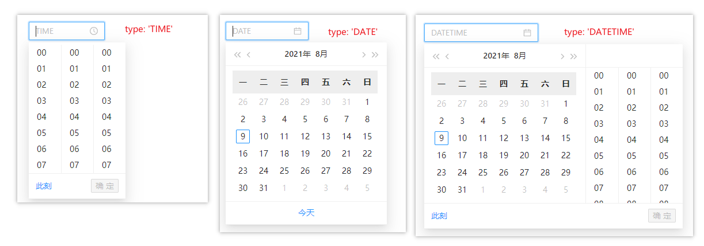
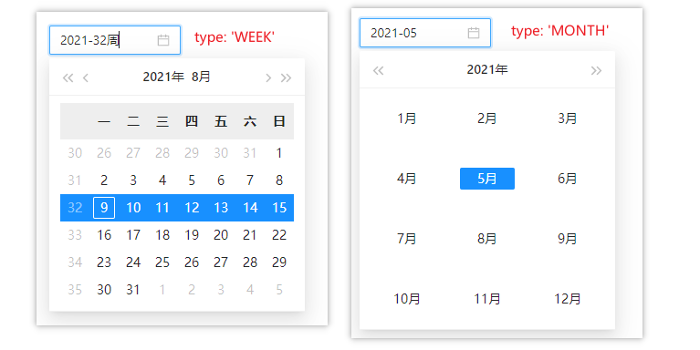
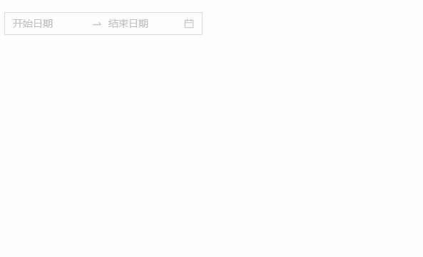
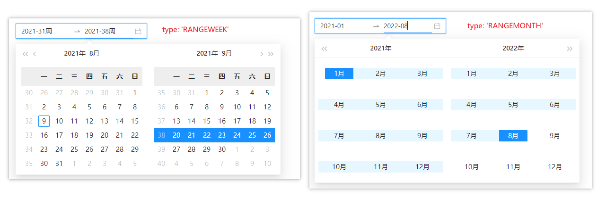
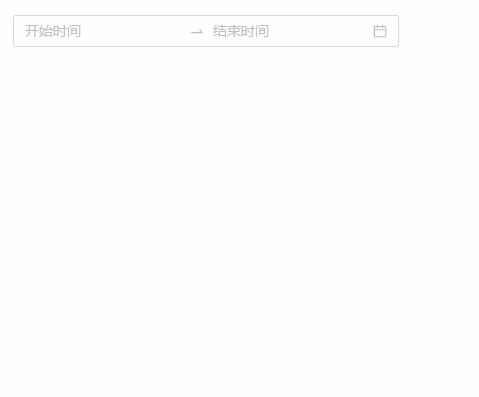
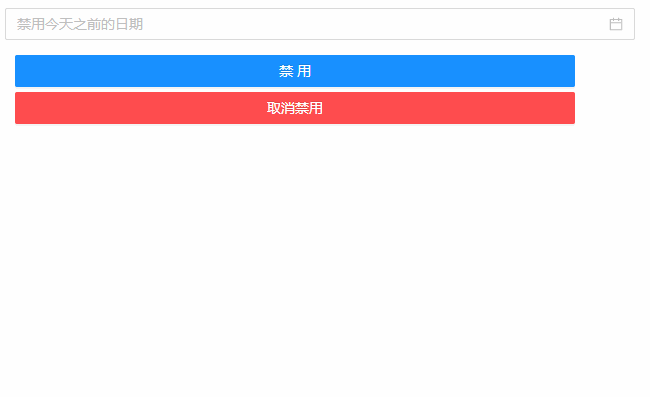
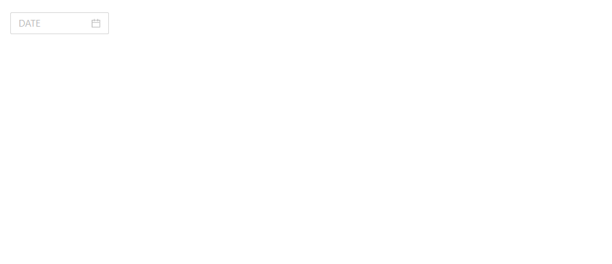

## DateTime 日期时间
### 完整API
```tsx
interface IProps extends IBaseFormModel {
  /** 日期时间类型 */
	type?: "TIME" | "DATE" | "DATETIME" | "WEEK" | "MONTH" | "RANGEDATE" | "RANGEWEEK" | "RANGEDATETIME" | "RANGEMONTH"
	format?: string
  /** 禁用制定的日期 */
	disabledDate?: (currentDate: moment.Moment) => boolean
  /** 改变日期时会触发 */
  onChange?: (params: EventHandlerResult, mobxState: IObservableObject) => void
  /** 以下三个事件回调均无效果 */
	onClick?: (params: EventHandlerResult, mobxState: IObservableObject) => void
	onFocus?: (params: EventHandlerResult, mobxState: IObservableObject) => void
	onOk?: (params: EventHandlerResult, mobxState: IObservableObject) => void
}
```
### 基本使用
#### 单个日期时间
```tsx
import React from 'react';
import { DateTime } from "zion-ui";

export const Demo = function () {
  const Tpl = DateTime({
    // "TIME" | "DATE" | "DATETIME" | "WEEK" | "MONTH" 
    type: 'DATETIME',
    placeholder: "DATETIME"
  }, true)
  return <div style={{ padding: "20px 20px" }}>
    <Tpl />
  </div>
}
```


#### 多个日期时间
```tsx
import React from 'react';
import { DateTime } from "zion-ui";

export const Demo = function () {
  const Tpl = DateTime({
    // "RANGEDATE" | "RANGEWEEK" | "RANGEMONTH"
    type: 'RANGEDATE',
    placeholder: ["开始日期", "结束日期"]
  }, true)
  return <div style={{ padding: "20px 20px" }}>
    <Tpl />
  </div>
}
```


```tsx
import React from 'react';
import { DateTime } from "zion-ui";

export const Demo = function () {
  const Tpl = DateTime({
    type: 'RANGEDATETIME',
    placeholder: ["开始时间", "结束时间"]
  }, true)
  return <div style={{ padding: "20px 20px" }}>
    <Tpl />
  </div>
}
```

#### 禁用
```tsx
import React from 'react';
import { DateTime, Button, StateManage } from "zion-ui";
import { Row, Col } from "antd";
import moment from "moment";

export const Demo = function () {
  const controlKey = "DateTime.Demo003"
  return <div>
    <Row>
      <Col span={12} style={{ padding: "10px" }}>
        <DateTime
          controlKey={controlKey}
          style={{ width: "90%" }}
          placeholder="禁用今天之前的日期"
          disabledDate={date => {
            return date.isBefore(moment())
          }} />
      </Col>
    </Row>
    <Row>
      <Col span={10}>
        <Button
          onClick={function () {
            StateManage.set(controlKey, { disabled: true })
          }}
          style={{ display: "block", margin: "5px 20px" }}
          text="禁用"
          type="primary" />
        <Button
          onClick={function () {
            StateManage.set(controlKey, { disabled: false })
          }}
          style={{ display: "block", margin: "5px 20px" }}
          text="取消禁用"
          type="danger" />
      </Col>
    </Row>
  </div>
}
```

#### onChange
```tsx
import React from 'react';
import { DateTime, PopMessage } from "zion-ui";

export const Demo = function () {
  const Tpl = DateTime({
    type: 'DATE',
    placeholder: "DATE",
    onChange: (params, state) => {
      console.log(params, state);
      PopMessage({
        type: "success",
        title: params.eventName
      })
    }
  }, true)
  return <div style={{ padding: "20px 20px" }}>
    <Tpl />
  </div>
}
```
