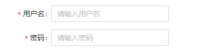
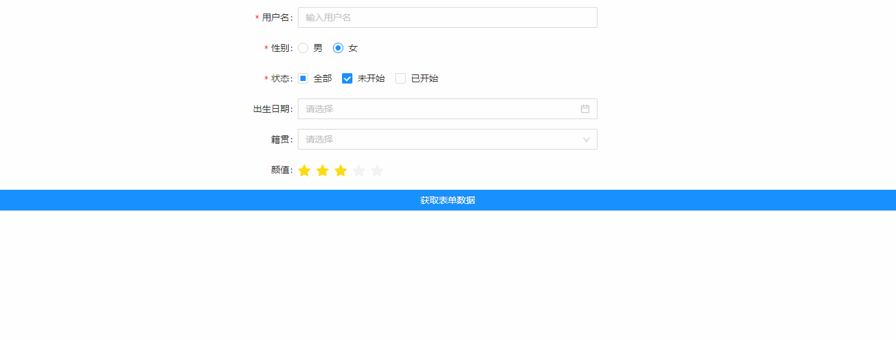
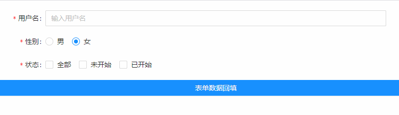
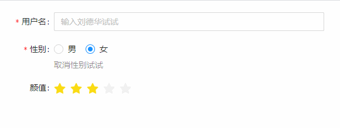
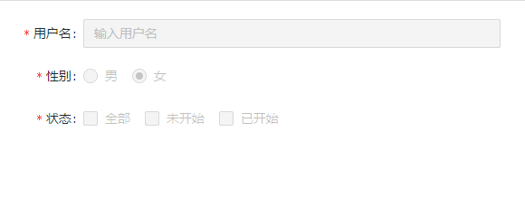

## Form 表单
### 完整API
```tsx
interface IProps extends IBaseModel {
  status?: "insert" | "update" | "detail"
  /** 表单属性配置 */
  formConfig?: IFormConfig
  /** 表单内容配置 */
  formItemConfig?: IFormItem[]
}
```
### formConfig配置
#### interface
```tsx
interface IFormConfig {
  /** 内容布局 水平 | 垂直(默认) | 内联 */
  layout?: "horizontal" | "vertical" | "inline"
  /** label标签布局，span: 6 在于一行中的第6个格局的位置 */
  labelCol?: object
  /** 输入控件设置布局，span: 8 占据了8个格局长的位置 */
  wrapperCol?: object
  /** 列布局,同一行包含number列 */
  columns?: number
}
```

### formItemConfig配置
#### interface
```tsx
interface IFormItem {
  /** 行布局 */
  rowCol?: number
  /** 域名（标识字段） */
  field: string
  order?: number
  /** label标签配置 */
  labelProps: ILabelProps,
  /** 是否展示 */
  show?: boolean
  /** 输入控件配置 */
  controlProps: {
    /** 控件使用类型 */
    type: (props: object, bool?: boolean) => [IObservableObject, ReactNode]
    props: any
  }
}

// labelProps
interface ILabelProps {
  /** 标签名 */
  label?: string | ReactNode
  /** 标签布局 */
  labelCol?: number
  /** 是否必填 */
  required?: boolean
  /** 验证状态 */
  validateStatus?: "" | "success" | "error"
  help?: string | ReactNode
  tail?: string | ReactNode
  tip?: string | ReactNode
}
```
### IMobxState配置
#### interface
```tsx
interface IMobxState {
  /** 设置表单内容 */
  setFormData?: (data: { [field: string]: IFormData }) => void
  /** 获取表单内容 */
  getFormData?: () => { [field: string]: IFormData }
  /** 根据配置属性进行重置 */
  resetForm?: () => { [field: string]: IFormData } 
  /** 设置控件内容 */   
  setFormControlProps?: (field: string, nextProps: object) => void
  /** 设置标签内容 */ 
  setFormLabelProps?: (field: string, nextProps: ILabelProps) => void
}

// IFormData
interface IFormData {
  value: string
  showValue: string
}
```
### 基本使用
```tsx
import React from 'react';
import { Input, Form } from "zion-ui"

export const Demo = function () {
  const Tpl = Form({
    status: "insert",
    // 表单配置
    formConfig: {
      layout: "horizontal",
      columns: 1,
      labelCol: { span: 6 },
      wrapperCol: { span: 4 }
    },
    // 表单内容
    formItemConfig: [
      {
        field: "username",
        labelProps: {
          label: "用户名",
          required: true
        },
        controlProps: {
          type: Input,
          props: {
            placeholder: "请输入用户名"
          }
        }
      },
      {
        field: "password",
        labelProps: {
          label: "密码",
          required: true
        },
        controlProps: {
          type: Input,
          props: {
            type: "password",
            placeholder: "请输入密码"
          }
        }
      },
    ]
  }, true)

  return <div style={{ padding: "20px 20px" }}>
    <Tpl />
  </div>
}
```

### 结合多种组件使用
```tsx

import React from 'react';
import { Checkbox, Input, Form, DateTime, Select, Radio, Rate, Button, StateManage, PopMessage } from "zion-ui"
import moment from 'moment';

export const Demo = function () {
  const [state, Tpl] = Form({
    status: "insert",
    formConfig: {
      layout: "horizontal",
      columns: 1,
      labelCol: { span: 8 },
      wrapperCol: { span: 8 }
    },
    formItemConfig: [
      {
        field: "username",
        labelProps: {
          label: "用户名",
          required: true
        },
        controlProps: {
          type: Input,
          props: {
            placeholder: "输入用户名",
          }
        }
      },
      {
        field: "sex",
        labelProps: {
          label: "性别",
          required: true
        },
        controlProps: {
          type: Radio,
          props: {
            value: "2",
            httpConfig: {
              init: async () => {
                return [
                  { key: "1", label: "男" },
                  { key: "2", label: "女" }
                ]
              }
            }
          }
        }
      },
      {
        field: "status",
        labelProps: {
          label: "状态",
          required: true
        },
        controlProps: {
          type: Checkbox,
          props: {
            value: ["001"],
            dataSource: [
              { key: "001", label: "未开始" },
              { key: "002", label: "已开始" },
            ]
          }
        }
      },
      {
        field: "birthday",
        labelProps: {
          label: "出生日期"
        },
        controlProps: {
          type: DateTime,
          props: {
            placeholder: "请选择",
            style: { width: "100%" },
            disabledDate: (date) => date.isAfter(moment()) || date.isSame(moment())
          }
        }
      },
      {
        field: "city",
        labelProps: {
          label: "籍贯"
        },
        controlProps: {
          type: Select,
          props: {
            dataSource: [
              { key: "001", label: "广东省广州市" },
              { key: "002", label: "广东省深圳市" },
            ]
          }
        }
      },
      {
        field: "appearance",
        labelProps: {
          label: "颜值"
        },
        controlProps: {
          type: Rate,
          props: {
            value: 3,
            count: 5,
            tooltips: ["一般", "还可以", "帅气", "盛世容颜", "一笑倾城"]
          }
        }
      }
    ]
  }, false)
  return <div style={{ padding: "20px" }}>
    <Tpl></Tpl>
    <Button
      style={{ display: "block" }}
      text="获取表单数据"
      type="primary"
      onClick={async () => {
        const { getFormData } = StateManage.get(state)
        const formData = await getFormData(true)
        PopMessage({ type: "success", text: JSON.stringify(formData) })
      }}
    />
  </div>
}
```

### 表单数据回填
```tsx
import React from 'react';
import { Checkbox, Input, Form, Radio, Button, StateManage } from "zion-ui"

export const Demo = function () {
  const [state, Tpl] = Form({
    status: "insert",
    formConfig: {
      layout: "horizontal",
      columns: 1,
      labelCol: { span: 6 },
      wrapperCol: { span: 12 }
    },
    formItemConfig: [
      {
        field: "username",
        labelProps: {
          label: "用户名",
          required: true
        },
        controlProps: {
          type: Input,
          props: {
            placeholder: "输入用户名",
          }
        }
      },
      {
        field: "sex",
        labelProps: {
          label: "性别",
          required: true
        },
        controlProps: {
          type: Radio,
          props: {
            value: "2",
            httpConfig: {
              init: async () => {
                return [
                  { key: "1", label: "男" },
                  { key: "2", label: "女" }
                ]
              }
            }
          }
        }
      },
      {
        field: "status",
        labelProps: {
          label: "状态",
          required: true
        },
        controlProps: {
          type: Checkbox,
          props: {
            dataSource: [
              { key: "001", label: "未开始" },
              { key: "002", label: "已开始" },
            ]
          }
        }
      }
    ]
  }, false)
  return <div style={{ padding: "20px" }}>
    <Tpl />
    <Button
      style={{ display: "block" }}
      text="表单数据回填"
      type="primary"
      onClick={async () => {
        const { setFormData } = StateManage.get(state)
        setFormData({
          "username": { value: "H02477", showValue: "admin" },
          "sex": { value: "1" },
          "status": { value: ["001", "002"] }
        })
      }}
    />
  </div>
}
```

### 关联控制示例
```tsx

import React from 'react';
import { Input, Form, Radio, Rate, StateManage } from "zion-ui"

export const Demo = function () {
  const [state, Tpl] = Form({
    status: "insert",
    formConfig: {
      layout: "horizontal",
      columns: 1,
      labelCol: { span: 6 },
      wrapperCol: { span: 8 }
    },
    formItemConfig: [
      {
        field: "username",
        labelProps: {
          label: "用户名",
          required: true
        },
        controlProps: {
          type: Input,
          props: {
            placeholder: "输入刘德华试试",
            onChange: function ({ value }) {
              const { setFormControlProps } = StateManage.get(state)
              if (value === "刘德华") {
                setFormControlProps("sex", { value: "1" })
                setFormControlProps("appearance", { value: 5 })
              } else {
                setFormControlProps("sex", { value: "2" })
                setFormControlProps("appearance", { value: 1 })
              }
            }
          }
        }
      },
      {
        field: "sex",
        labelProps: {
          label: "性别",
          required: true,
          help: "取消性别试试"
        },
        controlProps: {
          type: Radio,
          props: {
            value: "2",
            allowCancel: true,
            onChange: function ({ value }) {
              const { setFormLabelProps } = StateManage.get(state)
              if (!value) {
                setFormLabelProps("sex", { validateStatus: "error", help: "性别必填" })
              } else {
                setFormLabelProps("sex", { validateStatus: "success", help: "" })
              }
            },
            httpConfig: {
              init: async () => {
                return [
                  { key: "1", label: "男" },
                  { key: "2", label: "女" }
                ]
              }
            }
          }
        }
      },
      {
        field: "appearance",
        labelProps: {
          label: "颜值"
        },
        controlProps: {
          type: Rate,
          props: {
            value: 3,
            count: 5,
            tooltips: ["一般", "还可以", "帅气", "盛世容颜", "一笑倾城"]
          }
        }
      }
    ]
  }, false)
  return <div style={{ padding: "20px" }}>
    <Tpl />
  </div>
}
```

### 详情状态
```tsx

import React from 'react';
import { Checkbox, Input, Form, Radio, FormProps } from "zion-ui"

export const Demo = function () {
  const formProps: FormProps = {
    // 详情状态
    status: "detail",
    formConfig: {
      layout: "horizontal",
      columns: 1,
      labelCol: { span: 6 },
      wrapperCol: { span: 8 }
    },
    formItemConfig: [
      {
        field: "username",
        labelProps: {
          label: "用户名",
          required: true
        },
        controlProps: {
          type: Input,
          props: {
            placeholder: "输入用户名",
          }
        }
      },
      {
        field: "sex",
        labelProps: {
          label: "性别",
          required: true
        },
        controlProps: {
          type: Radio,
          props: {
            value: "2",
            httpConfig: {
              init: async () => {
                return [
                  { key: "1", label: "男" },
                  { key: "2", label: "女" }
                ]
              }
            }
          }
        }
      },
      {
        field: "status",
        labelProps: {
          label: "状态",
          required: true
        },
        controlProps: {
          type: Checkbox,
          props: {
            dataSource: [
              { key: "001", label: "未开始" },
              { key: "002", label: "已开始" },
            ]
          }
        }
      }
    ]
  }
  return <div style={{ padding: "20px" }}>
    <Form {...formProps} />
  </div>
}
```
