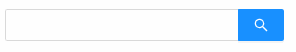
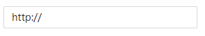

## Input 文本框

### 完整 API
```tsx
interface IProps extends IBaseFormModel {
	/** 文本框类型  输入库 | 文本域 | 搜索框 | 密码框 | 数字输入框 */
	type?: "input" | "textArea" | "search" | "password" | "number"
	/** 前置框内提示 */
    prefix?: string | ReactNode
    /** 后置框内提示 */
	suffix?: string | ReactNode
    /** 前置框外提示 */
	addonAfter?: string | ReactNode
    /** 后置框外提示 */
	addonBefore?: string | ReactNode
	enterButton?: boolean | ReactNode
	loading?: boolean
	visibilityToggle?: boolean
	autoSize?: boolean | { minRows?: number, maxRows?: number }
    /** 文末是否允许存在空格 */
	allowSpace?: boolean
    /** 是否禁止输入 */
	disableOnChange?: boolean
	showTitle?: boolean
	autoFocus?: boolean

	/** 最大输入长度 */
    maxLength?: number
    /** 最大值 */
    min?: number
    /** 最小值 */
    max?: number
    /** 是否只能输入整数 */
    onlyInt?: boolean

	/** 回车时触发 */
    onPressEnter?: (params: EventHandlerResult, mobxProps: IObservableObject) => void
    /** 点击搜索时触发 */
	onSearch?: (params: EventHandlerResult, mobxProps: IObservableObject) => void
    /** 聚焦时触发 */
	onFocus?: (params: EventHandlerResult, mobxProps: IObservableObject) => void
    /** 失焦时触发 */
	onBlur?: (params: EventHandlerResult, mobxProps: IObservableObject) => void
    /** 点击时触发 */
	onClick?: (params: EventHandlerResult, mobxProps: IObservableObject) => void
}

```

### 文本框类型
#### interface
```tsx
interface IProps extends IBaseFormModel {
    /** 文本框类型  输入库 | 文本域 | 搜索框 | 密码框 | 数字输入框 */
    type?: "input" | "textArea" | "search" | "password" | "number"
}
```
#### 输入框
```tsx
import React from 'react';
import { Input } from "zion-ui";
import { Row, Col } from "antd";

export const Demo = function () {
    const Tpl = Input({
        type: "input"
    }, true)

    return <Row>
        <Col span={5} style={{ padding: "10px 10px" }}>
            <span>type: input</span>
            <Tpl />
        </Col>
    </Row>
}
```


#### 文本域
```tsx
import React from 'react';
import { Input } from "zion-ui";
import { Row, Col } from "antd";

export const Demo = function () {
    const Tpl = Input({
        type: "textArea"
    }, true)

    return <Row>
        <Col span={5} style={{ padding: "10px 10px" }}>
            <Tpl />
        </Col>
    </Row>
}
```


#### 搜素框
```tsx
import React from 'react';
import { Input } from "zion-ui";
import { Row, Col } from "antd";

export const Demo = function () {
    const Tpl = Input({
        type: "search"
    }, true)

    return <Row>
        <Col span={5} style={{ padding: "10px 10px" }}>
            <Tpl />
        </Col>
    </Row>
}
```


#### 密码框
```tsx
import React from 'react';
import { Input } from "zion-ui";
import { Row, Col } from "antd";

export const Demo = function () {
    const Tpl = Input({
        type: "password"
    }, true)

    return <Row>
        <Col span={5} style={{ padding: "10px 10px" }}>
            <Tpl />
        </Col>
    </Row>
}
```


#### 数字输入框
```tsx
import React from 'react';
import { Input } from "zion-ui";
import { Row, Col } from "antd";

export const Demo = function () {
    const Tpl = Input({
        type: "number"
    }, true)

    return <Row>
        <Col span={5} style={{ padding: "10px 10px" }}>
            <Tpl />
        </Col>
    </Row>
}
```


### 前后置提示
#### interface
```tsx
nterface IProps extends IBaseFormModel {
    /** 前置框内提示 */
    prefix?: string | ReactNode
    /** 后置框内提示 */
	suffix?: string | ReactNode
    /** 前置框外提示 */
	addonAfter?: string | ReactNode
    /** 后置框外提示 */
	addonBefore?: string | ReactNode
}    
```
#### 前置框内提示
```tsx
import React from 'react';
import { Input } from "zion-ui";
import { Row, Col } from "antd";

export const Demo = function () {
    const Tpl = Input({
        prefix: "http://",
    }, true)
    return <Row>
        <Col span={5} style={{ padding: "10px 10px" }}>
            <Tpl />
        </Col>
    </Row>
}
```


#### 后置框内提示
```tsx
import React from 'react';
import { Input } from "zion-ui";
import { Row, Col } from "antd";

export const Demo = function () {
    const Tpl = Input({
        suffix: "@qq.com",
    }, true)
    return <Row>
        <Col span={5} style={{ padding: "10px 10px" }}>
            <Tpl />
        </Col>
    </Row>
}
```


#### 前置框外提示
```tsx
import React from 'react';
import { Input } from "zion-ui";
import { Row, Col } from "antd";

export const Demo = function () {
    const Tpl = Input({
        addonBefore: "https://",
    }, true)
    return <Row>
        <Col span={5} style={{ padding: "10px 10px" }}>
            <Tpl />
        </Col>
    </Row>
}
```


#### 后置框外提示
```tsx
import React from 'react';
import { Input } from "zion-ui";
import { Row, Col } from "antd";

export const Demo = function () {
    const Tpl = Input({
        addonAfter: "@163.com",
    }, true)
    return <Row>
        <Col span={5} style={{ padding: "10px 10px" }}>
            <Tpl />
        </Col>
    </Row>
}
```


#### 支持图标提示
```tsx
import React from 'react';
import { Input } from "zion-ui";
import { Row, Col } from "antd";
import { DownCircleTwoTone } from "@ant-design/icons"

export const Demo = function () {
    const Tpl1 = Input({
        prefix: <DownCircleTwoTone />,
    }, true)
    const Tpl2 = Input({
        suffix: <DownCircleTwoTone />,
    }, true)
    const Tpl3 = Input({
        addonBefore: <DownCircleTwoTone />,
    }, true)
    const Tpl4 = Input({
        addonAfter: <DownCircleTwoTone />,
    }, true)
    return <div>
        <Row>
            <Col span={5} style={{ padding: "10px 10px" }}>
                <Tpl1 />
            </Col>
            <Col span={5} style={{ padding: "10px 10px" }}>
                <Tpl2 />
            </Col>
        </Row>
        <Row>
            <Col span={5} style={{ padding: "10px 10px" }}>
                <Tpl3 />
            </Col>
            <Col span={5} style={{ padding: "10px 10px" }}>
                <Tpl4 />
            </Col>
        </Row>
    </div>
}
```


### 事件回调
#### interface
```tsx
interface IProps extends IBaseFormModel {
    /** 回车时触发 */
    onPressEnter?: (params: EventHandlerResult, mobxProps: IObservableObject) => void
    /** 点击搜索时触发 */
	onSearch?: (params: EventHandlerResult, mobxProps: IObservableObject) => void
    /** 聚焦时触发 */
	onFocus?: (params: EventHandlerResult, mobxProps: IObservableObject) => void
    /** 失焦时触发 */
	onBlur?: (params: EventHandlerResult, mobxProps: IObservableObject) => void
    /** 点击时触发 */
	onClick?: (params: EventHandlerResult, mobxProps: IObservableObject) => void
}
```
#### onPressEnter
```tsx
import React from 'react';
import { Input, PopMessage } from "zion-ui";
import { Row, Col } from "antd";

export const Demo = function () {
    const Tpl = Input({
        onPressEnter: function (params, state) {
            PopMessage({
                type: "success",
                title: params.eventName
            })
        }
    }, true)
    return <Row>
        <Col span={4} style={{ padding: "10px 10px" }}>
            <Tpl />
        </Col>
    </Row>
}
```


#### onSearch
```tsx
import React from 'react';
import { Input, PopMessage } from "zion-ui";
import { Row, Col } from "antd";

export const Demo = function () {
    const Tpl = Input({
        type: "search",
        onSearch: function (params, state) {
            PopMessage({
                type: "success",
                title: params.eventName
            })
        }
    }, true)
    return <Row>
        <Col span={4} style={{ padding: "10px 10px" }}>
            <Tpl />
        </Col>
    </Row>
}
```


#### onFocus
```tsx
import React from 'react';
import { Input, PopMessage } from "zion-ui";
import { Row, Col } from "antd";

export const Demo = function () {
    const Tpl = Input({
        onFocus: function (params, state) {
            PopMessage({
                type: "success",
                title: params.eventName
            })
        }
    }, true)
    return <Row>
        <Col span={4} style={{ padding: "10px 10px" }}>
            <Tpl />
        </Col>
    </Row>
}
```


#### onBlur
```tsx
import React from 'react';
import { Input, PopMessage } from "zion-ui";
import { Row, Col } from "antd";

export const Demo = function () {
    const Tpl = Input({
        onBlur: function (params, state) {
            PopMessage({
                type: "success",
                title: params.eventName
            })
        }
    }, true)
    return <Row>
        <Col span={4} style={{ padding: "10px 10px" }}>
            <Tpl />
        </Col>
    </Row>
}
```


#### onClick
```tsx
import React from 'react';
import { Input, PopMessage } from "zion-ui";
import { Row, Col } from "antd";

export const Demo = function () {
    const Tpl = Input({
        onClick: function (params, state) {
            PopMessage({
                type: "success",
                title: params.eventName
            })
        }
    }, true)
    return <Row>
        <Col span={4} style={{ padding: "10px 10px" }}>
            <Tpl />
        </Col>
    </Row>
}
```


### 数据属性
#### interface
```tsx
interface IProps extends IBaseFormModel {
    /** 最大输入长度 */
    maxLength?: number
    /** 最大值 */
    min?: number
    /** 最小值 */
    max?: number
    /** 是否只能输入整数 */
    onlyInt?: boolean
}
```
#### 最大输入长度
##### 其他interface
```tsx
/** 是否允许一键清空 */
allowClear?: boolean
/** 数据回填的默认值 */
value?: string
/** 是否显示标题“最多输入maxLength个字符”，结合maxLength使用*/
showTitle?: true
```
```tsx
import React from 'react';
import { Input } from "zion-ui";
import { Row, Col } from "antd";

export const Demo = function () {
    const Tpl1 = Input({
        allowClear: true,
        value: "回填数据",
        maxLength: 5,
        showTitle: true
    }, true)

    return <Row>
        <Col span={6} style={{ padding: "10px 10px" }}>
            <Tpl1 />
        </Col>
    </Row>
}
```


#### 数字输入属性
##### 最大值
```tsx
import React from 'react';
import { Input } from "zion-ui";
import { Row, Col } from "antd";

export const Demo = function () {
    const Tpl1 = Input({
        type: "number",
        max: 5
    }, true)

    return <Row>
        <Col span={6} style={{ padding: "10px 10px" }}>
            <Tpl1 />
        </Col>
    </Row>
}
```

##### 最小值
```tsx
import React from 'react';
import { Input } from "zion-ui";
import { Row, Col } from "antd";

export const Demo = function () {
    const Tpl1 = Input({
        type: "number",
        min: 5
    }, true)

    return <Row>
        <Col span={6} style={{ padding: "10px 10px" }}>
            <Tpl1 />
        </Col>
    </Row>
}
```

##### 是否只能输入整数
```tsx
import React from 'react';
import { Input } from "zion-ui";
import { Row, Col } from "antd";

export const Demo = function () {
    const Tpl1 = Input({
        type: "number",
        onlyInt: true
    }, true)

    return <Row>
        <Col span={6} style={{ padding: "10px 10px" }}>
            <Tpl1 />
        </Col>
    </Row>
}
```


### 表单属性

### 其他属性
#### 文末禁止空格
```tsx
import React from 'react';
import { Input } from "zion-ui";
import { Row, Col } from "antd";

export const Demo = function () {
    const Tpl = Input({
        allowSpace: false
    }, true)

    return <Row>
        <Col span={6} style={{ padding: "10px 10px" }}>
            <Tpl />
        </Col>
    </Row>
}
```

#### 禁止输入
```tsx
import React from 'react';
import { Input } from "zion-ui";
import { Row, Col } from "antd";

export const Demo = function () {
    const Tpl = Input({
        disableOnChange: true
    }, true)

    return <Row>
        <Col span={6} style={{ padding: "10px 10px" }}>
            <Tpl />
        </Col>
    </Row>
}
```
