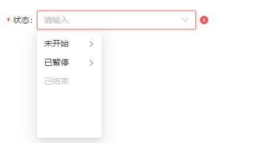

# 数据录入组件

## 顶层接口

### IBaseModel

> 组件顶层接口

```ts
interface IBaseModel {
    /** 组件唯一标识符 */
	controlKey?: string
    /** 组件尺寸: small | middle | large */
	size?: EnumSize
    /** 类名 */
	className?: string
    /** 是否显示 */
	show?: boolean
    /** 观察函数，组件每次渲染，都会触发该函数 */
	observer?: (count: number, state: IObservableObject) => void
    /** 样式对象 */
	style?: CSSProperties
    /** 对应 useEffect(() => {},[]),组件加载完后执行一次 */
	didMount?: (mobxProps: IObservableObject) => void
    /** 存放额外数据的字段，对于数据录入组件(如:Input)，表单在收集数据(getFormData)的时候，会收集该字段的数据 */
	extraData?: object
}
```

### IBaseFormModel

> 数据录入组件顶层接口

```ts
interface IBaseFormModel extends IBaseModel {
    /** 实际值 */
	value?: any
    /** 显示值 */
	showValue?: any
    /** 是否自动聚焦 */
	autoFocus?: boolean
	placeholder?: string | string[]
    /** 组件值改变时触发 */
	onChange?: (params: EventHandlerResult, mobxProps: IObservableObject) => void
    /** 是否禁用 */
	disabled?: boolean
    /** 是否支持一键清空 */
	allowClear?: boolean

	/** 表单相关的属性配置,通过配置以下属性，可丰富组件的展示效果 */
    /** 文字说明 */
	label?: string
    /** 是否必填 */
	required?: boolean
    /** 栅格布局 */
	layout?: {
		wrapperCol?: { span: number },
		labelCol?: { span: number }
	}
    /** 检验结果 */
	validateResult?: IValidateResult
    /** 是否展示校验结果的小图标 */
	hasFeedback?: boolean
    /** 是否自动校验 */
	autoValidate?: boolean
}
/** 表单元素校验结果 */
interface IValidateResult {
    /** 检验结果 */
	status?: "error" | "success" | "validating" | "warning"
    /** 文字提示 */
	help?: string | ReactNode
}
```

## 示例

```tsx
import React from 'react';
import { SelectCascade } from "zion-ui"

export const Demo = function () {
  const Status = SelectCascade({
    allowSearch: true,
    changeOnSelect: true,
    dataSource: [
      { key: "1", label: "未开始" },
      { key: "3", label: "已暂停", isLeaf: false },
      { key: "11", uiPid: "1", label: "子节点" },
      { key: "4", label: "已结束", disabled: true }
    ],
    httpConfig: {
      onExpand: async (data) => {
        return [
          { key: "111", uiPid: data["key"], label: "444" }
        ]
      }
    },
    label: "状态",
    required: true,
    hasFeedback: true,
    autoValidate: true,
    style: { width: "90%" },
    layout: {
      labelCol: { span: 4 }
    }
  }, true)

  return <div style={{ width: "400px", padding: "20px 20px" }}>
    <Status />
  </div>
}
```

