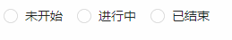
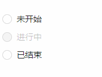
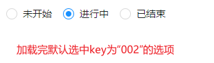
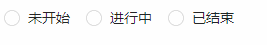
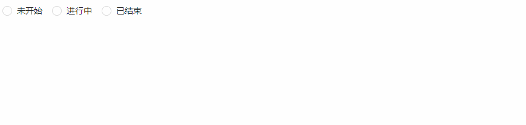

## Radio 单选框
### 完整API
```tsx
interface IProps extends IBaseFormModel {
  /** 单选框数据源 */
	dataSource?: IDataSourceItem[],
  /** 默认选中（key为标识） */
	value?: string
  /** 是否允许取消选中 */
	allowCancel?: boolean
  /** 布局方式 垂直布局 | 水平布局（默认）  */
	placement?: "vertical" | "inline"
  /** 事件回调 */
	onChange?: (params: EventHandlerResult, mobxState: IObservableObject) => void
  /** httpConfig 数据请求 */
	httpConfig?: {
    /** 初始化 */
		init?: () => Promise<IDataSourceItem[]>
	}
}

/** dataSource */
interface IDataSourceItem {
  /** 标识字段 */
	key: string,
  /** 显示标签 */
	label: string,
  /** 是否禁用 */
	disabled?: boolean
}
```
### 基本使用
#### 水平布局
```tsx
import React from 'react';
import { Radio } from "zion-ui"

export const Demo = function () {
  const Tpl = Radio({
    placement: "inline",
    dataSource: [
      { key: "001", label: "未开始" },
      { key: "002", label: "进行中" },
      { key: "003", label: "已结束" }
    ]
  }, true)
  return <div style={{ padding: "10px 10px" }}>
    <Tpl />
  </div>
}
```

#### 垂直布局
```tsx
import React from 'react';
import { Radio } from "zion-ui"

export const Demo = function () {
  const Tpl = Radio({
    placement: "vertical",
    dataSource: [
      { key: "001", label: "未开始" },
      { key: "002", label: "进行中" },
      { key: "003", label: "已结束" }
    ]
  }, true)
  return <div style={{ padding: "10px 10px" }}>
    <Tpl />
  </div>
}
```

#### 默认选中
```tsx
import React from 'react';
import { Radio } from "zion-ui"

export const Demo = function () {
  const Tpl = Radio({
    dataSource: [
      { key: "001", label: "未开始" },
      { key: "002", label: "进行中", disabled: true },
      { key: "003", label: "已结束" }
    ],
    value: "002"
  }, true)
  return <div style={{ padding: "10px 10px" }}>
    <Tpl />
  </div>
}
```

#### 允许取消选中
```tsx
import React from 'react';
import { Radio } from "zion-ui"

export const Demo = function () {
  const Tpl = Radio({
    dataSource: [
      { key: "001", label: "未开始" },
      { key: "002", label: "进行中" },
      { key: "003", label: "已结束" }
    ],
    allowCancel: true
  }, true)
  return <div style={{ padding: "10px 10px" }}>
    <Tpl />
  </div>
}
```

#### httpConfig 数据请求
```tsx
import React from 'react';
import { Radio } from "zion-ui"

export const Demo = function () {
  const Tpl = Radio({
    httpConfig: {
      init: async () => {
        return [
          { key: "001", label: "未开始" },
          { key: "002", label: "进行中" },
          { key: "003", label: "已结束" }
        ]
      }
    }
  }, true)
  return <div style={{ padding: "10px 10px" }}>
    <Tpl />
  </div>
}
```

#### onChange
```tsx
import React from 'react';
import { Radio, PopMessage } from "zion-ui"

export const Demo = function () {
  const Tpl = Radio({
    httpConfig: {
      init: async () => {
        return [
          { key: "001", label: "未开始" },
          { key: "002", label: "进行中" },
          { key: "003", label: "已结束" }
        ]
      }
    },
    onChange: function (params, state) {
      PopMessage({
        type: "success",
        title: params.eventName
      })
    }
  }, true)
  return <div style={{ padding: "10px 10px" }}>
    <Tpl />
  </div>
}
```
