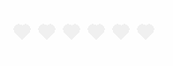
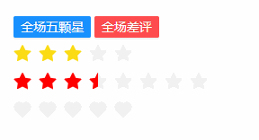

## Rate 评分
### 完整API
```tsx
interface IProps extends IBaseFormModel {
  /** 是否允许再次点击后清除 */
	allowClear?: boolean  
  /** 是否允许半选 */ 
	allowHalf?: boolean
  /** 自定义图标 */                     
	character?: ReactNode                  
  /** 评分数量 */
	count?: number                          
  /** 已选分数 */
	value?: number                          
  /** 填充颜色 */
	color?: string                          
  /** 是否禁用 */
	disabled?: boolean                      
  /** 鼠标移入时的文字提示 */
	tooltips?: string[]                     
  /** 鼠标hover时的回调 */
	onHoverChange?: (value: number) => void 
}
```
### 基本使用
#### 再次点击后清除评分
```tsx
import React from 'react';
import { Rate } from "zion-ui"

export const Demo = function () {
  const Tpl = Rate({
    count: 5,
    value: 3,
    /** 允许清除 */
    allowClear: true,
  }, true)
  return <div style={{ padding: "20px 20px" }}>
    <Tpl />
  </div>
}
```

#### 半选
```tsx
import React from 'react';
import { Rate } from "zion-ui"

export const Demo = function () {
  const Tpl = Rate({
    count: 4,
    color: "green",
    /** 允许半选 */
    allowHalf: true,
  }, true)
  return <div style={{ padding: "20px 20px" }}>
    <Tpl />
  </div>
}
```

#### 自定义图标
```tsx
import React from 'react';
import { Rate } from "zion-ui"
import { HeartFilled } from "@ant-design/icons"

export const Demo = function () {
  const Tpl = Rate({
    count: 6,
    color: "red",
    /** 更换图标 */
    character: < HeartFilled />
  }, true)
  return <div style={{ padding: "20px 20px" }}>
    <Tpl />
  </div>
}
```

#### 文字提示
```tsx
import React from 'react';
import { Rate } from "zion-ui"

export const Demo = function () {
  const Tpl = Rate({
    count: 5,
    color: "blue",
    /** 文字提示 */
    tooltips: ["提示", "一般", "严重", "紧急", "致命"],
  }, true)
  return <div style={{ padding: "20px 20px" }}>
    <Tpl />
  </div>
}
```

#### onHoverChange
```tsx
import React from 'react';
import { Rate, PopMessage } from "zion-ui"

export const Demo = function () {
  const Tpl = Rate({
    count: 5,

    onHoverChange: (value) => {
      console.log(value);
      PopMessage({
        type: "success",
        title: value + "颗星"
      })

    }
  }, true)
  return <div style={{ padding: "20px 20px" }}>
    <Tpl />
  </div>
}
```

### 综合示例
```tsx
import React from 'react';
import { Rate, Button, StateManage } from "zion-ui"
import { HeartFilled } from "@ant-design/icons"

export const Demo = function () {
  const controlKey = {
    "001": "Rate_Demo001.001",
    "002": "Rate_Demo001.002",
    "003": "Rate_Demo001.003",
  }
  const Tpl = Rate({
    controlKey: controlKey["001"],
    tooltips: ["提示", "一般", "严重", "紧急", "致命"],
    count: 5,
    value: 3
  }, true)
  return <div style={{ padding: "20px 20px" }}>
    <div>
      <Button text="全场五颗星" size="small" type="primary" onClick={() => {
        StateManage.set(controlKey["001"], { value: 5 })
        StateManage.set(controlKey["002"], { value: 5 })
        StateManage.set(controlKey["003"], { value: 5 })
      }} />
      &nbsp;
      <Button text="全场差评" size="small" type="danger" onClick={() => {
        StateManage.set(controlKey["001"], { value: 0 })
        StateManage.set(controlKey["002"], { value: 0 })
        StateManage.set(controlKey["003"], { value: 0 })
      }} />
    </div>
    <div>
      <Tpl />
    </div>
    <div>
      <Rate controlKey={controlKey["002"]} color={"red"} count={8} value={3.5} allowHalf={true} allowClear={false}></Rate>
    </div>
    <div>
      <Rate controlKey={controlKey["003"]} color={"blue"} count={5} character={<HeartFilled />}></Rate>
    </div>
  </div>
}
```
