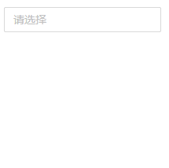
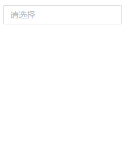
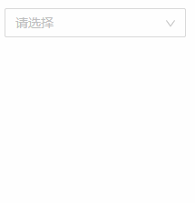
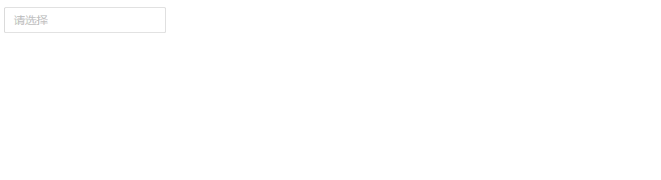
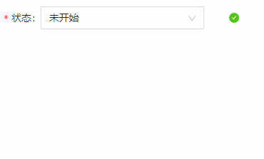

## Select 下拉框
### 完整API
```tsx
interface IProps extends IBaseFormModel {
	/** 下拉框模式 多选 | 单选(默认) */
	mode?: "checkbox" | "radio"
    /** 是否展示底部按钮 */
	showFooter?: boolean
    /** 没有作用 */
	maxTagCount?: number | null
	/** 下拉框数据源 */
	dataSource?: IDataSourceItem[]
    /** 默认选中数据 */
	value?: string[] | [] | string

	/** httpConfig数据请求 */
	httpConfig?: {
        /** 初始化 */
		init?: (params: EventHandlerResult, mobxProps: IObservableObject) => Promise<IDataSourceItem[]>
        /** 异步查询 */
		onSearch?: (params: EventHandlerResult, mobxProps: IObservableObject) => Promise<IDataSourceItem[]>
	}

	/** 聚焦时触发 */
	onFocus?: (params: EventHandlerResult, mobxProps: IObservableObject) => void
    /** 失焦时触发 */
	onBlur?: (params: EventHandlerResult, mobxProps: IObservableObject) => void
    /** 点击时触发（测试后不起作用） */
	onClick?: (params: EventHandlerResult, mobxProps: IObservableObject) => void
}
```

### 基本使用
#### 下拉单选框
```tsx
import React from 'react';
import { Select } from "zion-ui"
import { WarningTwoTone } from "@ant-design/icons"
import { Row, Col } from "antd"

export const Demo = function () {
    const RadioStatus = Select({
        style: { width: "200px" },
        dataSource: [
            { key: "1", label: "未开始" },
            { key: "2", label: "进行中", render: (data) => data["label"] + "..." },
            { key: "3", label: "已暂停", icon: <WarningTwoTone /> },
            { key: "4", label: "已结束", disabled: true }
        ],
    }, true)
    return <Row>
        <Col span={11}>
            <RadioStatus />
        </Col>
    </Row>
}
```

#### 下拉多选框
```tsx
import React from 'react';
import { Select } from "zion-ui"
import { WarningTwoTone } from "@ant-design/icons"
import { Row, Col } from "antd"

export const Demo = function () {
    const MultipeStatus = Select({
        mode: "checkbox",
        style: { width: "200px" },
        dataSource: [
            { key: "1", label: "未开始" },
            { key: "2", label: "进行中", render: (data) => data["label"] + "..." },
            { key: "3", label: "已暂停", icon: <WarningTwoTone /> },
            { key: "4", label: "已结束", disabled: true }
        ],
    }, true)
    return <Row>
        <Col span={11} style={{ padding: "10px 10px" }}>
            <MultipeStatus />
        </Col>
    </Row>
}
```

#### 展示底部按钮
```tsx
import React from 'react';
import { Select } from "zion-ui"
import { WarningTwoTone } from "@ant-design/icons"
import { Row, Col } from "antd"

export const Demo = function () {
    const MultipeStatus = Select({
        mode: "checkbox",
        style: { width: "200px" },
        dataSource: [
            { key: "1", label: "未开始" },
            { key: "2", label: "进行中", render: (data) => data["label"] + "..." },
            { key: "3", label: "已暂停", icon: <WarningTwoTone /> },
            { key: "4", label: "已结束", disabled: true }
        ],
        /** 仅多选下拉框展示 */
        showFooter: true
    }, true)
    return <Row>
        <Col span={11} style={{ padding: "10px 10px" }}>
            <MultipeStatus />
        </Col>
    </Row>
}
```


### httpConfig 数据请求
#### init 初始化
```tsx
import React from 'react';
import { Select } from "zion-ui"
import { WarningTwoTone } from "@ant-design/icons"
import { Row, Col } from "antd"

export const Demo = function () {
    const RadioStatus = Select({
        style: { width: "200px" },
        httpConfig: {
            init: async () => {
                const dataSource = [
                    { key: "1", label: "未开始" },
                    { key: "2", label: "进行中", render: (data: any) => data["label"] + "..." },
                    { key: "3", label: "已暂停", icon: <WarningTwoTone style={{ paddingRight: "5px" }} /> },
                    { key: "4", label: "已结束", disabled: true }
                ]
                return new Promise((resolve) => {
                    setTimeout(() => {
                        resolve(dataSource)
                    }, 300)
                })
            }
        }
    }, true)
    return <Row>
        <Col span={11} style={{ padding: "10px 10px" }}>
            <RadioStatus />
        </Col>
    </Row>
}
```


#### onSearch 异步查询
```tsx
import React from 'react';
import { Select } from "zion-ui"
import { WarningTwoTone } from "@ant-design/icons"
import { Row, Col } from "antd"

export const Demo = function () {
    const MultipeStatus = Select({
        mode: "checkbox",
        style: { width: "200px" },
        httpConfig: {
            init: async () => {
                const dataSource = [
                    { key: "1", label: "未开始" },
                    { key: "2", label: "进行中", render: (data: any) => data["label"] + "..." },
                    { key: "3", label: "已暂停", icon: <WarningTwoTone /> },
                    { key: "4", label: "已结束", disabled: true }
                ]
                return new Promise((resolve) => {
                    setTimeout(() => {
                        resolve(dataSource)
                    }, 300)
                })
            },
            onSearch: async ({ value }: any) => {
                const dataSource = [
                    { key: "1", label: value },
                ]
                return new Promise((resolve) => {
                    setTimeout(() => {
                        if (!value) resolve([])
                        resolve(dataSource)
                    }, 100)
                })
            }
        }
    }, true)
    return <Row>
        <Col span={11} style={{ padding: "10px 10px" }}>
            <MultipeStatus />
        </Col>
    </Row>
}
```

### 事件回调
#### onFocus
```tsx
import React from 'react';
import { Select, PopMessage } from "zion-ui"
import { WarningTwoTone } from "@ant-design/icons"
import { Row, Col } from "antd"

export const Demo = function () {
    const MultipeStatus = Select({
        mode: "checkbox",
        style: { width: "200px" },
        dataSource: [
            { key: "1", label: "未开始" },
            { key: "2", label: "进行中", render: (data) => data["label"] + "..." },
            { key: "3", label: "已暂停", icon: <WarningTwoTone /> },
            { key: "4", label: "已结束", disabled: true }
        ],
        onFocus: function (params, state) {
            PopMessage({
                type: "success",
                title: params.eventName
            })
        }
    }, true)
    return <Row>
        <Col span={11} style={{ padding: "10px 10px" }}>
            <MultipeStatus />
        </Col>
    </Row>
}
```

#### onBlur
```tsx
import React from 'react';
import { Select, PopMessage } from "zion-ui"
import { WarningTwoTone } from "@ant-design/icons"
import { Row, Col } from "antd"

export const Demo = function () {
  const MultipeStatus = Select({
    mode: "checkbox",
    style: { width: "200px" },
    dataSource: [
      { key: "1", label: "未开始" },
      { key: "2", label: "进行中", render: (data) => data["label"] + "..." },
      { key: "3", label: "已暂停", icon: <WarningTwoTone /> },
      { key: "4", label: "已结束", disabled: true }
    ],
    onBlur: function (params, state) {
      PopMessage({
        type: "success",
        title: params.eventName
      })
    }
  }, true)
  return <Row>
    <Col span={11} style={{ padding: "10px 10px" }}>
      <MultipeStatus />
    </Col>
  </Row>
}
```

#### onClick(无效)
```tsx
import React from 'react';
import { Select, PopMessage } from "zion-ui"
import { WarningTwoTone } from "@ant-design/icons"
import { Row, Col } from "antd"

export const Demo = function () {
  const MultipeStatus = Select({
    mode: "checkbox",
    style: { width: "200px" },
    dataSource: [
      { key: "1", label: "未开始" },
      { key: "2", label: "进行中", render: (data) => data["label"] + "..." },
      { key: "3", label: "已暂停", icon: <WarningTwoTone /> },
      { key: "4", label: "已结束", disabled: true }
    ],
    /** 无效 */
    onClick: function (params, state) {
      PopMessage({
        type: "success",
        title: params.eventName
      })
    }
  }, true)
  return <Row>
    <Col span={11} style={{ padding: "10px 10px" }}>
      <MultipeStatus />
    </Col>
  </Row>
}
```


### 表单示例
```tsx
import React from 'react';
import { Select } from "zion-ui"
import { WarningTwoTone } from "@ant-design/icons"
import { Row, Col } from "antd"

export const Demo = function () {
  const RadioStatus = Select({
    dataSource: [
      { key: "1", label: "未开始" },
      { key: "2", label: "进行中", render: (data) => data["label"] + "..." },
      { key: "3", label: "已暂停", icon: <WarningTwoTone /> },
      { key: "4", label: "已结束", disabled: true }
    ],
    autoValidate: true,
    hasFeedback: true,
    allowClear: true,
    value: "1",
    label: "状态",
    required: true,
    style: { width: "80%" },
    validateResult: { status: "success" }
  }, true)
  return <Row>
    <Col span={6} style={{ padding: "10px 10px" }}>
      <RadioStatus />
    </Col>
  </Row>
}
```
