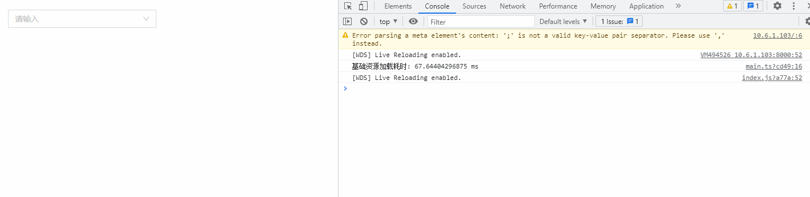
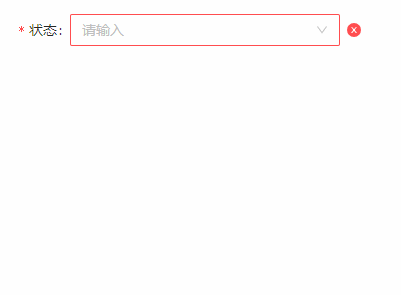

## SelectCascade 下拉级联
### 完整API
```tsx
interface IProps extends IBaseFormModel {
  /** 是否允许查询 */
	allowSearch?: boolean

	changeOnSelect?: boolean
  /** 默认选中 */
	value?: string[]
  /** 下拉级联数据源 */
	dataSource: IDataSourceItem[];
  /** 下拉级联展开触发模式 点击 | 悬停 */
	trigger?: "click" | "hover"
  /** 选中时触发 */
	onChange?: (params: EventHandlerResult, mobxProps: IObservableObject) => void
  /** 非叶子节点（以及字节点使用httpConfig.onExpand展开渲染数据）展开触发 */
	onExpand?: (params: EventHandlerResult, mobxProps: IObservableObject) => void
  /** httpConfig数据请求 */
	httpConfig: {
    /** 初始化 */
		init?: () => Promise<IDataSourceItem[]>
    /** 展开渲染新数据 */
		onExpand?: (data: IDataSourceItem) => Promise<IDataSourceItem[]>
	}
}

/** dataSource */
interface IDataSourceItem {
  /** 标识字段 */
	key: string | number
  /** 显示标签 */
	label: string
	uiPid?: string | number | null
  /** 是否为叶子节点 */
	isLeaf?: boolean
  /** 可带图标 */
	icon?: ReactNode
  /** 是否禁用 */
	disabled?: boolean
  /** 渲染函数 */
	render?: (data: IDataSourceItem) => ReactNode | string
}

```
### 基本使用
```tsx
import React from 'react';
import { SelectCascade } from "zion-ui"

export const Demo = function () {
  const Status = SelectCascade({
    allowSearch: true,
    changeOnSelect: true,
    dataSource: [
      { key: "1", label: "未开始", isLeaf: false },
      { key: "3", label: "已暂停", isLeaf: false },
      { key: "11", uiPid: "3", label: "子节点" },
      { key: "4", label: "已结束", disabled: true }
    ],
    onExpand: function (params, state) {
      console.log('onExpand==>', params, state);

    },
    onChange: function (params, state) {
      console.log('onChange==>', params, state);

    },
    httpConfig: {
      onExpand: async (data) => {
        console.log('data==>', data);
        return [
          { key: "111", uiPid: data["key"], label: "444" }
        ]
      }
    },
  }, true)

  return <div style={{ width: "300px", padding: "20px 20px" }}>
    <Status />
  </div>
}
```

### 表单属性示例
```tsx
import React from 'react';
import { SelectCascade } from "zion-ui"

export const Demo = function () {
  const Status = SelectCascade({
    allowSearch: true,
    changeOnSelect: true,
    dataSource: [
      { key: "1", label: "未开始" },
      { key: "3", label: "已暂停", isLeaf: false },
      { key: "11", uiPid: "1", label: "子节点" },
      { key: "4", label: "已结束", disabled: true }
    ],
    httpConfig: {
      onExpand: async (data) => {
        return [
          { key: "111", uiPid: data["key"], label: "444" }
        ]
      }
    },
    label: "状态",
    required: true,
    hasFeedback: true,
    autoValidate: true,
    style: { width: "90%" },
    layout: {
      labelCol: { span: 4 }
    }
  }, true)

  return <div style={{ width: "400px" }}>
    <Status />
  </div>
}
```
