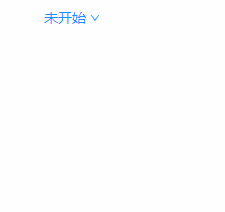
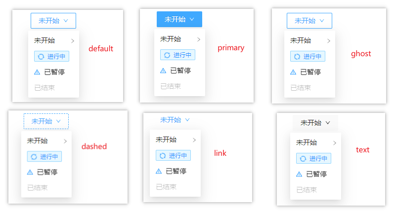
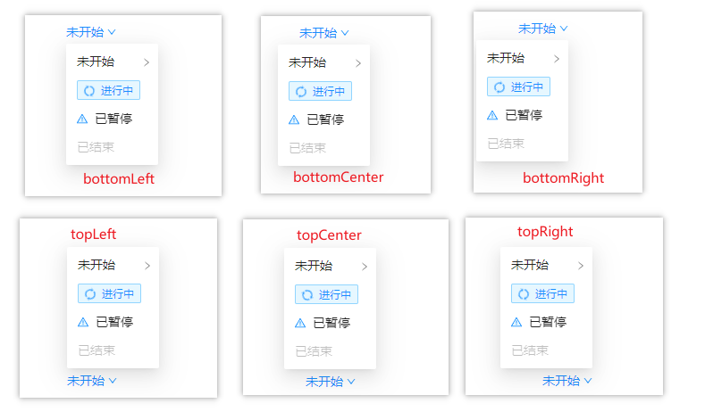
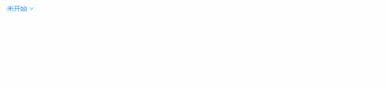
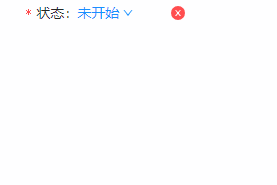

## SelectMenu 下拉菜单
### 完整API
```tsx
interface IProps extends IBaseFormModel {
  /** 下拉框样式（默认为link） */
	type?: "link" | "button";
  /** 下拉菜单布局  左下方 | 正下方 | 右下方 | 左上方 | 正上方 | 右上方 */
	placement?: "bottomLeft" | "bottomCenter" | "bottomRight" | "topLeft" | "topCenter" | "topRight"
  /** 是否禁用 */
	disabled?: boolean
  /** 下单菜单文本 */
	text?: string | ReactNode
  /** 结合type:button使用，设置下拉框样式 */
	buttonType?: "default" | "primary" | "ghost" | "dashed" | "link" | "text"
  /** 下拉菜单数据源 */
	dataSource: IDataSourceItem[];
  /** 下拉框展开触发方式 点击 | 悬停 | 右键点击 */
	trigger?: Array<"click" | "hover" | "contextMenu">
  /** 点击展开下拉菜单时触发 */
	onClick?: (params: EventHandlerResult, mobxProps: IObservableObject) => void
  /** 点击下拉菜单内容时触发 */
	onMenuClick?: (params: EventHandlerResult, mobxProps: IObservableObject) => void
  /** 展开 | 收起下拉框时触发 */
	onVisibleChange?: (visible: boolean, mobxProps: IObservableObject) => void
}

/** dataSource */
interface IDataSourceItem {
  /** 标识字段 */
	key: string | number
  /** 显示标签 */
	label: string
	uiPid?: string | number | null
  /** 带图标 */
	icon?: ReactNode
  /** 是否禁用 */
	disabled?: boolean
  /** 渲染函数 */
	render?: (data: IDataSourceItem) => ReactNode | string
}
```
### 基本使用
#### 下拉框样式
##### link样式
```tsx
import React from 'react';
import { SelectMenu, Tag } from "zion-ui"
import { WarningTwoTone } from "@ant-design/icons"

export const Demo = function () {
  const Status = SelectMenu({
    type: "link",
    text: "未开始",
    placement: "bottomCenter",
    trigger: ["click"],
    dataSource: [
      { key: "1", label: "未开始" },
      { key: "111", uiPid: "1", label: "children" },
      {
        key: "2", label: "进行中", render: item => {
          const Tpl = Tag({
            type: "processing",
            text: item["label"]
          }, true)
          return <Tpl />
        }
      },
      { key: "3", label: "已暂停", icon: <WarningTwoTone /> },
      { key: "4", label: "已结束", disabled: true }
    ]
  }, true)

  return <div style={{ padding: "10px 50px" }}>
    <Status />
  </div>
}
```

##### button样式
```tsx
import React from 'react';
import { SelectMenu, Tag } from "zion-ui"
import { WarningTwoTone } from "@ant-design/icons"

export const Demo = function () {
  const Status = SelectMenu({
    text: "未开始",
    type: "button",
    // "default" | "primary" | "ghost" | "dashed" | "link" | "text"
    buttonType: "default",
    placement: "bottomCenter",
    trigger: ["click"],
    dataSource: [
      { key: "1", label: "未开始" },
      { key: "111", uiPid: "1", label: "children" },
      {
        key: "2", label: "进行中", render: item => {
          const Tpl = Tag({
            type: "processing",
            text: item["label"]
          }, true)
          return <Tpl />
        }
      },
      { key: "3", label: "已暂停", icon: <WarningTwoTone /> },
      { key: "4", label: "已结束", disabled: true }
    ]
  }, true)

  return <div style={{ padding: "10px 50px" }}>
    <Status />
  </div>
}
```


#### 下拉菜单布局
```tsx
import React from 'react';
import { SelectMenu, Tag } from "zion-ui"
import { WarningTwoTone } from "@ant-design/icons"

export const Demo = function () {
  const Status = SelectMenu({
    text: "未开始",
    // 左下方 | 正下方 | 右下方 | 左上方 | 正上方 | 右上方
    // "bottomLeft" | "bottomCenter" | "bottomRight" | "topLeft" | "topCenter" | "topRight"
    placement: "topRight",
    trigger: ["click"],
    dataSource: [
      { key: "1", label: "未开始" },
      { key: "111", uiPid: "1", label: "children" },
      {
        key: "2", label: "进行中", render: item => {
          const Tpl = Tag({
            type: "processing",
            text: item["label"]
          }, true)
          return <Tpl />
        }
      },
      { key: "3", label: "已暂停", icon: <WarningTwoTone /> },
      { key: "4", label: "已结束", disabled: true }
    ]
  }, true)

  return <div style={{ padding: "200px 200px" }}>
    <Status />
  </div>
}
```

#### 事件回调
##### onClick
```tsx
import React from 'react';
import { SelectMenu, Tag, PopMessage } from "zion-ui"
import { WarningTwoTone } from "@ant-design/icons"

export const Demo = function () {
  const Status = SelectMenu({
    text: "未开始",
    placement: "bottomLeft",
    trigger: ["click"],
    dataSource: [
      { key: "1", label: "未开始" },
      { key: "111", uiPid: "1", label: "children" },
      {
        key: "2", label: "进行中", render: item => {
          const Tpl = Tag({
            type: "processing",
            text: item["label"]
          }, true)
          return <Tpl />
        }
      },
      { key: "3", label: "已暂停", icon: <WarningTwoTone /> },
      { key: "4", label: "已结束", disabled: true }
    ],
    onClick: (params, state) => {
      // console.log(state, params, "onClick")
      PopMessage({
        type: "success",
        title: params.eventName
      })
    },
  }, true)

  return <div style={{ padding: "10px 20px" }}>
    <Status />
  </div>
}
```

##### onMenuClick
```tsx
import React from 'react';
import { SelectMenu, Tag, PopMessage } from "zion-ui"
import { WarningTwoTone } from "@ant-design/icons"

export const Demo = function () {
  const Status = SelectMenu({
    text: "未开始",
    placement: "bottomLeft",
    trigger: ["click"],
    dataSource: [
      { key: "1", label: "未开始" },
      { key: "111", uiPid: "1", label: "children" },
      {
        key: "2", label: "进行中", render: item => {
          const Tpl = Tag({
            type: "processing",
            text: item["label"]
          }, true)
          return <Tpl />
        }
      },
      { key: "3", label: "已暂停", icon: <WarningTwoTone /> },
      { key: "4", label: "已结束", disabled: true }
    ],
    onMenuClick: (params, state) => {
      // console.log(state, params, "onMenuClick")
      PopMessage({
        type: "success",
        title: params.eventName
      })
    },
  }, true)

  return <div style={{ padding: "10px 20px" }}>
    <Status />
  </div>
}
```

##### onVisibleChange
```tsx
import React from 'react';
import { SelectMenu, Tag, PopMessage } from "zion-ui"
import { WarningTwoTone } from "@ant-design/icons"

export const Demo = function () {
  const Status = SelectMenu({
    text: "未开始",
    placement: "bottomLeft",
    trigger: ["click"],
    dataSource: [
      { key: "1", label: "未开始" },
      { key: "111", uiPid: "1", label: "children" },
      {
        key: "2", label: "进行中", render: item => {
          const Tpl = Tag({
            type: "processing",
            text: item["label"]
          }, true)
          return <Tpl />
        }
      },
      { key: "3", label: "已暂停", icon: <WarningTwoTone /> },
      { key: "4", label: "已结束", disabled: true }
    ],
    onVisibleChange: (params, state) => {
      // console.log(state, params, "onMenuClick")
      PopMessage({
        type: "success",
        title: "onVisibleChange " + params
      })
    },
  }, true)

  return <div style={{ padding: "10px 20px" }}>
    <Status />
  </div>
}
```


### 表单属性示例
```tsx
import React from 'react';
import { SelectMenu, Tag } from "zion-ui"
import { WarningTwoTone } from "@ant-design/icons"

export const Demo = function () {
  const Status = SelectMenu({
    text: "未开始",
    placement: "topCenter",
    trigger: ["hover"],
    dataSource: [
      { key: "1", label: "未开始" },
      { key: "111", uiPid: "1", label: "children" },
      {
        key: "2", label: "进行中", render: item => {
          const Tpl = Tag({
            type: "processing",
            text: item["label"]
          }, true)
          return <Tpl />
        }
      },
      { key: "3", label: "已暂停", icon: <WarningTwoTone /> },
      { key: "4", label: "已结束", disabled: true }
    ],
    label: "状态",
    required: true,
    hasFeedback: true,
    autoValidate: true,
    layout: {
      labelCol: { span: 10 }
    }
  }, true)

  return <div style={{ width: "200px" }}>
    <Status />
  </div>
}
```

