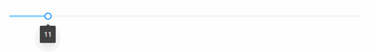
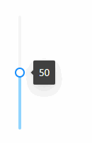
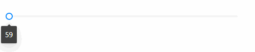

## Slider 数字条
### 完整API
```tsx
interface IProps extends IBaseFormModel {
  /** 初始进度数 */
	value?: number
  /** 数字条布局 垂直布局 | 水平布局（默认） */
	placement?: "vertical" | "inline"
  /** 最小值（默认0） */
	min?: number
  /** 最大值（默认100） */
	max?: number
  /** 数字条提示配置 */
	tooltip?: {
    /** 是否显示数字条 */
		visible?: boolean
    /** 提示内容 */
		content?: (value) => ReactNode | string
    /** 提示内容布局 */
		placement?: "top" | "left" | "right" | "bottom" | "topLeft" | "topRight" | "bottomLeft" | "bottomRight" | "leftTop" | "leftBottom" | "rightTop" | "rightBottom"
	}
}
```
### 基本使用
#### 数字条布局
##### 水平布局
```tsx
import React from 'react';
import { Slider } from "zion-ui"
import { Row, Col } from "antd"

export const Demo = function () {
  return <Row style={{ padding: "20px 20px" }}>
    <Col span={12}>
      <Slider value={11} tooltip={{ visible: true }} />
    </Col>
  </Row>
}
```

##### 垂直布局
```tsx
import React from 'react';
import { Slider } from "zion-ui"

export const Demo = function () {
  const Tpl = Slider({
    value: 50,
    /** 垂直布局 */
    placement: "vertical",
    tooltip: {
      visible: true
    }
  }, true)
  return <div style={{ height: "200px", padding: "20px 20px" }}>
    <Tpl />
  </div>
}
```

#### 自定义大小
```tsx
import React from 'react';
import { Slider } from "zion-ui"

export const Demo = function () {
  const Tpl = Slider({
    /** 设置最小59 */
    min: 59,
    /** 设置最大150 */
    max: 150,
    tooltip: {
      visible: true
    }
  }, true)
  return <div style={{ width: "500px", padding: "20px 20px" }}>
    <Tpl />
  </div>
}
```

#### 提示配置
```tsx
import React from 'react';
import { Slider } from "zion-ui"

export const Demo = function () {
  const Tpl = Slider({
    label: "项目进度",
    required: true,
    tooltip: {
      visible: true,
      content: (value) => value + "%",
      placement: "top"
    }
  }, true)
  return <div style={{ width: "500px", padding: "50px 20px" }}>
    <Tpl />
  </div>
}
```
