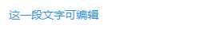
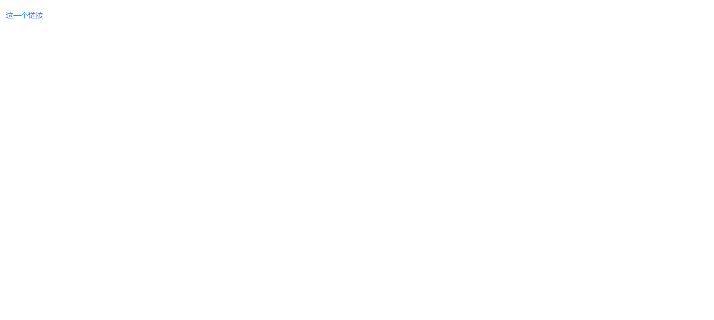
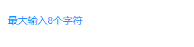
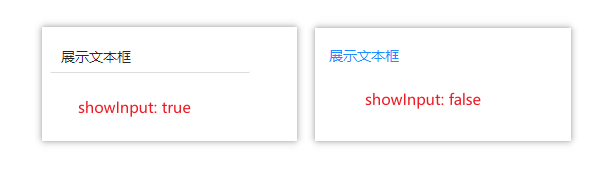
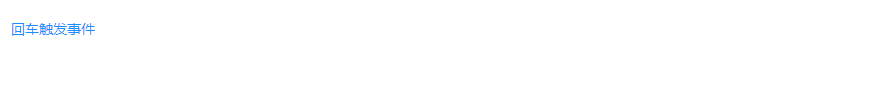
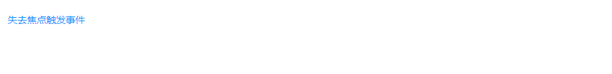
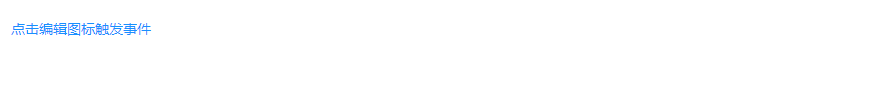

## SpanInput 可编辑Span
### 完整API
```tsx
interface IProps extends IBaseFormModel {
  /** 默认文本内容 */
	value?: string
  /** 最大可输入字符个数 */
	maxLength?: number
  /** 是否展示编辑图标（默认为true，但是flase了也会显示图标，测试无效果） */
	showEdit?: boolean
  /** 将文本转化为链接，点击文本跳转至该链接 */
	href?: string
  /** 是否允许首尾有空格 */
	allowSpace?: boolean
  /** 是否展示文本框 */
	showInput?: boolean
  /** 无效果 */
	showTitle?: boolean

  /** 回车时触发 */
	onPressEnter?: (params: EventHandlerResult, mobx: IObservableObject) => void
  /** 失去焦点时触发 */
	onBlur?: (params: EventHandlerResult, mobx: IObservableObject) => void
  /** 点击编辑图标时触发 */
	onEdit?: (params: EventHandlerResult, mobx: IObservableObject) => void
  /** 点击时触发 */
	onClick?: (params: EventHandlerResult, mobx: IObservableObject) => void
}
```
### 基本使用
#### 可编辑
```tsx
import React from 'react';
import { SpanInput } from "zion-ui"

export const Demo = function () {
  const Tpl = SpanInput({
    style: { width: "200px" },
    value: "这一段文字可编辑",
  }, true)
  return <div style={{ padding: "20px 20px" }}>
    <Tpl />
  </div>
}
```

#### 链接
```tsx
import React from 'react';
import { SpanInput } from "zion-ui"

export const Demo = function () {
  const Tpl = SpanInput({
    style: { width: "200px" },
    value: "这一个链接",
    href: "http://www.haoyuntech.com/"
  }, true)
  return <div style={{ padding: "20px 20px" }}>
    <Tpl />
  </div>
}
```

#### 最大输入长度
```tsx
import React from 'react';
import { SpanInput } from "zion-ui"

export const Demo = function () {
  const Tpl = SpanInput({
    style: { width: "200px" },
    value: "最大输入8个字符",
    maxLength: 8
  }, true)
  return <div style={{ padding: "20px 20px" }}>
    <Tpl />
  </div>
}
```

#### 文本框
```tsx
import React from 'react';
import { SpanInput } from "zion-ui"

export const Demo = function () {
  const Tpl = SpanInput({
    style: { width: "200px" },
    value: "展示文本框",
    showInput: false,
    // showInput: false
  }, true)
  return <div style={{ padding: "20px 20px" }}>
    <Tpl />
  </div>
}
```

#### 事件回调
##### onPressEnter
```tsx
import React from 'react';
import { SpanInput, PopMessage } from "zion-ui"

export const Demo = function () {
  const Tpl = SpanInput({
    style: { width: "200px" },
    value: "回车触发事件",
    onPressEnter: function (params, state) {
      console.log(params, state);
      PopMessage({
        type: "success",
        title: params.eventName
      })
    }
  }, true)
  return <div style={{ padding: "20px 20px" }}>
    <Tpl />
  </div>
}
```

##### onBlur
```tsx
import React from 'react';
import { SpanInput, PopMessage } from "zion-ui"

export const Demo = function () {
  const Tpl = SpanInput({
    style: { width: "200px" },
    value: "失去焦点触发事件",
    onBlur: function (params, state) {
      console.log(params, state);
      PopMessage({
        type: "success",
        title: params.eventName
      })
    }
  }, true)
  return <div style={{ padding: "20px 20px" }}>
    <Tpl />
  </div>
}

```

##### onEdit
```tsx
import React from 'react';
import { SpanInput, PopMessage } from "zion-ui"

export const Demo = function () {
  const Tpl = SpanInput({
    style: { width: "200px" },
    value: "点击编辑图标触发事件",
    onEdit: function (params, state) {
      console.log(params, state);
      PopMessage({
        type: "success",
        title: params.eventName
      })
    }
  }, true)
  return <div style={{ padding: "20px 20px" }}>
    <Tpl />
  </div>
}
```

##### onClick
```tsx
import React from 'react';
import { SpanInput, PopMessage } from "zion-ui"

export const Demo = function () {
  const Tpl = SpanInput({
    style: { width: "200px" },
    value: "点击触发事件",
    onClick: function (params, state) {
      console.log(params, state);
      PopMessage({
        type: "success",
        title: params.eventName
      })
    }
  }, true)
  return <div style={{ padding: "20px 20px" }}>
    <Tpl />
  </div>
}
```
