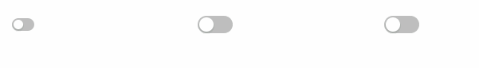
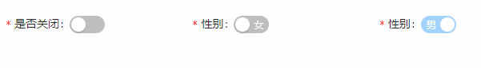
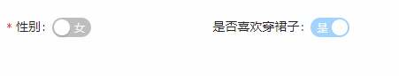

## Switch 开关
### 完整API
```tsx
interface IProps extends IBaseFormModel {
  /** 是否选中 */
	value?: boolean 
  /** 开关大小(默认middle) */
  size: "large" | "middle" | "small"
  /** 标签内容 */
  label: string
  /** 标签内容是否带‘*’ */
  required: boolean
  /** 选中时显示的内容 */                        
	checkedChildren?: string | ReactNode   
  /** 非选中时显示的内容 */ 
	unCheckedChildren?: string | ReactNode 
```
### 基本使用
#### 开关大小
```tsx
import React from 'react';
import { Switch } from "zion-ui"
import { Row, Col } from "antd"

export const Demo = function () {
  return <Row style={{ padding: "20px 20px" }}>
    <Col span={4}>
      <Switch size="small" />
    </Col>
    <Col span={4}>
      <Switch size="middle" />
    </Col>
    <Col span={4}>
      <Switch size="large" />
    </Col>
  </Row>
}
```

#### 显示内容
```tsx
import React from 'react';
import { Switch } from "zion-ui"
import { Row, Col } from "antd"

export const Demo = function () {
  return <Row style={{ padding: "20px 20px" }}>
    <Col span={4}>
      <Switch label="是否关闭" required={true} />
    </Col>
    <Col span={4}>
      <Switch label="性别" required={true} unCheckedChildren={"女"} checkedChildren="男" />
    </Col>
    <Col span={4}>
      <Switch label="性别" required={true} value={true} disabled={true} unCheckedChildren={"女"} checkedChildren="男" />
    </Col>
  </Row>
}
```

### 受控示例
```tsx
import React from 'react';
import { Switch, StateManage } from "zion-ui"
import { Row, Col } from "antd"

export const Demo = function () {
  const [hobbyState, HobbyTpl] = Switch({
    label: "是否喜欢穿裙子",
    value: true,
    disabled: true,
    unCheckedChildren: "否",
    checkedChildren: "是"
  }, false)
  return <Row style={{ padding: "20px 20px" }}>
    <Col span={4}>
      <Switch
        label="性别"
        required={true}
        unCheckedChildren={"女"}
        checkedChildren="男"
        onChange={({ value }) => {
          StateManage.set(hobbyState, { value: value ? false : true })
        }}
      />
    </Col>
    <Col span={8}>
      <HobbyTpl />
    </Col>
  </Row>
}
```
