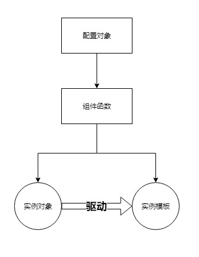

## 核心概念

### 设计初衷
 - 通过配置对象的方式生成组件，屏蔽react官方绝大部分的API，回归最原生的js开发
 - 对antd的组件进行二次封装，降低使用难度，丰富更强大的功能
 - 对于数据管理系统类的应用，封装通用的组件，提高开发效率，如(Loading, QueryForm等)
 - 通过状态管理服务解决组件之前通信的痛点，使用最简单的API实现任意组件之间无死角通信
 - 面向UI编程，屏蔽各种复杂高深的设计理论，UI即设计，简单直接高效

### 四个核心概念


#### 配置对象
>用于描述组件的属性，如组件UI，事件，数据请求，生命周期; 
>配置对象一般是字面量对象
```ts
const property = {
  text: "提交按钮",
  onClick: () => {
  	// 点击事件
  }
}
```
 - 配置属性可以分为四类
   - UI属性: 描述组件UI相关的属性，如: style,className
   - 事件属性: 组件的事件绑定，如: onClick, onFocus
   - 数据请求属性: 组件数据请求相关的属性配置, 如: httpConfig.init
   - 生命周期属性：组件生命周期相关的属性配置, 如: didMount

#### 组件函数
> ① 组件函数可用于生成实例模板和实例对象
```tsx
	// Button 作为组件函数
	import { Button } from "zion-ui";
	import React from "react";
	import ReactDOM from "react-dom";
	const property = {
  	text: "提交按钮",
  	onClick: () => {
  		console.log("onClick...")
  	}
	}
	// ① state是实例对象  ② Template 是实例模板
	const [state,Template] = Button(property,true)
	ReactDOM.render(<Template />, document.getElementById("root"))
```

> ② 组件函数可当作React组件直接使用
```tsx
  // Button 作为React组件
	import { Button } from "zion-ui";
	import React from "react";
	import ReactDOM from "react-dom";
	const property = {
  	text: "提交按钮",
  	onClick: () => {
  		console.log("onClick...")
  	}
  }
	ReactDOM.render(<Button {...property}/>, document.getElementById("root"))
```

#### 实例对象
> 用于控制实例模板，当实例对象发生改变时，实例模板会自动更新

```tsx
  import { Button, StateManage } from "zion-ui";
	import React from "react";
	import ReactDOM from "react-dom";
	const property = {
  	text: "提交按钮",
  	onClick: () => {
  		console.log("onClick...")
  	}
	}
	// ① state是实例对象  ② Template 是组件模板
	const [state,Template] = Button(property,true)
	ReactDOM.render(<Template />, document.getElementById("root"))
	setTimeout(() => {
		// 通过状态管理服务修改实例对象的属性
		StateManage.set(state,{text:"修改按钮文字"})
	}, 800)
```

#### 实例模板
> 实例模板类似于React组件，但是不支持传递props参数

```tsx
	// Button 作为组件函数
	import { Button } from "zion-ui";
	import React from "react";
	import ReactDOM from "react-dom";
	const property = {
  	text: "提交按钮",
  	onClick: () => {
  		console.log("onClick...")
  	}
	}
	// ① state是实例对象  ② Template 是实例模板
	const [state,Template] = Button(property,true)
	ReactDOM.render(<Template />, document.getElementById("root"))
```