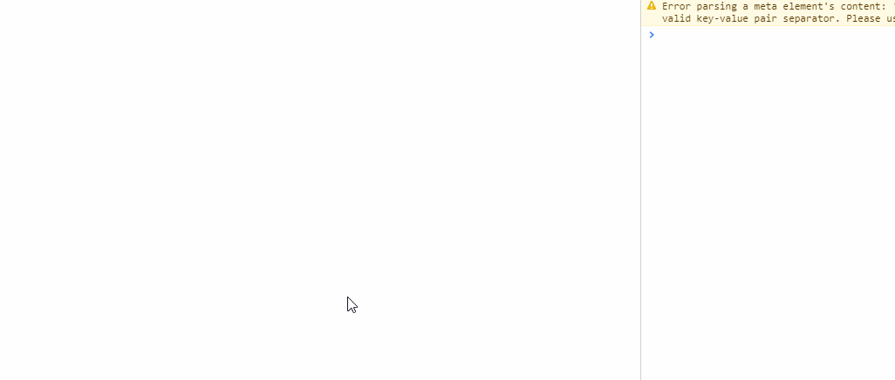

## 实例对象
 - 实例对象是框架最核心的概念，它的主要功能是用于和视图进行绑定，当实例对象发生变更时，视图会及时更新
 - 实例对象类似于react中state+props的结合，但是又有区别
   - react中的state存在于组件内部，其他组件很难控制它
   - react中的props只能通过父组件传给子组件
 - 对实例对象的操作(取值或设置), 都必须通过状态管理服务StateManage
 - 获取一个实例对象, `PropertyService.getObservableObj(obj:object<any>)`
 - 框架内置的组件
   - 绝大部分都提供了输出实例对象的能力
   - 也可通过controlKey的方式，对实例对象进行托管

### 实例对象的管理方式
 - 单独管理
 ```tsx
	import { PropertyService, StateManage } from "zion-ui"
	/** 这个实例对象是单独存在的 */ 
	const state = PropertyService.getObservableObj({
    title:"弹出标题", 
	  visible: false
	})
	/** 设值 */
	StateManage.set(state, { visible: false })
	/** 取值 */
	StateManage.get(state, "title")
 ```
 - StateManage统一托管
```tsx
	import { PropertyService } from "zion-ui"
	const state = PropertyService.getObservableObj({
    title:"弹出标题", 
	  visible: false
	})
	/** 通过一个字符串标识，将 state 托管给 StateManage  */
	const controlKey = "BBK.location_mananage.group_building.addButton"
	StateManage.addState(controlKey, state)
	/** 设值 */
	StateManage.set(controlKey, { visible: false })
	/** 取值 */
	StateManage.get(controlKey, "title")
 ```

 ### 实例对象与组件如何绑定
 1. 通过 `PropertyService.getObservableObj(obj:object<any>)` 获取一个实例对象
 2. 通过 `observer` 组件包装器将组件二次包装
 3. 通过 `StateManage` 在组件内部操作实例对象

```tsx
import { PropertyService, observer, StateManage, Input, Tag } from "zion-ui"

/** 获取实例对象 */
const state = PropertyService.getObservableObj({ name: "zion-ui", version: "2.0.1" })

/** 组件二次包装 */
const Show = observer(() => {
	/** 获取实例对象的属性 */
	const { version } = StateManage.get(state)
	return <div style={{ padding: "100px", width: "400px" }}>
		<Tag text={version} type="success" />
	</div>
})

/** 组件二次包装 */
const Controller = observer(() => {
	const { name, version } = StateManage.get(state)
	return <Input
		addonBefore={name}
		value={version}
		autoFocus={true}
		onChange={({ value }) => {
			/** 设值实例对象的属性 */
			StateManage.set(state, { version: value })
		}}
	/>
})

const App = () => {
	return <div style={{ padding: "100px", width: "400px" }}>
		<Show />
		<Controller />
	</div>
}

ReactDOM.render(<App />, document.getElementById("zion-ui"))
```



 