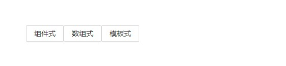
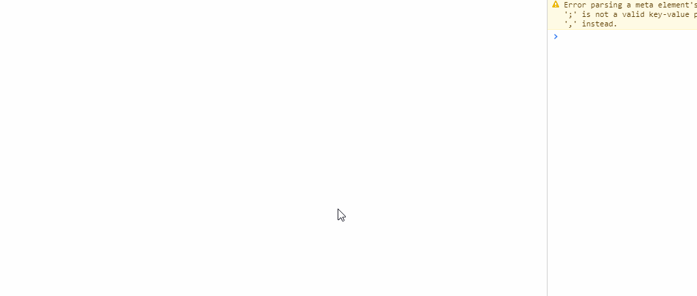
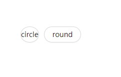
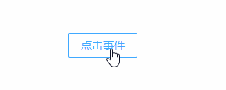

## Button 按钮

### 完整API
 - [BaseModel](../../架构设计/基础模型.md)
```ts
interface IProps extends IBaseModel {
	/** 按钮文字 */
	text?: string
	/** 按钮类型: "default" | "primary" | "link" | "danger" | "dashed" | "ghost" | "warn" | "warning" | "info" | "success" */
	type?: ButtonTypes
	/** 是否禁用 */
	disabled?: boolean
	/** 按钮形状 */
	shape?: "round" | "circle"
	/** 调整链接，当type="link"时有效 */
	href?: string
	/** 等同于a标签的target属性, 当type="link"时有效 */
	target?: string
	/** 是否loading */
	loading?: boolean
	/** 是否显示 */
	show?: boolean
	/** 小图标 */
	icon?: ReactNode
	/** 按钮点击事件 */
	onClick?: (params: EventHandlerParams, state: IObservableObject) => void
}
```

### 示例

#### 三种使用方式


```tsx
import { Button } from "zion-ui"

const Demo = () => {
	const [state, Tpl] = Button({ text: "数组式" }, false)
	const Template = Button({ text: "模板式" }, true)
	return <div style={{ padding: "100px" }}>
		<Button text="组件式" />
		<Tpl />
		<Template />
	</div>
}
```

#### 按钮类型

```tsx
import { Button } from "zion-ui"

const Demo = () => {
	const types = ["default", "primary", "link", "danger", "dashed", "ghost", "warn", "warning", "info", "success"]
	return <div style={{ padding: "100px" }}>
		{types.map(type => {
			return <Button text={type} type={type} style={{ margin: "5px" }} />
		})}
	</div>
}
```

#### 按钮图标

```tsx
import { Button } from "zion-ui"
import { DownloadOutlined } from "@ant-design/icons"

const Demo = () => {
	return <div style={{ padding: "100px" }}>
		<Button icon={< DownloadOutlined />} type="primary" text="下载" />
	</div>
}
```

#### 按钮形状

```tsx
import { Button } from "zion-ui"

const Demo = () => {
	return <div style={{ padding: "100px" }}>
		<Button shape="circle" text="circle" style={{ marginRight: "10px" }} />
		<Button shape="round" text="round" />
	</div>
}
```

#### 自定义样式

```tsx
import { Button } from "zion-ui"
import { DownloadOutlined } from "@ant-design/icons"

const Demo = () => {
	return <div style={{ padding: "100px" }}>
		<Button style={{
			padding: "10px 20px",
			border: "1px solid #1890ff",
			lineHeight: "10px",
			background: "red",
			color: "#fff"
		}}
			text="自定义样式"
		/>
	</div>
}
```

#### 按钮事件

```tsx
import { Button, StateManage } from "zion-ui"

const Demo = () => {
	return <div style={{ padding: "100px" }}>
		<Button text="点击事件" onClick={({ }, state) => {
			StateManage.set(state, { loading: true })
			const timer = setTimeout(() => {
				StateManage.set(state, { loading: false })
				clearTimeout(timer)
			}, 800)
		}} />
	</div>
}
```

