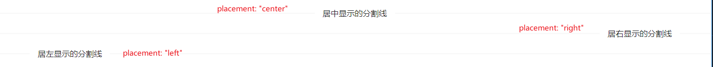
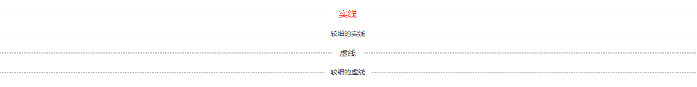

## Divider 分割线
### 完整API
```tsx
interface IProps extends IBaseModel {
  /** 分割线上添加的内容 */
	content?: ReactNode | string
  /** 是否为虚线 */
	dashed?: boolean
  /** content的布局(默认居中) */
	placement?: "left" | "right" | "center"
  /** 是否使用较细的线 */
	plain?: boolean
}
```
### 基本使用
#### content布局
```tsx
import React from 'react';
import { Divider } from "zion-ui"

export const Demo = function () {
  const CenterDivider = Divider({
    content: "居中显示的分割线",
  }, true)
  const DeleteDivider = Divider({
    content: "居右显示的分割线",
    placement: "right",
  }, true)
  const LeftDivider = Divider({
    content: "居左显示的分割线",
    placement: "left",
  }, true)
  return <div>
    <CenterDivider />
    <DeleteDivider />
    <LeftDivider />
  </div>
}
```

#### 分割线样式
```tsx
import React from 'react';
import { Divider } from "zion-ui"

export const Demo = function () {
  const Divider001 = Divider({
    content: "实线",
    style: { color: "red", fontSize: "18px" }
  }, true)
  const Divider002 = Divider({
    content: "较细的实线",
    plain: true
  }, true)
  const Divider003 = Divider({
    content: "虚线",
    dashed: true
  }, true)
  const Divider004 = Divider({
    content: "较细的虚线",
    dashed: true,
    plain: true
  }, true)
  return <div>
    <Divider001 />
    <Divider002 />
    <Divider003 />
    <Divider004 />
  </div>
}
```

