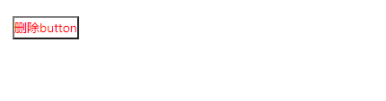

## PopConfirm 确认提示
### 完整API
```tsx
interface IProps extends IBaseModel {
  /** 取消框文本 */
	cancelText?: string
  /** 确认框文本 */
	okText?: string
  /** 触发确认提示的容器 */
	content: ReactNode
  /** 添加图标 */
	icon?: ReactNode
  /** 确认提示标题 */
	title: string
  /** 确认提示的布局 */
	placement?: "top" | "left" | "right" | "bottom" | "topLeft" | "topRight" | "bottomLeft" | "bottomRight" | "leftTop" | "leftBottom" | "rightTop" | "rightBottom"
  /** 触发确认提示的模式 点击 | 悬停 | 聚焦 */
	trigger?: "click" | "hover" | "focus"
  /** 触发取消框时的回调 */
	onCancel?: () => void
  /** 触发确认框时的回调 */
	onConfirm?: () => void
}
```
### 基本使用
```tsx
import React from 'react';
import { PopConfirm, PopMessage } from "zion-ui"
import { WarningTwoTone } from "@ant-design/icons"

export const Demo = function () {
  const content = <button style={{ cursor: "pointer", color: "red", backgroundColor: "#fff" }}>删除button</button>
  const DeleteConfirm = PopConfirm({
    title: "确认删除?",
    cancelText: "取消",
    okText: "确认",
    trigger: "click",
    placement: "right",
    onCancel: function () {
      PopMessage({
        type: "success",
        title: "取消成功"
      })

    },
    onConfirm: function () {
      PopMessage({
        type: "success",
        title: "确认删除"
      })
    },
    icon: <WarningTwoTone />,
    content
  }, true)
  return <div style={{ padding: "20px 20px" }}>
    <DeleteConfirm />
  </div>
}
```
