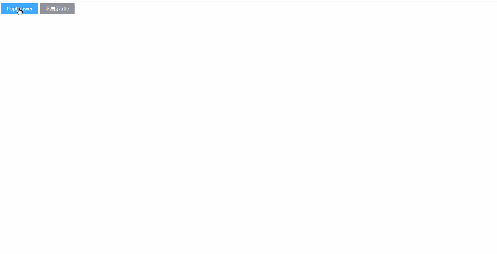
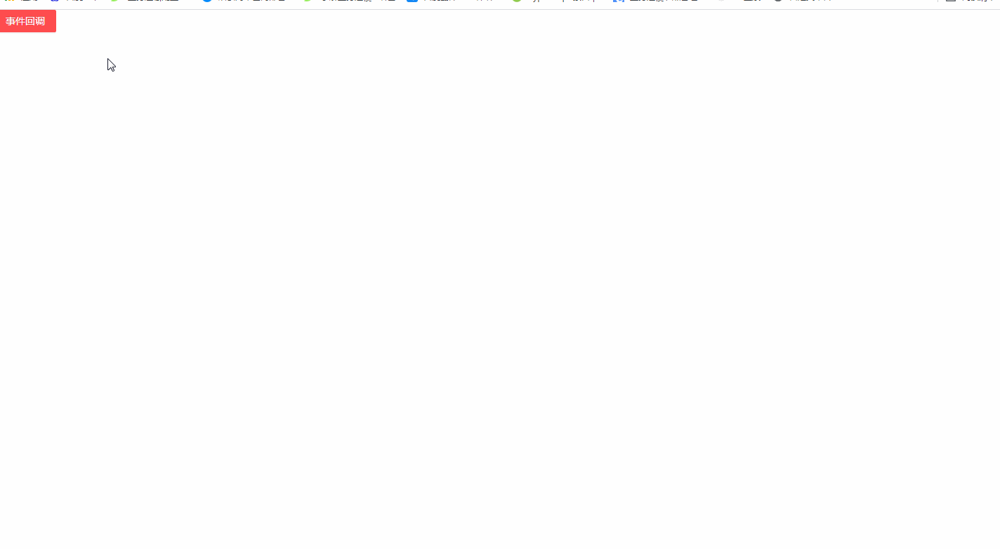
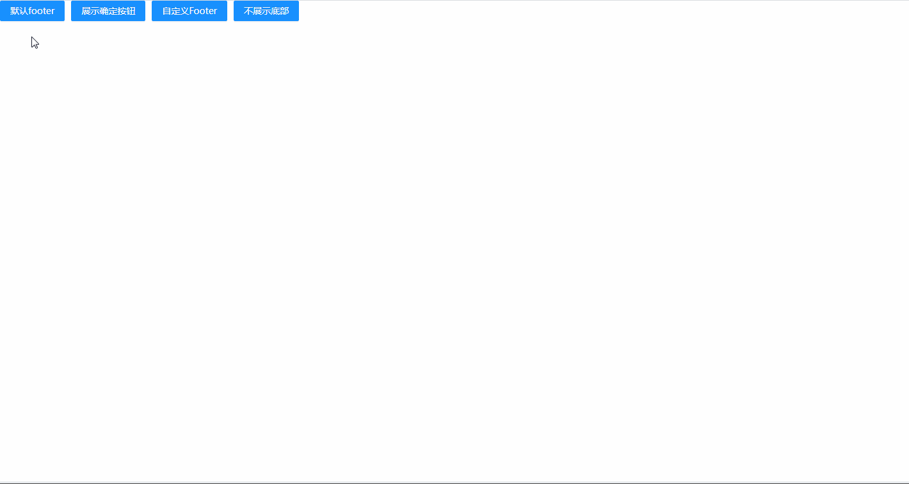
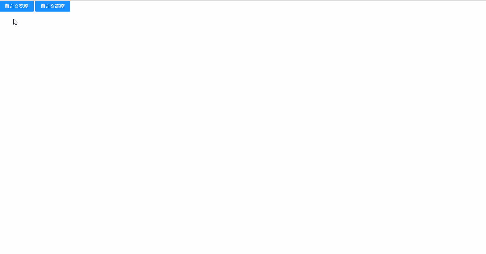

## PopDrawer 抽屉弹窗

### 完整API

```ts
interface IProps extends IBaseModel {
	/* 弹窗标题 */
  title?: string | ReactNode | null
	/* 弹窗内容 */
  content?: ReactNode
	/* 弹窗尾部 */
  footer?: ReactNode | null
	/* 弹出位置 */
  placement?: "right" | "top" | "left" | "bottom"
	/* 弹窗宽度 */
  width?: string
	/* 弹窗高度 */
  height?: string
	/* 是否支持Esc按钮关闭 */
  keyboard?: boolean
	/* 是否支持点击遮罩层关闭 */
  maskClosable?: boolean
	/* 是否显示遮罩层 */
  showMask?: boolean
	/* 遮罩层样式 */
  maskStyle?: CSSProperties
	/* 弹窗层级 */
  zIndex?: number
	/* 是否显示弹窗 */
  visible?: boolean
	/* 关闭按钮内容 */
  cancelText?: string
	/* 确定按钮内容 */
  okText?: string

	/* 按"确定"按钮后的回调事件 */
  onOk?: (params: EventHandlerResult, mobxProps: IObservableObject) => void
	/* 按"确定"按钮后的回调事件 */
  onConfirm?: (params: EventHandlerResult, mobxProps: IObservableObject) => void
	/* 按"关闭"按钮后的回调事件 */
  onCancel?: () => void
	/* 按"关闭"按钮后的回调事件 */
  onClose?: () => void
}
```

### 示例

#### 基本使用

```tsx
import { PopDrawer, Button, ButtonProps } from "zion-ui"
import { DownloadOutlined } from "@ant-design/icons"
import { Button as AntButton } from "antd"

export const Demo = function () {
  const btnProps: ButtonProps = {
    text: "PopDrawer",
    type: "primary",
    style: { margin: "5px" },
    onClick: function () {
      PopDrawer({
        title: "自定义弹窗标题",
        width: "20%",
        content: <div>
          content
        </div>
      })
    }
  }
  const NoTitle = Button({
    text: "不展示title",
    type: "info",
    onClick: function () {
      PopDrawer({
        title: null,
        placement: "top",
        footer: <div style={{ textAlign: "right" }}>
          <AntButton icon={<DownloadOutlined />} type="primary" size="small">下载</AntButton>
        </div>,
        width: "400px",
        height: "400px",
      })
    }
  }, true)
  return <div style={{ marginBottom: "10px" }}>
    <Button {...btnProps} />
    <NoTitle />
  </div>
}
```

#### 弹窗位置

```tsx
import { PopDrawer, Button } from "zion-ui"

export const Demo = function () {
  const RightBtn = Button({
    text: "right",
    type: "primary",
    style: { margin: "0px 5px" },
    onClick: function () {
      PopDrawer({
        placement: "right"
      })
    }
  }, true)
  const TopBtn = Button({
    text: "top",
    type: "primary",
    style: { margin: "0px 5px" },
    onClick: function () {
      PopDrawer({
        placement: "top"
      })
    }
  }, true)
  const BottomBtn = Button({
    text: "bottom",
    type: "primary",
    style: { margin: "0px 5px" },
    onClick: function () {
      PopDrawer({
        placement: "bottom"
      })
    }
  }, true)
  const LeftBtn = Button({
    text: "left",
    type: "primary",
    style: { margin: "0px 5px" },
    onClick: function () {
      PopDrawer({
        placement: "left"
      })
    }
  }, true)
  return <div style={{ marginBottom: "10px" }}>
    <RightBtn />
    <TopBtn />
    <BottomBtn />
    <LeftBtn />
  </div>
}
```

#### 事件回调

```tsx
import { PopDrawer, Button, StateManage, Loading } from "zion-ui"

export const Demo = function () {
  const [btnState, BtnTpl] = Button({
    text: "事件回调",
    type: "danger",
    onClick: function () {
      PopDrawer({
        title: "自定义弹窗标题",
        onCancel: function () {
          window.alert("onCancel")
        },
        onOk: function (params, modalState) {
          StateManage.set(modalState, { visible: false })
          StateManage.set(btnState, { type: "success" })
          Loading.setGlobalLoading(true)
          const timer = setTimeout(() => {
            clearTimeout(timer)
            Loading.setGlobalLoading(false)
          }, 800)
        }
      })
    }
  }, false)

  return <div style={{ marginBottom: "10px" }}>
    <BtnTpl />
  </div>
}
```

#### footer配置

```tsx
import { PopDrawer, Button, StateManage } from "zion-ui"

export const Demo = function () {
  const DefaultFooter = Button({
    text: "默认footer",
    type: "primary",
    style: { margin: "0px 5px" },
    onClick: function () {
      PopDrawer({
      })
    }
  }, true)
  const ShowOkBtn = Button({
    text: "展示确定按钮",
    type: "primary",
    style: { margin: "0px 5px" },
    onClick: function () {
      PopDrawer({
        onConfirm: (params, state) => {
          StateManage.set(state, { visible: false })
        }
      })
    }
  }, true)
  const CustomerFooter = Button({
    text: "自定义Footer",
    type: "primary",
    style: { margin: "0px 5px" },
    onClick: function () {
      PopDrawer({
        footer: <div>
          <DefaultFooter />
          <ShowOkBtn />
          <CustomerFooter />
        </div>
      })
    }
  }, true)
  const NoFooterBtn = Button({
    text: "不展示底部",
    type: "primary",
    style: { margin: "0px 5px" },
    onClick: function () {
      PopDrawer({
        footer: null
      })
    }
  }, true)
  return <div style={{ marginBottom: "10px" }}>
    <DefaultFooter />
    <ShowOkBtn />
    <CustomerFooter />
    <NoFooterBtn />
  </div>
}
```

#### 设置宽度/高度

```tsx
import { PopDrawer, Button } from "zion-ui"

export const Demo = function () {
  const WidthBtn = Button({
    text: "自定义宽度",
    type: "primary",
    onClick: function () {
      PopDrawer({
        width: "80%"
      })
    }
  }, true)
  const HeightBtn = Button({
    text: "自定义高度",
    type: "primary",
    onClick: function () {
      PopDrawer({
        placement: "top",
        height: "80%"
      })
    }
  }, true)
  return <div style={{ marginBottom: "10px" }}>
    <WidthBtn />
    &nbsp;
    <HeightBtn />
  </div>
}
```