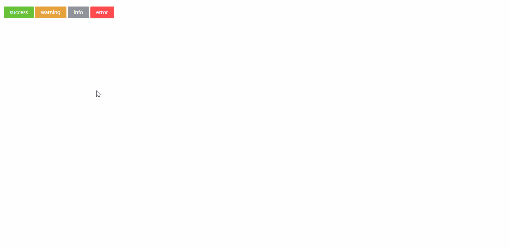

## PopMessage 全局提示
### 完整API
```tsx
interface IProps extends IBaseModel {
  /** 提示标题 */
	title?: string | ReactNode
  /** 提示内容(有标题时不显示) */
	text?: string | ReactNode
  /** 提示框类型 */
	type?: "info" | "warning" | "success" | "error"
  /** 自动关闭的延时，单位秒。设为 0 时不自动关闭 */
	duration?: number
  /** 关闭时触发的回调函数 */
	onClose?: () => void
}
```
### 基本使用
```tsx
import React from 'react';
import { PopMessage, Button, Loading } from "zion-ui"

export const Demo = function () {
  const SuccessBtn = Button({
    text: "success",
    type: "success",
    onClick: function () {
      Loading.setGlobalLoading(true)
      const timer = setTimeout(() => {
        clearTimeout(timer)
        PopMessage({
          type: "success",
          text: "保存成功",
          duration: 2,
          onClose: function () {
            console.log("close...")
          }
        })
        Loading.setGlobalLoading(false)
      }, 800)
    }
  }, true)
  const InfoBtn = Button({
    text: "info",
    type: "info",
    onClick: function () {
      const timer = setTimeout(() => {
        clearTimeout(timer)
        PopMessage({
          type: "info",
          text: "保存成功"
        })
      }, 800)
    }
  }, true)
  const WarningBtn = Button({
    text: "warning",
    type: "warning",
    onClick: function () {
      PopMessage({
        type: "warning",
        text: "保存成功"
      })
    }
  }, true)
  const ErrorBtn = Button({
    text: "error",
    type: "danger",
    onClick: function () {
      Loading.setGlobalLoading(true)
      const timer = setTimeout(() => {
        clearTimeout(timer)
        PopMessage({
          type: "error",
          text: "保存失败"
        })
        Loading.setGlobalLoading(false)
      }, 800)
    }
  }, true)
  return <div style={{ padding: "20px 20px" }}>
    <SuccessBtn />
    &nbsp;
    <WarningBtn />
    &nbsp;
    <InfoBtn />
    &nbsp;
    <ErrorBtn />
  </div>
}
```

