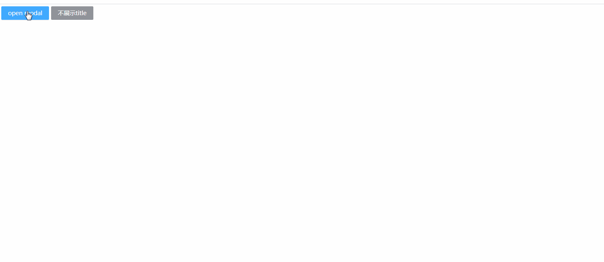
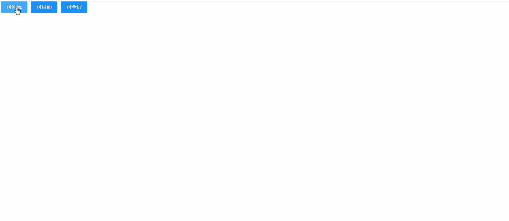
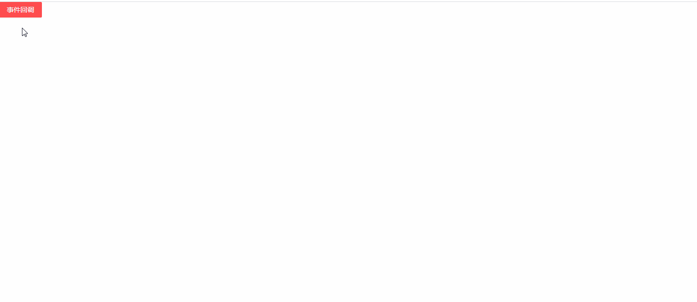
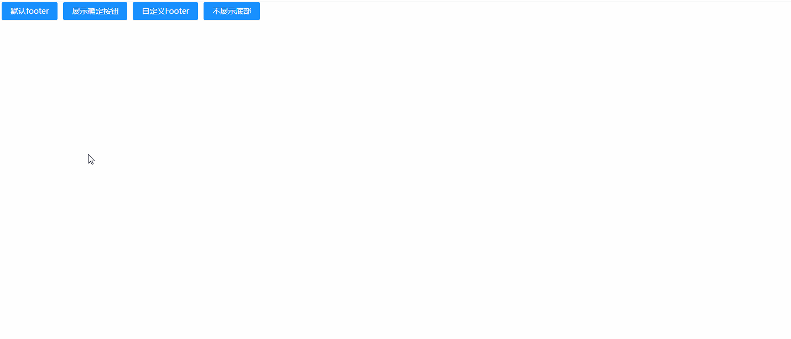
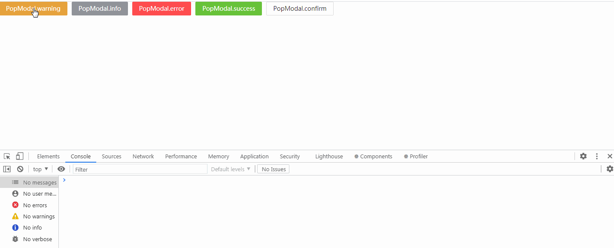

## PopModal 居中弹窗

### 完整API

```ts
interface IProps extends IBaseModel {

	/* 头部标题 */
  title?: string | ReactNode
	/* 中间内容 */
  content?: ReactNode
	/* 尾部内容 */
  footer?: ReactNode | null
	/* 是否全屏显示 */
  fullScreen?: boolean
	/* 是否可以拖拽 */
  allowDrag?: boolean
	/* 是否可以拉伸 */
  allowResize?: boolean
	/* 是否可以全屏 */
  allowFullScreen?: boolean
	/* 距离页面顶部的距离 */
  top?: string
	/* 弹窗宽度 */
  width?: string
	/* 弹窗高度 */
  height?: string
	/* 是否支持按Esc键关闭弹窗 */
  keyboard?: boolean
	/* 是否支持点击遮罩层关闭弹窗 */
  maskClosable?: boolean
	/* 是否显示遮罩层 */
  showMask?: boolean
	/* 遮罩层样式 */
  maskStyle?: CSSProperties
	/* 弹窗层级 */
  zIndex?: number
	/* 是否显示弹窗 */
  visible?: boolean
	/* "确定"按钮的内容 */
  okText?: ReactNode | string
	/* "取消"按钮的内容 */
  cancelText?: ReactNode | string

	/* 按"确认"按钮后的回调事件（推荐使用） */
  onOk?: (params: EventHandlerResult, state: IObservableObject) => void
	/* 按"确认"按钮后的回调事件 */
  onConfirm?: (params: EventHandlerResult, state: IObservableObject) => void
	/* 按"关闭"按钮后的回调事件（推荐使用） */
  onCancel?: () => void
	/* 按"关闭"按钮后的回调事件 */
  onClose?: () => void
}
```

### 示例

#### 基本使用


```tsx
import { PopModal, Button } from "zion-ui"
import { DownloadOutlined } from "@ant-design/icons"
import { Button as AntButton } from "antd"
const Icon: any = DownloadOutlined

export const Demo = function () {
  const BtnTpl = Button({
    text: "open modal",
    type: "primary",
    style: { margin: "5px" },
    onClick: function () {
      PopModal({
        title: "自定义弹窗标题",
        width: "20%",
        height: "400px",
        content: <div>
          PopModal
        </div>
      })
    }
  }, true)
  const NoTitle = Button({
    text: "不展示title",
    type: "info",
    onClick: function () {
      PopModal({
        title: null,
        maskClosable: true,
        footer: <AntButton icon={<Icon />} type="primary" size="small">下载</AntButton>,
        width: "400px",
        height: "400px",
      })
    }
  }, true)
  return <div style={{ marginBottom: "10px" }}>
    <BtnTpl />
    <NoTitle />
  </div>
}
```

#### 拖拽/拉伸/全屏

```tsx
import { PopModal, Button } from "zion-ui"

export const Demo = function () {
  const DragBtn = Button({
    text: "可拖拽",
    type: "primary",
    style: { margin: "0px 5px" },
    onClick: function () {
      PopModal({
        title: "可拖拽",
        allowDrag: true
      })
    }
  }, true)
  const ResizeBtn = Button({
    text: "可拉伸",
    type: "primary",
    style: { margin: "0px 5px" },
    onClick: function () {
      PopModal({
        title: "可拉伸",
        allowResize: true
      })
    }
  }, true)
  const FullScreenBtn = Button({
    text: "可全屏",
    type: "primary",
    style: { margin: "0px 5px" },
    onClick: function () {
      PopModal({
        title: "可全屏",
        allowFullScreen: true
      })
    }
  }, true)

  return <div style={{ paddingBottom: "10px" }}>
    <DragBtn />
    <ResizeBtn />
    <FullScreenBtn />
  </div>
}
```

#### 事件回调

```tsx
import { PopModal, Button, StateManage, Loading } from "zion-ui"

export const Demo = function () {
  const [btnState, BtnTpl] = Button({
    text: "事件回调",
    type: "danger",
    onClick: function () {
      PopModal({
        title: "自定义弹窗标题",
        onCancel: function () {
          window.alert("onCancel")
        },
        onOk: function (params, modalState) {
          console.log(params, modalState)
          StateManage.set(modalState, { visible: false })
          StateManage.set(btnState, { type: "success" })
          Loading.setGlobalLoading(true)
          const timer = setTimeout(() => {
            clearTimeout(timer)
            Loading.setGlobalLoading(false)
          }, 800)
        }
      })
    }
  }, false)

  return <div style={{ marginBottom: "10px" }}>
    <BtnTpl />
  </div>
}
```

#### footer配置

```tsx
import { PopModal, Button, StateManage } from "zion-ui"

export const Demo = function () {
  const DefaultFooter = Button({
    text: "默认footer",
    type: "primary",
    style: { margin: "0px 5px" },
    onClick: function () {
      PopModal({
        allowDrag: true,
      })
    }
  }, true)
  const ShowOkBtn = Button({
    text: "展示确定按钮",
    type: "primary",
    style: { margin: "0px 5px" },
    onClick: function () {
      PopModal({
        onConfirm: (params, state) => {
          StateManage.set(state, { visible: false })
        }
      })
    }
  }, true)
  const CustomerFooter = Button({
    text: "自定义Footer",
    type: "primary",
    style: { margin: "0px 5px" },
    onClick: function () {
      PopModal({
        footer: <div>
          <DefaultFooter />
          <ShowOkBtn />
          <CustomerFooter />
        </div>
      })
    }
  }, true)
  const NoFooterBtn = Button({
    text: "不展示底部",
    type: "primary",
    style: { margin: "0px 5px" },
    onClick: function () {
      PopModal({
        footer: null
      })
    }
  }, true)
  return <div style={{ marginBottom: "10px" }} >
    <DefaultFooter />
    <ShowOkBtn />
    <CustomerFooter />
    <NoFooterBtn />
  </div>
}
```

#### 静态方法

```tsx
import { Button, PopModal } from "zion-ui"

export const Demo = function () {
  const warningModal = function () {
    PopModal.warning({
      title: "warning",
      content: "是否确认删除?",
      onOk: function () {
        console.log("warning ok...")
      }
    })
  }
  const successModal = function () {
    PopModal.success({
      title: "success",
      content: "操作成功",
      onOk: function () {
        console.log("success ok...")
      }
    })
  }
  const infoModal = function () {
    PopModal.info({
      title: "info",
      content: "温馨提示",
      onOk: function () {
        console.log("info ok...")
      }
    })
  }
  const errorModal = function () {
    PopModal.error({
      title: "error",
      content: "不可删除",
      onOk: function () {
        console.log("error ok...")
      }
    })
  }
  const confirmModal = function () {
    PopModal.confirm({
      title: "confirm",
      content: "再次确认",
      onOk: function () {
        console.log("confirm ok...")
      }
    })
  }
  return <div style={{ marginBottom: "10px" }}>
    <Button text="PopModal.warning" style={{ marginRight: "10px" }} type="warning" onClick={warningModal} />
    <Button text="PopModal.info" style={{ marginRight: "10px" }} type="info" onClick={infoModal} />
    <Button text="PopModal.error" style={{ marginRight: "10px" }} type="danger" onClick={errorModal} />
    <Button text="PopModal.success" style={{ marginRight: "10px" }} type="success" onClick={successModal} />
    <Button text="PopModal.confirm" style={{ marginRight: "10px" }} onClick={confirmModal} />
  </div>
}
```