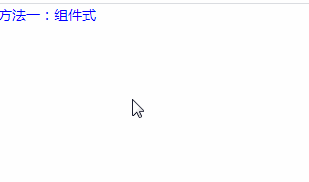
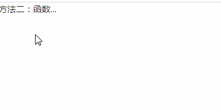

## PopTip 文字提示

### 完整API

```ts
interface IProps extends IBaseModel {
	/* 需要提示的内容 */
  title: string | ReactNode
	/* 提示的内容 */
  content: ReactNode
	/* 触发的方式 */
  trigger?: "click" | "hover" | "focus"
	/* 触发的位置 */
  placement?: "top" | "left" | "right" | "bottom" | "topLeft" | "topRight" | "bottomLeft" | "bottomRight" | "leftTop" | "leftBottom" | "rightTop" | "rightBottom"
}
```

### 示例
>请确保content能接受 onMouseEnter、onMouseLeave、onFocus、onClick 事件作为props
>zion-ui中的大部分组件不接受以上事件，content可以是原生标签或其他第三方支持以上事件的组件

#### 使用方式一：组件式

```tsx
import { PopTip, } from "zion-ui";

export const Demo = function () {
  const text = "这是一段很长很长很长很长很长很长很长很长很长很长很长很长很长很长的文字"

  return <div>
    <PopTip placement="top" title={text} content={<span style={{ color: "blue" }}>方法一：组件式</span>} />
  </div>
}
```

#### 使用方式二：函数式

```tsx
import { PopTip, } from "zion-ui";

export const Demo = function () {
  const text = "方法二：函数式+很长很长很长很长很长很长很长很长很长很长很长很长很长很长的文字"
  const PopTipTest = PopTip({
    title: text,
    placement: "right",
    trigger: "click",
    content: <div style={{ width: "100px", textOverflow: "ellipsis", overflow: "hidden", whiteSpace: "nowrap" }}>
      {text}
    </div>
  }, true)

  return <div>
    <PopTipTest />
  </div>
}
```