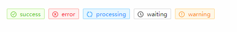
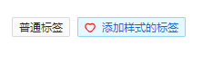
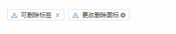

## Tag 标签
### 完整API
```tsx
interface IProps extends IBaseModel {
  /** 标签文本 */
	text?: string
  /** 类型 */
	type?: TtagType
  /** 是否可删除 */
	closable?: boolean
  /** 自定义删除图标 */
	closeIcon?: ReactNode
  /** 自定义颜色 */
	color?: string
  /** 自定义图标 */
	icon?: ReactNode
  /** 测试无效 */
	onClose?: (params: EventHandlerParams, state: IObservableObject) => void
}

// type
type TtagType = "success" | "warning" | "processing" | "error" | "waiting"
```
### 基本使用
#### 标签类型
```tsx
import React from 'react';
import { Tag } from "zion-ui"

export const Demo = function () {
  const SuccessTag = Tag({
    text: "success",
    type: "success"
  }, true)
  const ErrorTag = Tag({
    text: "error",
    type: "error"
  }, true)
  const ProcessingTag = Tag({
    text: "processing",
    type: "processing"
  }, true)
  const WaitingTag = Tag({
    text: "waiting",
    type: "waiting"
  }, true)
  const WarningTag = Tag({
    text: "warning",
    type: "warning"
  }, true)
  return <div style={{ padding: "20px 20px" }}>
    <SuccessTag />
    <ErrorTag />
    <ProcessingTag />
    <WaitingTag />
    <WarningTag />
  </div>
}
```

#### 自定义标签
##### 普通标签
```tsx
import React from 'react';
import { Tag } from "zion-ui"
import { HeartOutlined } from "@ant-design/icons"

export const Demo = function () {
  const CommonTag = Tag({
    text: "普通标签",
  }, true)
  const StyleTag = Tag({
    text: "添加样式的标签",
    color: "blue",
    icon: <HeartOutlined style={{ color: "red" }} />
  }, true)
  return <div style={{ padding: "20px 20px" }}>
    <CommonTag />
    <StyleTag />
  </div>
}
```

##### 删除标签
```tsx
import React from 'react';
import { Tag } from "zion-ui"
import { WarningTwoTone, CloseCircleFilled } from "@ant-design/icons"

export const Demo = function () {
  const DeleteTag001 = Tag({
    text: "可删除标签",
    icon: <WarningTwoTone />,
    closable: true
  }, true)
  const DeleteTag002 = Tag({
    text: "更改删除图标",
    icon: <WarningTwoTone />,
    closable: true,
    closeIcon: <CloseCircleFilled />
  }, true)
  return <div style={{ padding: "20px 20px" }}>
    <DeleteTag001 />
    <DeleteTag002 />
  </div>
}
```
