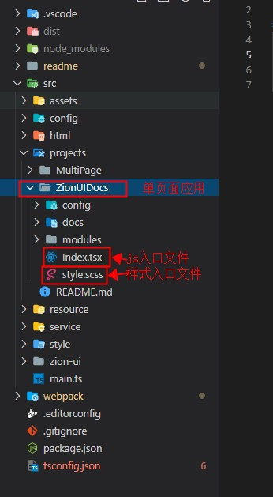
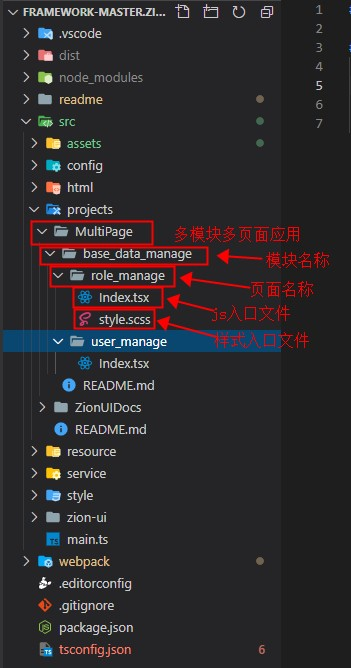
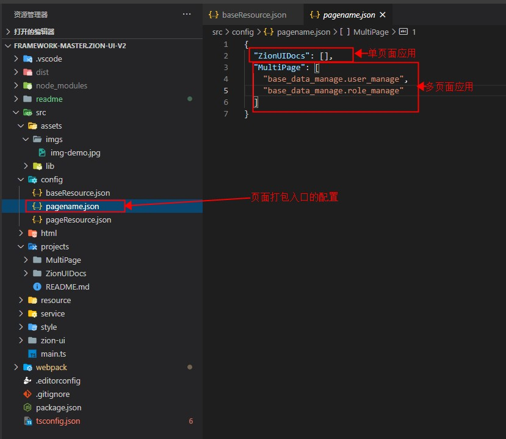
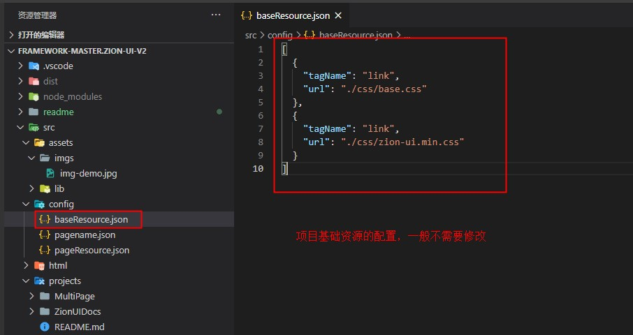
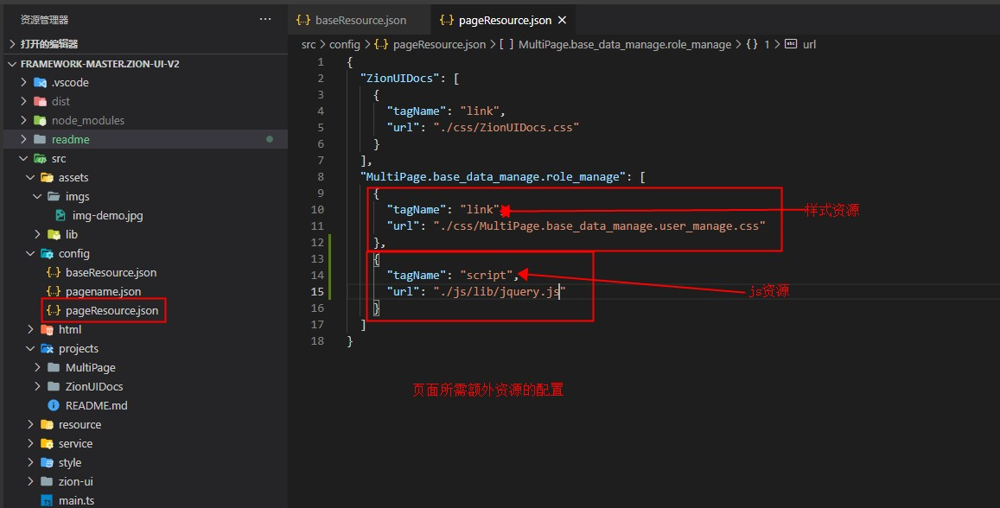
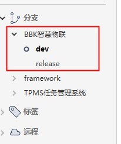
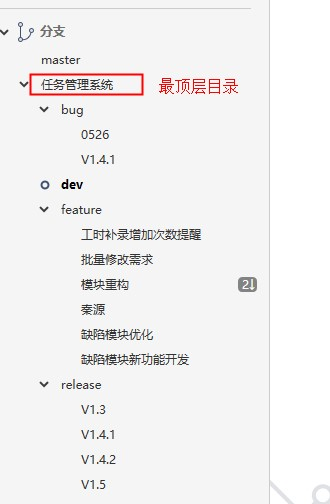

## 快速入门

### 代码分支
 - git仓库地址：`https://10.0.4.55/CAS/haoyun-web`, 从 framework/zion-ui 切出对应的项目分支
 - 分支名规范请查看git分支策略 `./git分支策略.jpg` `./git分支策略2.jpg`
  
### 快速启动
 - 首次启动  cnpm install && npm run build && npm run dev
 - 非首次启动  npm run dev

### 本地访问
 - 启动服务:npm run dev
 - `http://${ip}:${port}?pagename={entry}`  ip是本机ip，如果ip访问不了，就用localhost
 - port 查看 webpack/devConfig 中的端口配置
 - entry 查看 src/config/pagename.json 中的入口配置
   - 单页面应用访问示例：`http://10.6.2.33:9000?pagename=ZionUIDocs`
   - 多模块多页面应用访问示例：`http://10.6.2.33:9000?pagename=BBK.Location_manage.batch_insert_area`

### 本地访问框架文档
 - `http://${ip}:${port}?pagename=ZionUIDocs`  ip是本机ip，如果ip访问不了，就用localhost；
 - 需确保 webpack/devConfig.js 中的监视入口添加了 ZionUIDocs
 
### 项目打包
	- ① 在 webpack/devConfig.js 中指定需要打包的项目
	- ② npm run build
	- ③ 将dist目录下的文件部署到服务器上即可
	- ④ 如果添加了新的代理，需要在服务器上配置nginx代理

### 单页面应用目录结构

### 多模块多页面应用目录结构

### 打包与访问入口配置

### 基础资源配置

### 页面特殊资源配置

### 项目git分支策略

