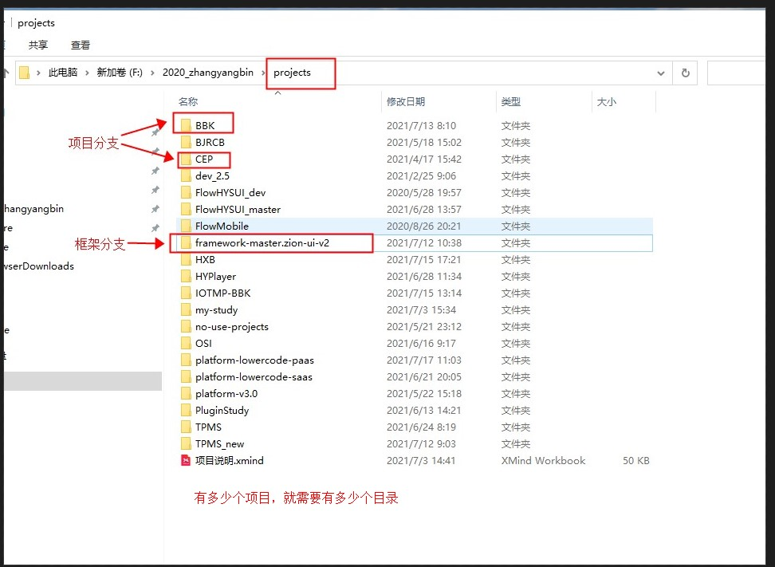
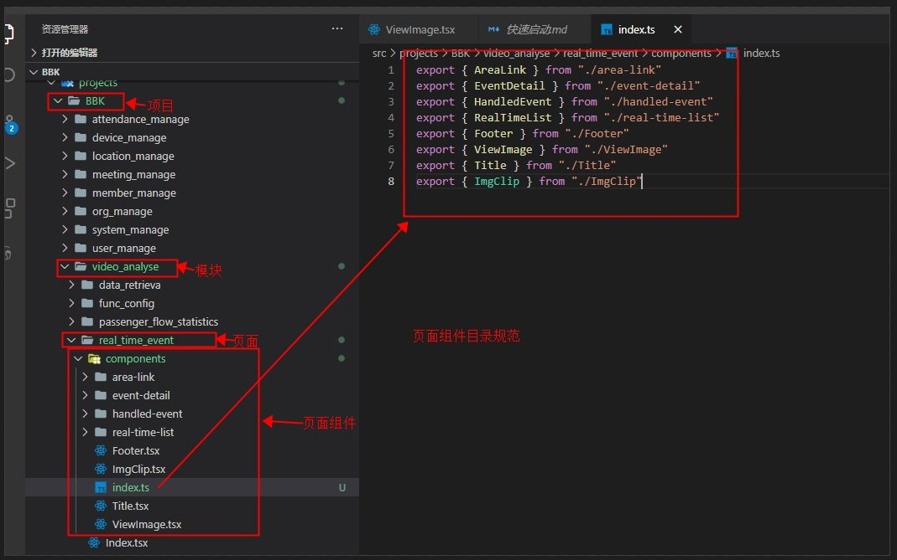
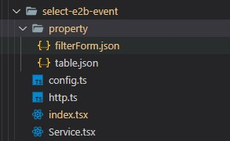
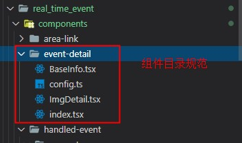

## 文件目录命名规范

### 标准目录或文件规范
	- property 组件的配置属性
	- Service  业务逻辑的处理
	- http     数据请求
	- config   常量或枚举值的配置文件
	- index.ts 组件的入口文件或当前目录的入口文件

### 打包入口文件
	- js打包入口文件都要命名为: Index.tsx
	- 样式打包入口文件都要命名为: style.scss

### 多模块多页面目录名
	- 模块目录格式：
  	- xxx_xxx_xxx 模块
    	- xxx_xxx_xxx 页面
      	- components
        	- xxx-xxx-xx 参考组件目录名规范
        	- xxx-xxx-xx 参考组件目录名规范
        	- index.ts
      	- config.ts
      	- Index.tsx
      	- style.scss
	- 页面目录格式: xxx_xxx_xxx

### 组件文件名
	> 代码量较少的组件，直接单个文件处理完组件的所有业务
	- YourComponent.tsx  大驼峰

### 组件目录名
	- xxx-xxx-xxx
  	- config.ts
  	- property.json | propert.ts
  	- Service.ts | Service.tsx 
  	- http.ts
  	- index.tsx  组件入口文件名(注意不是大驼峰)

  - xxx-xxx-xxx
  	- config.ts
  	- property
    	- xxx.tsx | xxx.json | xxx.ts
    	- xxx.tsx | xxx.json | xxx.ts
    	- ...
  	- Service
    	- xxx.tsx
    	- xxx.tsx 
    	- ...
  	- http
    	- xxx.ts
    	- xxx.ts
    	- ...
  	- index.tsx  组件入口文件名(注意不是大驼峰)

### 示例目录

