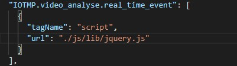

## 如何配置不需要参与打包的插件
 > 有些插件较为特殊，不需要参与webpack的打包，对于这类插件需要特殊处理。

### 以jquery为例
 - ① 将插件放在 src/assets/lib
 - ② npm run build  将src/assets/lib 移动至 dist/js/lib
    - 如果正在开发，不想 npm run build，手动将src/assets/lib 移动至 dist/js/lib即可，不需要重启服务
 - ③ 在 src/config/pageResource.json 添加配置

