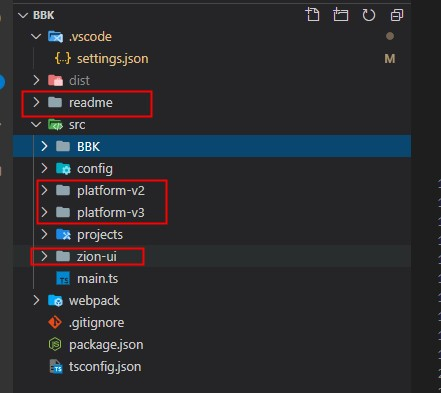

## 框架升级
> 框架升级指的是分支: framework/zion-ui 更新了新的内容

### 一般会更新什么内容
 1. 平台组件：对应目录 src/platform-v2   src/platform-v3
 2. 框架组件: 对应目录 src/zion-ui
 3. 文档说明：对应目录 readme

### 如何同步
  1. 本地一定要有一个仓库(zion-ui)，专门用于拉取 framework/zion-ui 分支的代码
  2. 将 framework/zion-ui 分支的最新代码拉取到本地
  3. 假设本地有一个项目仓库 ERP
  4. 将仓库(zion-ui)中的以下目录替换仓库(ERP)中的对应目录
      - src/zion-ui
      - src/platform-v2
      - src/platform-v3
      - readme

      